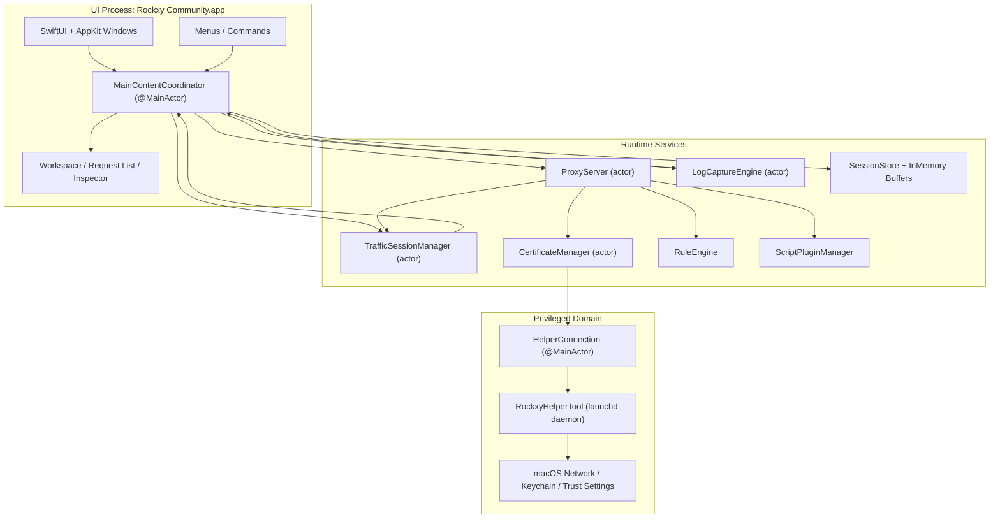
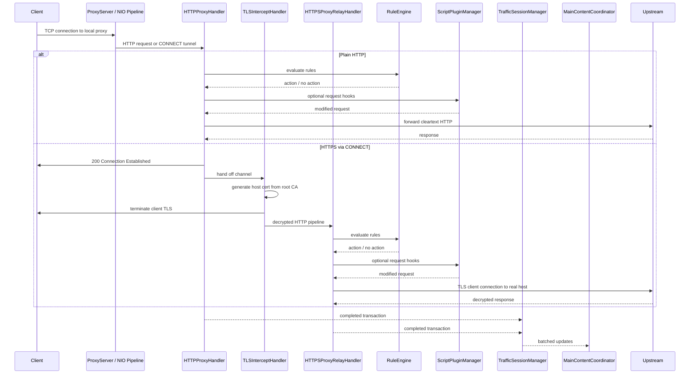
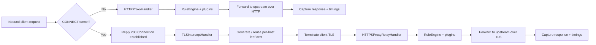
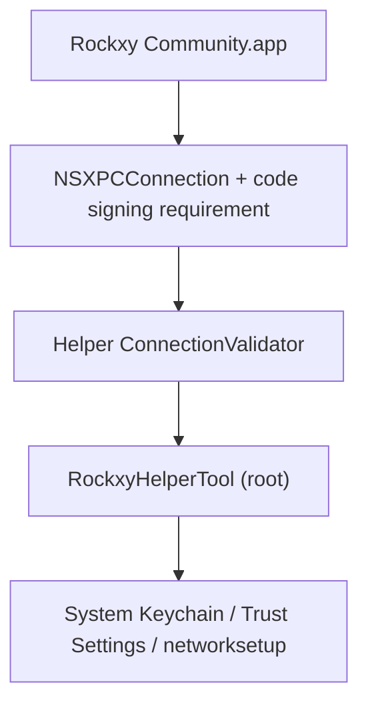

<p align="center">
  
</p>

<h1 align="center">Rockxy</h1>

<p align="center">
  <a href="README.md">English</a> |
  <a href="README.vi.md">Tiếng Việt</a> |
  <a href="README.zh.md">中文</a> |
  <a href="README.ja.md">日本語</a> |
  <a href="README.ko.md">한국어</a> |
  <a href="README.fr.md">Français</a> |
  <a href="README.de.md">Deutsch</a>
</p>

<p align="center">
  <strong>Quelloffener HTTP-Debugging-Proxy für macOS.</strong>
</p>

<p align="center">
  HTTP/HTTPS-Verkehr abfangen, API-Anfragen inspizieren, WebSocket-Verbindungen debuggen und GraphQL-Abfragen analysieren.<br>
  Entwickelt in Swift mit SwiftNIO, SwiftUI und AppKit.
</p>

<p align="center">
  <a href="#"></a>
  <a href="#"></a>
  <a href="LICENSE"></a>
  <a href="CONTRIBUTING.md"></a>
  <a href="https://github.com/sponsors/LocNguyenHuu"></a>
</p>

<p align="center">
  
</p>

---

> **Status**: Aktive Entwicklung. Proxy-Engine, HTTPS-Abfangen, Regelsystem, Plugin-Ökosystem und Inspector-Oberfläche sind funktionsfähig. Fortschritte finden Sie im [CHANGELOG.md](CHANGELOG.md).

<!-- BEGIN GENERATED: latest-release -->
## Neueste Version

**v0.4.0** — 2026-04-09

### Hinzugefügt

- Regel-Editor mit Dropdown-Menüs und vergrößertem Fenster neu gestaltet

### Behoben

- Ladestatus-Überschreibung bei selectPlugin-Fehler verhindert
- UI-Feedback bei unbekanntem Template-Namen in applyTemplate angezeigt
- Scripting-Template-Fallback, Subpaths-Toggle-Umfang und Provenance-Lokalisierung verbessert
- Code-Review-Befunde für Block-List-PR behoben
- Quick-Create-Handoff wiederhergestellt, nicht funktionierende Steuerelemente entfernt, ehrliche UI erzwungen

### Geändert

- Remote-Tracking-Branch 'origin/main' zusammengeführt
- Mehrsprachige README-Übersetzungen hinzugefügt
- Lokalisierte READMEs hinzugefügt

Die vollständige Versionshistorie finden Sie in [CHANGELOG.md](CHANGELOG.md).
<!-- END GENERATED: latest-release -->

## Funktionen

### Netzwerkverkehr erfassen
- **HTTP/HTTPS-Proxy-Server** — SwiftNIO-basierter abfangender Proxy mit CONNECT-Tunnel-Unterstützung
- **SSL/TLS-Abfangen** — Man-in-the-Middle-Entschlüsselung mit automatisch generierten Zertifikaten pro Host (LRU-Cache ~1000)
- **WebSocket-Debugging** — bidirektionale Frame-Erfassung und -Inspektion
- **GraphQL-Erkennung** — automatische Extraktion von Operationsnamen und Abfrageinspektion
- **Prozessidentifikation** — sehen Sie, welche App (Safari, Chrome, curl, Slack, Postman usw.) jede Anfrage gestellt hat, via `lsof`-Port-Mapping + User-Agent-Parsing

### Anfrage- & Antwort-Inspector
- **JSON-Viewer** — aufklappbare Baumansicht mit Syntaxhervorhebung
- **Hex-Inspector** — binäre Darstellung für Nicht-Text-Inhalte
- **Timing-Wasserfall** — DNS, TCP-Verbindung, TLS-Handshake, TTFB und Übertragungsphasen pro Anfrage visualisiert
- **Header, Cookies, Query-Parameter, Authentifizierung** — Inspector mit Tabs und Rohdatenansicht
- **Benutzerdefinierte Header-Spalten** — zusätzliche Anfrage-/Antwort-Header als Spalten anzeigen

### Arbeitsbereiche & Produktivität
- **Arbeitsbereich-Tabs** — separate Erfassungsbereiche mit unabhängigen Filtern und Fokus
- **Favoriten** — häufig genutzte Hosts oder Anfragen für schnellen Zugriff anpinnen
- **Zeitachsenansicht** — visuelle Anfragesequenz-Zeitachse für einen fokussierten Ausschnitt

### Verkehrsmanipulation & Mock-API
- **Map Local** — Antworten aus lokalen Dateien ausliefern (API-Antworten mocken, ohne Servercode zu ändern)
- **Map Remote** — Anfragen an einen anderen Host/Port/Pfad umleiten (API-Gateway-Tests, Staging ↔ Produktion umschalten)
- **Breakpoints** — Anfragen oder Antworten unterbrechen, URL/Header/Body/Status bearbeiten, dann weiterleiten oder abbrechen
- **Sperrliste** — Anfragen nach URL-Muster blockieren (Wildcard oder Regex)
- **Drosselung** — langsames Netzwerk simulieren durch verzögertes Weiterleiten von Anfragen
- **Header modifizieren** — HTTP-Header on-the-fly hinzufügen, entfernen oder ersetzen
- **Erlaubnisliste** — nur ausgewählte Domains oder Apps erfassen, um Rauschen zu reduzieren
- **Proxy umgehen** — bestimmte Hosts vom Proxying ausschließen, während der System-Proxy aktiv ist
- **SSL-Proxying-Regeln** — TLS-Abfangen pro Domain steuern

### Debugging & Analyse
- **OSLog-Integration** — macOS-Systemprotokolle erfassen und per Zeitstempel mit Netzwerk-Anfragen korrelieren
- **Vergleichsansicht** — zwei erfasste Anfragen/Antworten nebeneinander vergleichen
- **Anfragezeitachse** — visueller Wasserfall von Anfragesequenzen und Timing
- **Zugangsdaten-Schwärzung** — automatische Schwärzung von Bearer-Tokens und Passwörtern in erfassten Protokollen

### Erweiterbarkeit
- **JavaScript-Plugin-System** — Rockxy mit benutzerdefinierten Skripten erweitern (JavaScriptCore-Laufzeit, 5-Sekunden-Timeout-Sandbox)
- **Anfrage-/Antwort-Hooks** — Plugins können Verkehr in der Proxy-Pipeline inspizieren und modifizieren
- **Plugin-Einstellungen-UI** — automatisch generierte Konfigurationsformulare aus dem Plugin-Manifest
- **Exportformate** — als cURL, HAR, rohes HTTP oder JSON kopieren
- **Erstellen + Wiederholen** — Anfragen bearbeiten und erneut senden oder erfassten Verkehr wiederholen
- **Import-Prüfung** — HAR-/Sitzungsimporte vor der Speicherung verifizieren

### Natives macOS-Erlebnis
- **Natives SwiftUI + AppKit** — kein Electron, keine Webviews, keine plattformübergreifenden Kompromisse
- **NSTableView-Anfrageliste** — virtuelles Scrollen bewältigt 100.000+ erfasste Anfragen ohne Verzögerung
- **Echte App-Icons** — aufgelöst via `NSWorkspace`-Bundle-ID-Lookup
- **System-Proxy-Integration** — privilegierter Hilfsdienst-Daemon für passwortfreie Proxy-Einrichtung (SMAppService)
- **Dunkelmodus** — volle Unterstützung mit systemsemantischen Farben
- **Tastenkombinationen** — Cmd+Shift+R (Start), Cmd+. (Stopp), Cmd+K (Löschen) und mehr

## Anwendungsfälle

- **iOS-/macOS-App-Debugging** — API-Aufrufe Ihrer App im Simulator oder auf dem Gerät inspizieren
- **REST-API-Tests** — exakte Anfrage-/Antwort-Paare ansehen, ohne zu einem separaten Tool zu wechseln
- **GraphQL-Debugging** — Operationsnamen, Variablen und Antworten auf einen Blick sehen
- **API-Antworten mocken** — lokale Dateien auf Endpunkte mappen für Offline-Entwicklung oder Edge-Case-Tests
- **WebSocket-Inspektion** — Echtzeit-Verbindungen debuggen (Chat-Apps, Live-Feeds, Spielprotokolle)
- **Leistungsanalyse** — langsame Endpunkte, große Payloads und redundante API-Aufrufe identifizieren
- **SSL/TLS-Debugging** — verschlüsselten HTTPS-Verkehr mit domainspezifischer Abfangkontrolle inspizieren
- **Netzwerkverkehr aufzeichnen** — HTTP-Sitzungen für Regressionstests erfassen und wiedergeben
- **APIs reverse-engineeren** — undokumentiertes API-Verhalten von Drittanbieter-Apps verstehen
- **CI/CD-Integration** — Headless-Proxy für automatisierte API-Vertragstests (geplant)

## Rockxy vs. Proxyman vs. Charles Proxy

Sie suchen eine quelloffene Alternative zu Proxyman oder Charles Proxy? So schneidet Rockxy im Vergleich ab:

| Funktion | Rockxy | Proxyman | Charles Proxy |
|----------|--------|----------|---------------|
| **Lizenz** | Quelloffen (AGPL-3.0) | Proprietär (Freemium) | Proprietär (kostenpflichtig) |
| **Preis** | Kostenlos | Kostenlose Stufe + 69 $/Jahr | 50 $ einmalig |
| **Plattform** | macOS | macOS, iOS, Windows | macOS, Windows, Linux |
| **Quellcode** | Vollständig auf GitHub verfügbar | Geschlossener Quellcode | Geschlossener Quellcode |
| **Technologie** | Swift + SwiftNIO (nativ) | Swift + AppKit (nativ) | Java (plattformübergreifend) |
| **HTTP/HTTPS-Abfangen** | Ja | Ja | Ja |
| **WebSocket-Debugging** | Ja | Ja | Ja |
| **GraphQL-Erkennung** | Ja (automatisch) | Ja | Nein |
| **Map Local** | Ja | Ja | Ja |
| **Map Remote** | Ja | Ja | Ja |
| **Breakpoints** | Ja | Ja | Ja |
| **Sperrliste** | Ja | Ja | Ja |
| **Header modifizieren** | Ja | Ja | Ja (Rewrite) |
| **Drosselung / Netzwerkbedingungen** | Ja | Ja | Ja |
| **Anfragevergleich** | Ja (nebeneinander) | Ja | Nein |
| **JavaScript-Plugins** | Ja (JSCore-Sandbox) | Ja (Scripting) | Nein |
| **Anfrage wiederholen** | Ja (Wiederholen + Bearbeiten) | Ja | Ja |
| **HAR-Import/Export** | Ja | Ja | Nein (eigenes Format) |
| **OSLog-Integration** | Ja | Nein | Nein |
| **Prozessidentifikation** | Ja (welche App pro Anfrage) | Ja | Nein |
| **JSON-Baumansicht** | Ja | Ja | Ja |
| **Hex-Inspector** | Ja | Ja | Ja |
| **Timing-Wasserfall** | Ja | Ja | Ja |
| **Virtuelles Scrollen (100.000+ Zeilen)** | Ja (NSTableView) | Ja | Langsam bei hohem Volumen |
| **Privilegierter Hilfsdienst (keine sudo-Abfragen)** | Ja (SMAppService) | Ja | Nein (wiederholte Abfragen) |
| **Dunkelmodus** | Ja | Ja | Teilweise |
| **Selbst hostbar / prüfbar** | Ja | Nein | Nein |
| **Community-Beiträge** | Offen für PRs | Nein | Nein |

**Warum Rockxy?**
- Sie wollen einen **kostenlosen, quelloffenen** HTTP-Debugging-Proxy ohne Lizenzbeschränkungen
- Sie wollen den **Quellcode des Tools prüfen**, das Ihren Datenverkehr abfängt
- Sie wollen **Funktionen beitragen** oder das Tool an Ihren Arbeitsablauf anpassen
- Sie brauchen **OSLog-Korrelation**, um macOS-App-Protokolle neben dem Netzwerkverkehr zu debuggen
- Sie wollen ein **natives macOS-Erlebnis** ohne Java-Laufzeit-Overhead

## Voraussetzungen

- macOS 14.0+ (Sonoma oder neuer)
- Xcode 16+
- Swift 5.9

## Schnellstart

```bash
git clone https://github.com/LocNguyenHuu/Rockxy.git
cd Rockxy
xcodebuild -project Rockxy.xcodeproj -scheme Rockxy -configuration Debug build
```

Oder öffnen Sie `Rockxy.xcodeproj` in Xcode und klicken Sie auf „Run".

Beim ersten Start führt Sie das Willkommensfenster durch folgende Schritte:
1. Root-CA-Zertifikat generieren und als vertrauenswürdig einstufen
2. Privilegiertes Hilfstool für die System-Proxy-Steuerung installieren
3. System-Proxy aktivieren
4. Proxy-Server starten

## Architektur

### Systemübersicht

Rockxy ist in drei Vertrauens- und Ausführungsdomänen aufgeteilt:

1. **UI + Orchestrierungsschicht** — SwiftUI/AppKit-Fenster, Inspectors, Menüs und der `MainContentCoordinator`
2. **Proxy-/Laufzeitschicht** — SwiftNIO-Channel-Handler, Zertifikatsausstellung, Anfragemodifikation, Speicherung und Plugins
3. **Privilegierte Hilfsdienstschicht** — ein separater launchd-Daemon, der ausschließlich für systemweite Proxy- und Zertifikatsoperationen verwendet wird, die erhöhte Berechtigungen erfordern

Das Designziel ist es, die Paketverarbeitung vom Hauptthread fernzuhalten, privilegierte Operationen außerhalb des App-Prozesses auszuführen und den benutzersichtbaren Zustand durch explizite actor- oder `@MainActor`-Grenzen synchron zu halten.

### Komponentenübersicht



### Laufzeitschichten

| Schicht | Haupttypen | Verantwortlichkeit |
|---------|------------|-------------------|
| **Darstellung** | `MainContentCoordinator`, `ContentView`, Inspector-/Anfragelisten-/Sidebar-Views | Hält benutzersichtbaren Zustand, routet Befehle, bindet Proxy-/Protokolldaten an SwiftUI/AppKit |
| **Erfassung / Transport** | `ProxyServer`, `HTTPProxyHandler`, `TLSInterceptHandler`, `HTTPSProxyRelayHandler` | Nimmt Proxy-Verkehr entgegen, führt CONNECT-Handling, MITM-TLS-Abfangen und Upstream-Weiterleitung durch |
| **Modifikation / Richtlinien** | `RuleEngine`, `BreakpointRequestBuilder`, `AllowListManager`, `NoCacheHeaderMutator`, `MapLocalDirectoryResolver` | Wendet Anfrage-/Antwort-Regeln und aktuelle Debugging-Richtlinien vor Weiterleitung oder Speicherung an |
| **Zertifikat / Vertrauen** | `CertificateManager`, `RootCAGenerator`, `HostCertGenerator`, `CertificateStore`, `KeychainHelper` | Generiert und speichert das Root-CA, cached Host-Zertifikate, validiert Vertrauensstatus, installiert Vertrauen via Hilfsdienst/App-Abläufe |
| **Speicherung / Sitzung** | `TrafficSessionManager`, `LogCaptureEngine`, `SessionStore`, In-Memory-Buffer | Puffert Live-Daten, persistiert ausgewählten Zustand in SQLite und bündelt Updates an die UI |
| **Beobachtung / Analyse** | GraphQL-Erkennung, Content-Type-Erkennung, Protokollkorrelation | Reichert erfassten Verkehr nach oder während der Transportverarbeitung an |
| **Privilegierte Systemintegration** | `HelperConnection`, `RockxyHelperTool`, gemeinsames XPC-Protokoll | Wendet System-Proxy-Einstellungen und privilegierte Zertifikatsoperationen mit expliziten Vertrauensprüfungen an |

### Proxy-Anfrage-Lebenszyklus



### HTTP- vs. HTTPS-Ablauf



### Nebenläufigkeitsmodell

- `ProxyServer` ist ein actor, der Lebenszyklusübergänge wie Bind und Shutdown verwaltet.
- NIO-Channel-Handler laufen auf Event-Loop-Threads und brücken nur bei Bedarf in actor-isolierte Dienste.
- `CertificateManager`, `TrafficSessionManager` und verwandte Dienste nutzen actor-Isolation statt manueller Locks für langlebigen gemeinsamen Zustand.
- `MainContentCoordinator` ist `@MainActor`, da er die Synchronisierungsgrenze für SwiftUI/AppKit darstellt.
- UI-Aktualisierungen werden gebündelt statt pro Transaktion ausgeliefert, um Hauptthread-Überlastung bei starkem Verkehr zu vermeiden.

### Kernsubsysteme

| Subsystem | Verzeichnis | Funktion |
|-----------|-------------|----------|
| **Proxy-Engine** | `Core/ProxyEngine/` | SwiftNIO `ServerBootstrap`, Channel-Pipeline pro Verbindung, CONNECT-Handling, TLS-Übergabe, HTTP/HTTPS-Weiterleitung |
| **Zertifikat** | `Core/Certificate/` | Root-CA-Lebenszyklus, Host-Zertifikatsausstellung, Vertrauensprüfungen, Disk- + Keychain-Persistenz, Host-Zertifikat-Cache |
| **Regel-Engine** | `Core/RuleEngine/` | Geordnete Regelauswertung für Blockieren, Map Local, Map Remote, Drosselung, Header-Modifikation und Breakpoints |
| **Verkehrserfassung** | `Core/TrafficCapture/` | Sitzungsbündelung, Erlaubnislisten-Richtlinie, Wiedergabeunterstützung, Proxy-Zustandsübergabe an die UI |
| **Speicherung** | `Core/Storage/` | SQLite-basierte Persistenz, In-Memory-Sitzungs-/Protokollpuffer, Auslagerung großer Bodies |
| **Erkennung / Anreicherung** | `Core/Detection/` | GraphQL-Erkennung, Content-Type-Erkennung, API-Endpunkt-Gruppierung |
| **Plugins** | `Core/Plugins/` | JavaScriptCore-basierte Anfrage-/Antwort-Hook-Ausführung und Plugin-Metadaten-/Konfigurationsunterstützung |
| **Hilfstool** | `RockxyHelperTool/`, `Shared/` | Privilegierter XPC-Dienst für Proxy-Override, Bypass-Domain-Konfiguration und Unterstützung bei Zertifikatsinstallation/-entfernung |

### Sicherheitsarchitektur

> **Schwachstellen melden:** Falls Sie ein Sicherheitsproblem entdecken, melden Sie es bitte vertraulich. Hinweise zur Offenlegung finden Sie in [SECURITY.md](SECURITY.md).

Rockxy verwendet ein mehrschichtiges Sicherheitsmodell, da es TLS terminiert, sensiblen Datenverkehr speichert und mit einem root-privilegierten Hilfsdienst kommuniziert.



#### Sicherheitsgrenzen

| Grenze | Risiko | Aktuelle Maßnahme |
|--------|--------|-------------------|
| **App ↔ Hilfsdienst** | Nicht vertrauenswürdige App versucht, privilegierte Proxy-/Zertifikatsoperationen aufzurufen | `NSXPCConnection` mit Code-Signing-Anforderungen plus hilfsdienstseitige Verbindungsvalidierung und Zertifikatsketten-Vergleich |
| **TLS-Abfangen** | Ungültiges oder veraltetes Root-CA verursacht fehlerhaftes Vertrauen oder unklaren MITM-Zustand | Expliziter Root-CA-Lebenszyklus, Vertrauensprüfungen, Root-Fingerprint-Tracking, Host-Zertifikatsausstellung nur vom aktiven Root |
| **Anfrage-Body-Behandlung** | Speichererschöpfung durch überdimensionierte Anfrage-/Antwort-Bodies | 100 MB Anfrage-Body-Limit (413-Ablehnung), 8 KB URI-Längenlimit (414-Ablehnung), WebSocket-Frame-Limits (10 MB/Frame, 100 MB/Verbindung) |
| **Regelbasierte lokale Dateiauslieferung** | Path-Traversal oder Symlink-Escape durch Map-Local-Verzeichnisregeln | fd-basiertes Dateiladen (eliminiert TOCTOU), Symlink-Auflösung, Pfadeindämmungsprüfungen mit Root-Verankerung |
| **Regex-Muster in Regeln** | ReDoS durch pathologische Regex, die den Proxy einfriert | Regex-Validierung zur Kompilierzeit, vorkompilierter Muster-Cache, 500-Zeichen-Musterlängenlimit, 8 KB Eingabelimit |
| **Bearbeitete Anfragen bei Breakpoints** | Weiterleitung fehlerhafter Anfragen nach URL-/Header-/Body-Bearbeitung | Zentrale Anfrageneuaufbau in `BreakpointRequestBuilder`, Authority-Erhaltung, Schema-Normalisierung, Content-Length-Abgleich |
| **Plugin-Ausführung** | Skripte, die Verkehr auf unsichere oder nicht-deterministische Weise verändern | JavaScriptCore-Bridge, begrenzte Hook-API, Timeout-Durchsetzung, Plugin-ID-/Key-Validierung, kein direkter Dateisystem-/Netzwerkzugriff |
| **Gespeicherter Verkehr** | Sensible Anfrage-/Antwort-Bodies zu lange oder mit schwachen Berechtigungen gespeichert | In-Memory-Pufferung plus Disk-/SQLite-Persistenz, Auslagerung großer Bodies mit 0o600-Dateiberechtigungen, Pfadeindämmung bei Laden/Löschen, Zugangsdaten-Schwärzung in Protokollen |
| **Header-Injection** | CRLF-Injection via MapRemote-Host-Header-Manipulation | Header-Wert-Bereinigung durch Entfernung von Steuerzeichen vor der Weiterleitung |
| **Hilfsdienst-Eingabevalidierung** | Fehlerhafte Domains oder Dienstnamen an networksetup übergeben | Nur-ASCII-Bypass-Domain-Validierung, Dienstnamen-Bereinigung, Proxy-Typ-Whitelisting, Domain-Anzahl-Limits |

#### Vertrauensmodell des Hilfstools

Der Hilfsdienst läuft als launchd-Daemon (`com.amunx.Rockxy.HelperTool`), registriert via `SMAppService.daemon()`. Er existiert, damit Proxy-Override und bestimmte Zertifikatsoperationen ohne wiederholte `networksetup`-Passwortabfragen aus dem App-Prozess durchgeführt werden können.

Die gestaffelte Verteidigung umfasst derzeit:

- App-seitige privilegierte XPC-Verbindungseinrichtung
- Hilfsdienstseitige Anrufervalidierung in `ConnectionValidator` mit festkodierter Bundle-ID
- Durchsetzung der Code-Signing-Anforderung (`anchor apple generic`)
- Zertifikatsketten-Vergleich, sodass Vertrauen nicht allein auf Bundle-ID- oder Team-ID-Strings basiert
- Hilfsdienstseitige Ratenbegrenzung für zustandsändernde Operationen (Proxy-Änderungen, Zertifikatsinstallationen)
- Eingabevalidierung aller Hilfsdienstparameter (Bypass-Domains, Dienstnamen, Proxy-Typen)
- Atomare temporäre Dateierstellung mit eingeschränkten Berechtigungen (0o600)
- Explizite Proxy-Backup-/Wiederherstellungspfade für Absturz-Recovery

#### Zertifikats-Vertrauensmodell

- Root-CA-Generierung und -Persistenz befinden sich im `CertificateManager`.
- Die App verwaltet Root-CA-Erstellung, -Laden und Vertrauensstatus-Überprüfung.
- Der Hilfsdienst kann bei privilegierten Keychain-/Systeminstallationsoperationen unterstützen, aber das Vertrauen hat weiterhin einen app-seitigen Verifizierungspfad.
- Host-Zertifikate werden bei Bedarf vom aktuellen Root generiert und gecacht, um wiederholte aufwändige Ausstellung zu vermeiden.
- Root-Fingerprint-Tracking wird verwendet, um veraltete Zertifikate zu bereinigen und das Problem „mehrere alte Rockxy-Roots installiert" zu reduzieren.

#### Praktische Sicherheitshinweise

- Rockxy sollte als Entwicklertool mit Zugriff auf sensiblen Datenverkehr behandelt werden. Lassen Sie das System-Proxy-Override nicht länger als nötig aktiviert.
- Die Installation des Root-CA aktiviert HTTPS-Abfangen nur für Clients, die diesem Root vertrauen.
- Gespeicherte Sitzungen, Exporte und Plugin-Code sollten als potenziell sensible Projektartefakte behandelt werden.

## Projektstruktur

```
Rockxy/
├── Core/
│   ├── ProxyEngine/       # SwiftNIO-Server, HTTP/TLS/WS-Handler, Hilfsdienst-Client
│   ├── Certificate/       # X.509-Generierung, Root-CA, Keychain-Integration
│   ├── RuleEngine/        # Regelabgleich und Aktionsausführung
│   ├── LogEngine/         # OSLog- + Prozessprotokoll-Erfassung und -Korrelation
│   ├── TrafficCapture/    # Sitzungsmanager, System-Proxy, Anfragewiedergabe
│   ├── Storage/           # SQLite-Speicher, In-Memory-Buffer, Einstellungen
│   ├── Detection/         # Content-Type-, GraphQL-, API-Gruppierung
│   ├── Plugins/           # Plugin-Erkennung, JS-Laufzeit, Manifest-Parsing
│   ├── Services/          # Fensterverwaltung, Benachrichtigungen
│   └── Utilities/         # Body-Decoder, Eingabevalidierung, Formatierer
├── Views/
│   ├── Main/              # Hauptfenster, Coordinator-Erweiterungen
│   ├── RequestList/       # NSTableView-basierte Anfrageliste (100.000+ Zeilen)
│   ├── Inspector/         # Anfrage-/Antwort-Tabs, JSON-Baum, Hex-Anzeige
│   ├── Sidebar/           # Domain-Baum, App-Gruppierung, Favoriten
│   ├── Toolbar/           # Statusindikatoren, Steuerungsschaltflächen
│   ├── Welcome/           # Einrichtungsassistent, Zertifikats-Checkliste
│   ├── Settings/          # Allgemein, Proxy, SSL-Proxying, Datenschutz-Tabs
│   ├── Rules/             # Regelliste, Hinzufügen-/Bearbeiten-Dialoge
│   ├── Compose/           # Bearbeiten-und-Wiederholen-Anfrageeditor
│   ├── Diff/              # Nebeneinander-Transaktionsvergleich
│   ├── Scripting/         # Code-Editor, Plugin-Konsole
│   ├── Timeline/          # Anfrage-Wasserfall-Visualisierung
│   ├── Breakpoint/        # Breakpoint-Bearbeitungsfenster
│   └── Components/        # Wiederverwendbar: StatusCodeBadge, FilterPill usw.
├── Models/
│   ├── Network/           # HTTPTransaction, Request/Response, TimingInfo, WebSocket
│   ├── Log/               # LogEntry, LogLevel, LogSource
│   ├── Certificate/       # RootCA, RootCAStatusSnapshot
│   ├── Rules/             # ProxyRule, RuleAction
│   ├── Settings/          # AppSettings, ProxySettings
│   ├── UI/                # SidebarItem, FilterState
│   └── Plugins/           # PluginInfo, PluginConfig, PluginManifest
├── ViewModels/
├── Extensions/
└── Theme/

RockxyHelperTool/              # Privilegierter launchd-Daemon (läuft als root)
├── main.swift                 # Einstiegspunkt, XPC-Listener
├── HelperDelegate.swift       # Verbindungsvalidierung, Disconnect-Handling
├── HelperService.swift        # Protokollimplementierung, Ratenbegrenzung, Port-Validierung
├── ConnectionValidator.swift  # Zertifikatsketten-Extraktion & -Vergleich
├── CrashRecovery.swift        # Backup/Wiederherstellung von Proxy-Einstellungen
└── ProxyConfigurator.swift    # networksetup-Wrapper

Shared/
└── RockxyHelperProtocol.swift # @objc XPC-Protokoll (App ↔ Hilfsdienst)

RockxyTests/                   # Swift Testing Framework (@Suite, @Test, #expect)
├── Core/                      # Regel-Engine-, Zertifikats-, Plugin-, Speicher-, Proxy-Tests
├── ViewModels/                # WelcomeViewModel-Tests
└── Helpers/                   # TestFixtures-Fabrikmethoden

docs/                          # Dokumentation (Mintlify-Format)
.github/workflows/             # CI: Lint → Build (arm64 + x86_64) → Release
```

## Technologie-Stack

| Schicht | Technologie |
|---------|-------------|
| UI-Framework | SwiftUI + AppKit (NSTableView, NSViewRepresentable) |
| Netzwerk | [SwiftNIO](https://github.com/apple/swift-nio) 2.95 + [SwiftNIO SSL](https://github.com/apple/swift-nio-ssl) 2.36 |
| Zertifikate | [swift-certificates](https://github.com/apple/swift-certificates) 1.18 + [swift-crypto](https://github.com/apple/swift-crypto) 4.2 |
| Datenbank | [SQLite.swift](https://github.com/stephencelis/SQLite.swift) 0.16 |
| Nebenläufigkeit | Swift Actors, strukturierte Nebenläufigkeit, @MainActor |
| Plugins | JavaScriptCore (integriertes macOS-Framework) |
| Hilfsdienst-IPC | XPC Services + SMAppService (macOS 13+) |
| Tests | Swift Testing Framework (@Suite, @Test, #expect) |
| CI/CD | GitHub Actions (SwiftLint → paralleler arm64/x86_64-Build → Release) |

## Aus dem Quellcode bauen

### Entwicklungs-Build

```bash
git clone https://github.com/LocNguyenHuu/Rockxy.git
cd Rockxy
./scripts/setup-developer.sh   # Generiert Configuration/Developer.xcconfig für lokale Signierung
xcodebuild -project Rockxy.xcodeproj -scheme Rockxy -configuration Debug build
```

### Release-Build

```bash
# Apple Silicon (M1/M2/M3/M4)
xcodebuild -project Rockxy.xcodeproj -scheme Rockxy -configuration Release -arch arm64 build

# Intel
xcodebuild -project Rockxy.xcodeproj -scheme Rockxy -configuration Release -arch x86_64 build
```

### Tests ausführen

```bash
# Alle Tests
xcodebuild -project Rockxy.xcodeproj -scheme Rockxy test

# Bestimmte Testklasse
xcodebuild -project Rockxy.xcodeproj -scheme Rockxy test -only-testing:RockxyTests/CertificateTests

# Bestimmte Testmethode
xcodebuild -project Rockxy.xcodeproj -scheme Rockxy test -only-testing:RockxyTests/RuleEngineTests/testWildcardMatching
```

### Linting und Formatierung

```bash
brew install swiftlint swiftformat

swiftlint lint --strict    # Muss ohne Verstöße bestehen
swiftformat .              # Automatisch formatieren
```

### Hinweise zum Hilfstool

Wenn Sie Code unter `RockxyHelperTool/` oder `Shared/RockxyHelperProtocol.swift` ändern, reicht ein Neubauen der App nicht aus. Sie müssen den alten Hilfsdienst deinstallieren und den neuen über den Hilfsdienst-Manager der App neu installieren, damit die Änderungen wirksam werden.

## Designentscheidungen

### Warum SwiftNIO statt URLSession

URLSession ist ein hochrangiger HTTP-Client. Rockxy benötigt einen niedrigstufigen TCP-Server, der Verbindungen annehmen, HTTP parsen, MITM-TLS-Abfangen über CONNECT-Tunnel durchführen und Verkehr weiterleiten kann — alles Dinge, die direkte Socket-Kontrolle erfordern. SwiftNIO liefert die ereignisgesteuerte, nicht-blockierende I/O-Grundlage, die dies in reinem Swift ermöglicht.

### Warum NSTableView für die Anfrageliste

SwiftUI `List` kann 100.000+ Zeilen nicht mit virtuellem Scrollen bewältigen. Die Anfrageliste verwendet `NSTableView`, eingebettet in `NSViewRepresentable`, für O(1)-Scrollleistung unabhängig vom Verkehrsvolumen.

### Warum ein privilegierter Hilfsdienst-Daemon

macOS erfordert für jeden `networksetup`-Aufruf eine Administratorauthentifizierung. Das Hilfstool (`SMAppService.daemon()`) läuft als root und validiert Aufrufer via Zertifikatsketten-Vergleich, wodurch wiederholte Passwortabfragen entfallen und gleichzeitig die Sicherheit gewahrt bleibt.

### Actor-basiertes Nebenläufigkeitsmodell

Der Proxy-Server, die Sitzungsmanager und der Zertifikatsmanager sind allesamt Swift Actors. Dies eliminiert Data Races ohne manuelles Locking. Der Coordinator brückt actor-isolierten Zustand via gebündelter Updates (alle 250 ms) an `@MainActor` für den SwiftUI-Verbrauch.

### Plugin-Sandbox

JavaScript-Plugins laufen in JavaScriptCore mit einer kontrollierten Bridge-API (`$rockxy`). Jede Skriptausführung hat ein 5-Sekunden-Timeout. Plugins können Anfragen inspizieren und modifizieren, haben aber keinen direkten Zugriff auf Dateisystem oder Netzwerk.

## Leistung

- **100.000+ Anfragen** — NSTableView mit virtuellem Scrollen und Zellwiederverwendung, keine UI-Verzögerung
- **Ringpuffer-Räumung** — bei 50.000 Transaktionen werden die ältesten 10 % in SQLite verschoben oder verworfen
- **Body-Auslagerung** — Antwort-/Anfrage-Bodies >1 MB werden auf der Festplatte gespeichert und bei Bedarf geladen
- **Gebündelte UI-Updates** — Proxy-Transaktionen werden alle 250 ms oder 50 Einträge gebündelt, bevor sie an die UI geliefert werden
- **String-Leistung** — `NSString.length` (O(1)) statt `String.count` (O(n)) für große Bodies
- **Protokollpuffer** — 100.000 Einträge im Speicher, Überlauf in SQLite
- **Nebenläufige Builds** — `System.coreCount` NIO-Event-Loop-Threads

## Speicherung

| Daten | Mechanismus | Speicherort |
|-------|-------------|-------------|
| Benutzereinstellungen | UserDefaults | `AppSettingsStorage` |
| Aktive Sitzungen | In-Memory-Ringpuffer | `InMemorySessionBuffer` |
| Gespeicherte Sitzungen | SQLite | `SessionStore` |
| Root-CA-Privatschlüssel | macOS-Keychain | `KeychainHelper` |
| Regeln | JSON-Datei | `RuleStore` |
| Große Bodies | Festplattendateien | `~/Library/Application Support/Rockxy/bodies/` |
| Protokolleinträge | SQLite | `SessionStore` (log_entries-Tabelle) |
| Proxy-Backup | Plist (0o600) | `/Library/Application Support/com.amunx.Rockxy/proxy-backup.plist` |
| Plugins | JS-Dateien + Manifest | `~/Library/Application Support/Rockxy/Plugins/` |

## Code-Stil

Die vollständigen Regeln finden Sie in `.swiftlint.yml` und `.swiftformat`. Wichtigste Punkte:

- 4 Leerzeichen Einrückung, 120 Zeichen Zielzeilenbreite
- Explizite Zugriffskontrolle bei jeder Deklaration
- Kein Force-Unwrap (`!`) oder Force-Cast (`as!`) — verwenden Sie `guard let`, `if let`, `as?`
- OSLog für jegliches Logging, niemals `print()`
- `String(localized:)` für benutzersichtbare Zeichenketten
- [Conventional Commits](https://www.conventionalcommits.org/) für Commit-Nachrichten

### Dateigrößenlimits

| Metrik | Warnung | Fehler |
|--------|---------|--------|
| Dateilänge | 1200 Zeilen | 1800 Zeilen |
| Typ-Body | 1100 Zeilen | 1500 Zeilen |
| Funktions-Body | 160 Zeilen | 250 Zeilen |
| Zyklomatische Komplexität | 40 | 60 |

Bei Annäherung an die Limits extrahieren Sie Code in `TypeName+Category.swift`-Erweiterungsdateien, gruppiert nach Fachlogik.

## CI/CD

GitHub-Actions-Workflow (manueller Auslöser mit optionalem Channel-Parameter):

1. **Lint** — `swiftlint lint --strict` auf macOS 14
2. **Build** — parallele arm64- und x86_64-Release-Builds mit Xcode 16
3. **Artefakte** — Upload signierter Build-Artefakte zur Verteilung

## Roadmap

### Ausgeliefert

- [x] HAR-Datei-Import und -Export
- [x] Anfragewiedergabe (Wiederholen und Bearbeiten und Wiederholen)
- [x] Native `.rockxysession`-Sitzungsdateien (Speichern, Öffnen, Metadaten)
- [x] GraphQL-über-HTTP-Erkennung und -Inspektion
- [x] JavaScript-Scripting (Skripte erstellen, bearbeiten, testen, aktivieren/deaktivieren)
- [x] Nebeneinander-Anfragevergleich
- [x] Sicherheitshärtung (Body-Größenlimits, Regex-Validierung, Path-Traversal-Schutz, Eingabevalidierung)
- [x] Zugangsdaten-Schwärzung in erfassten Protokollen

### Geplant

- [ ] Fehlergruppierung und Analytics-Dashboard (HTTP-4xx/5xx-Clustering, Latenzmetriken)
- [ ] HTTP/2- und HTTP/3-Unterstützung
- [ ] Sequenzaufzeichnung (Kette abhängiger Anfragen wiedergeben)
- [ ] Remote-Geräte-Proxy (iOS-Geräte-Debugging über USB/WLAN)
- [ ] Headless-Modus für CI/CD-Pipeline-Integration
- [ ] gRPC-/Protocol-Buffers-Inspektion
- [ ] Netzwerkbedingungssimulation (Latenz, Paketverlust, Bandbreitenlimits)

## Mitwirken

Beiträge sind willkommen. Ob Fehlerbehebung, neue Funktion, Dokumentation oder UX-Feedback — jeder Beitrag hilft, Rockxy besser zu machen. Bitte lesen Sie unseren [Code of Conduct](CODE_OF_CONDUCT.md), bevor Sie teilnehmen.

**Erste Schritte:**

1. Forken Sie das Repository und klonen Sie Ihren Fork
2. Erstellen Sie einen Feature-Branch von `develop` (`feat/your-change` oder `fix/your-fix`)
3. Nehmen Sie Ihre Änderungen vor und stellen Sie sicher, dass `swiftlint lint --strict` besteht
4. Eröffnen Sie einen Pull Request mit einer klaren Beschreibung, was geändert wurde und warum

Detaillierte Einrichtungsanweisungen, Code-Stil, Commit-Konventionen und die vollständige PR-Checkliste finden Sie in [CONTRIBUTING.md](CONTRIBUTING.md).

**Möglichkeiten zur Mitwirkung:**

- **Code** — Fehlerbehebungen, neue Funktionen, Leistungsverbesserungen
- **Tests** — Testabdeckung erweitern, Grenzfälle hinzufügen, Fixtures verbessern
- **Dokumentation** — Docs in `docs/` verbessern, Tippfehler korrigieren, Beispiele ergänzen
- **Fehlerberichte** — klare, reproduzierbare Issues mit macOS-Version und Schritten einreichen
- **UX-Feedback** — Verbesserungsvorschläge für Inspector, Sidebar oder Toolbar-Workflows

Gute Einstiegsthemen sind auf GitHub mit [`good first issue`](https://github.com/LocNguyenHuu/Rockxy/labels/good%20first%20issue) gekennzeichnet.

Mit dem Eröffnen eines Pull Requests stimmen Sie dem [Contributor License Agreement](CLA.md) zu.

## Support

- [GitHub Sponsors](https://github.com/sponsors/LocNguyenHuu) — Rockxys Entwicklung unterstützen
- [GitHub Issues](https://github.com/LocNguyenHuu/Rockxy/issues) — Fehlerberichte und Funktionswünsche
- [GitHub Discussions](https://github.com/LocNguyenHuu/Rockxy/discussions) — Fragen und Community-Austausch
- **E-Mail** — [rockxyapp@gmail.com](mailto:rockxyapp@gmail.com)
- **Sicherheitsprobleme** — siehe [SECURITY.md](SECURITY.md) für verantwortungsvolle Offenlegung

## Lizenz

[GNU Affero General Public License v3.0](LICENSE) — Copyright 2024–2026 Rockxy Contributors.

---

**Gebaut mit Swift, SwiftNIO, SwiftUI und AppKit.**
