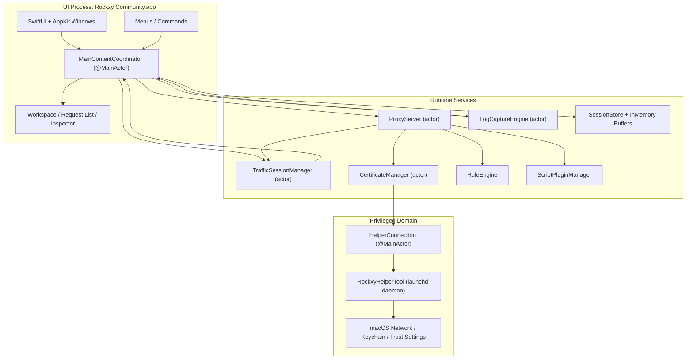
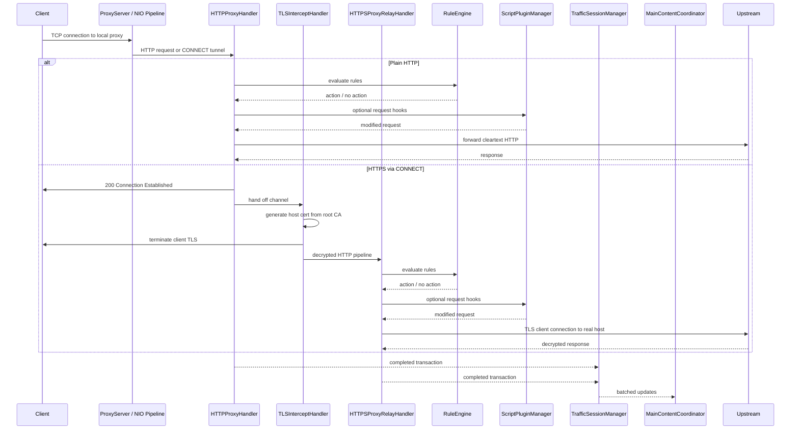
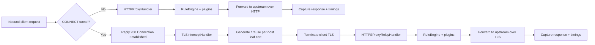
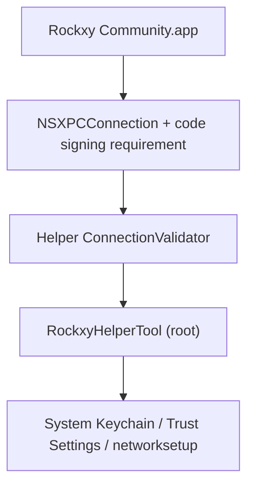

<p align="center">
  
</p>

<h1 align="center">Rockxy</h1>

<p align="center">
  <a href="README.md">English</a> |
  <a href="README.vi.md">Tiếng Việt</a> |
  <a href="README.zh.md">中文</a> |
  <a href="README.ja.md">日本語</a> |
  <a href="README.ko.md">한국어</a> |
  <a href="README.fr.md">Français</a> |
  <a href="README.de.md">Deutsch</a>
</p>

<p align="center">
  <strong>Proxy de débogage HTTP open-source pour macOS.</strong>
</p>

<p align="center">
  Interceptez le trafic HTTP/HTTPS, inspectez les requêtes API, déboguez les connexions WebSocket et analysez les requêtes GraphQL.<br>
  Développé en Swift avec SwiftNIO, SwiftUI et AppKit.
</p>

<p align="center">
  <a href="#"></a>
  <a href="#"></a>
  <a href="LICENSE"></a>
  <a href="CONTRIBUTING.md"></a>
  <a href="https://github.com/sponsors/LocNguyenHuu"></a>
</p>

<p align="center">
  
</p>

---

> **Statut** : Développement actif. Le moteur proxy principal, l'interception HTTPS, le système de règles, l'écosystème de plugins et l'interface d'inspection sont fonctionnels. Consultez le [CHANGELOG.md](CHANGELOG.md) pour suivre les avancées.

<!-- BEGIN GENERATED: latest-release -->
## Dernière Version

**v0.4.0** — 2026-04-09

### Ajouts

- Éditeur de règles redessiné avec menus déroulants et fenêtre agrandie

### Corrections

- Correction de l'écrasement du statut d'échec de chargement de selectPlugin
- Affichage du retour visuel lorsque applyTemplate reçoit un nom inconnu
- Amélioration du fallback des modèles de scripting, portée du toggle subpaths et localisation de la provenance
- Correction des résultats de revue de code pour le PR de liste de blocage
- Restauration du handoff quick-create, suppression des contrôles non fonctionnels, interface honnête

### Changements

- Fusion de la branche de suivi distant 'origin/main'
- Ajout des traductions README multilingues
- Ajout des READMEs localisés

Consultez [CHANGELOG.md](CHANGELOG.md) pour l’historique complet des versions.
<!-- END GENERATED: latest-release -->

## Fonctionnalités

### Capture du trafic réseau
- **Serveur proxy HTTP/HTTPS** — proxy d'interception basé sur SwiftNIO avec prise en charge des tunnels CONNECT
- **Interception SSL/TLS** — déchiffrement MITM avec génération automatique de certificats par hôte (cache LRU ~1000)
- **Débogage WebSocket** — capture et inspection bidirectionnelle des trames
- **Détection GraphQL** — extraction automatique du nom des opérations et inspection des requêtes
- **Identification des processus** — identifiez quelle application (Safari, Chrome, curl, Slack, Postman, etc.) a émis chaque requête via le mapping de ports `lsof` et l'analyse du User-Agent

### Inspecteur de requêtes et réponses
- **Visualiseur JSON** — arborescence repliable avec coloration syntaxique
- **Inspecteur hexadécimal** — affichage du corps en binaire pour le contenu non textuel
- **Cascade temporelle** — phases DNS, connexion TCP, handshake TLS, TTFB et transfert visualisées pour chaque requête
- **En-têtes, cookies, paramètres de requête, authentification** — inspecteur à onglets avec option d'affichage brut
- **Colonnes d'en-têtes personnalisées** — sélectionnez des en-têtes de requête/réponse supplémentaires à afficher en colonnes

### Espaces de travail et productivité
- **Onglets d'espace de travail** — espaces de capture séparés avec filtres et focus indépendants
- **Favoris** — épinglez les hôtes ou requêtes fréquents pour un accès rapide
- **Vue chronologique** — frise visuelle de la séquence des requêtes pour un sous-ensemble ciblé

### Manipulation du trafic et simulation d'API
- **Map Local** — servez des réponses depuis des fichiers locaux (simulez des réponses API sans modifier le code serveur)
- **Map Remote** — redirigez les requêtes vers un autre hôte/port/chemin (test de passerelle API, basculement staging ↔ production)
- **Breakpoints** — mettez en pause les requêtes ou réponses en cours de transit, modifiez l'URL/les en-têtes/le corps/le statut, puis transmettez ou abandonnez
- **Liste de blocage** — bloquez les requêtes par motif d'URL (joker ou regex)
- **Throttle** — simulez un réseau lent en retardant la transmission des requêtes
- **Modification d'en-têtes** — ajoutez, supprimez ou remplacez des en-têtes HTTP à la volée
- **Liste d'autorisation** — ne capturez que les domaines ou applications sélectionnés pour réduire le bruit
- **Contournement du proxy** — excluez certains hôtes du proxy tandis que le proxy système est activé
- **Règles de SSL Proxying** — contrôle de l'interception TLS par domaine

### Débogage et analyse
- **Intégration OSLog** — capturez les journaux système macOS et corrélez-les avec les requêtes réseau par horodatage
- **Comparaison côte à côte** — comparez deux requêtes/réponses capturées
- **Chronologie des requêtes** — cascade visuelle des séquences de requêtes et de leur temporisation
- **Masquage des identifiants** — masquage automatique des tokens Bearer et des mots de passe dans les journaux capturés

### Extensibilité
- **Système de plugins JavaScript** — étendez Rockxy avec des scripts personnalisés (runtime JavaScriptCore, sandbox avec délai d'expiration de 5 secondes)
- **Hooks requête/réponse** — les plugins peuvent inspecter et modifier le trafic dans le pipeline du proxy
- **Interface de configuration des plugins** — formulaires de configuration auto-générés à partir du manifeste du plugin
- **Formats d'export** — copie en cURL, HAR, HTTP brut ou JSON
- **Composition et rejeu** — modifiez et renvoyez des requêtes, ou rejouez du trafic capturé
- **Vérification à l'import** — vérifiez les imports HAR/session avant leur insertion en base

### Expérience native macOS
- **SwiftUI + AppKit natifs** — pas d'Electron, pas de vues web, pas de compromis multi-plateforme
- **Liste de requêtes NSTableView** — défilement virtuel capable de gérer plus de 100 000 requêtes capturées sans ralentissement
- **Icônes d'applications réelles** — résolues via la recherche de bundle ID par `NSWorkspace`
- **Intégration du proxy système** — démon assistant privilégié pour une configuration du proxy sans mot de passe (SMAppService)
- **Mode sombre** — prise en charge complète avec les couleurs sémantiques du système
- **Raccourcis clavier** — Cmd+Shift+R (démarrer), Cmd+. (arrêter), Cmd+K (effacer), et plus encore

## Cas d'utilisation

- **Débogage d'applications iOS / macOS** — inspectez les appels API de votre application dans le Simulateur ou sur un appareil
- **Test d'API REST** — visualisez les paires requête/réponse exactes sans changer d'outil
- **Débogage GraphQL** — consultez d'un coup d'œil les noms d'opération, les variables et les réponses
- **Simulation de réponses API** — mappez des fichiers locaux sur des endpoints pour le développement hors ligne ou les tests de cas limites
- **Inspection WebSocket** — déboguez les connexions temps réel (applications de chat, flux en direct, protocoles de jeu)
- **Profilage de performance** — identifiez les endpoints lents, les charges utiles volumineuses et les appels API redondants
- **Débogage SSL/TLS** — inspectez le trafic HTTPS chiffré avec un contrôle d'interception par domaine
- **Enregistrement du trafic réseau** — capturez et rejouez des sessions HTTP pour les tests de régression
- **Rétro-ingénierie d'API** — comprenez le comportement d'API non documentées d'applications tierces
- **Intégration CI/CD** — proxy headless pour les tests automatisés de contrats API (prévu)

## Rockxy vs Proxyman vs Charles Proxy

Vous cherchez une alternative open-source à Proxyman ou à Charles Proxy ? Voici comment Rockxy se positionne :

| Fonctionnalité | Rockxy | Proxyman | Charles Proxy |
|----------------|--------|----------|---------------|
| **Licence** | Open-source (AGPL-3.0) | Propriétaire (freemium) | Propriétaire (payant) |
| **Prix** | Gratuit | Offre gratuite + 69 $/an | 50 $ (achat unique) |
| **Plateforme** | macOS | macOS, iOS, Windows | macOS, Windows, Linux |
| **Code source** | Entièrement disponible sur GitHub | Code fermé | Code fermé |
| **Technologie** | Swift + SwiftNIO (natif) | Swift + AppKit (natif) | Java (multi-plateforme) |
| **Interception HTTP/HTTPS** | Oui | Oui | Oui |
| **Débogage WebSocket** | Oui | Oui | Oui |
| **Détection GraphQL** | Oui (auto-détection) | Oui | Non |
| **Map Local** | Oui | Oui | Oui |
| **Map Remote** | Oui | Oui | Oui |
| **Breakpoints** | Oui | Oui | Oui |
| **Liste de blocage** | Oui | Oui | Oui |
| **Modification d'en-têtes** | Oui | Oui | Oui (réécriture) |
| **Throttle / Conditions réseau** | Oui | Oui | Oui |
| **Comparaison de requêtes** | Oui (côte à côte) | Oui | Non |
| **Plugins JavaScript** | Oui (sandbox JSCore) | Oui (Scripting) | Non |
| **Rejeu de requêtes** | Oui (Repeat + Edit) | Oui | Oui |
| **Import/export HAR** | Oui | Oui | Non (format propriétaire) |
| **Intégration OSLog** | Oui | Non | Non |
| **Identification des processus** | Oui (quelle app par requête) | Oui | Non |
| **Visualiseur JSON arborescent** | Oui | Oui | Oui |
| **Inspecteur hexadécimal** | Oui | Oui | Oui |
| **Cascade temporelle** | Oui | Oui | Oui |
| **Défilement virtuel (100k+ lignes)** | Oui (NSTableView) | Oui | Lent en volume élevé |
| **Assistant privilégié (sans invite sudo)** | Oui (SMAppService) | Oui | Non (invites répétées) |
| **Mode sombre** | Oui | Oui | Partiel |
| **Auto-hébergeable / auditable** | Oui | Non | Non |
| **Contributions communautaires** | Ouvert aux PR | Non | Non |

**Pourquoi choisir Rockxy ?**
- Vous souhaitez un proxy de débogage HTTP **gratuit et open-source** sans restrictions de licence
- Vous voulez pouvoir **auditer le code source** de l'outil qui intercepte votre trafic
- Vous voulez **contribuer des fonctionnalités** ou personnaliser l'outil selon vos besoins
- Vous avez besoin de la **corrélation OSLog** pour déboguer les journaux d'applications macOS en parallèle du trafic réseau
- Vous voulez une **expérience native macOS** sans la surcharge d'un runtime Java

## Prérequis

- macOS 14.0+ (Sonoma ou ultérieur)
- Xcode 16+
- Swift 5.9

## Démarrage rapide

```bash
git clone https://github.com/LocNguyenHuu/Rockxy.git
cd Rockxy
xcodebuild -project Rockxy.xcodeproj -scheme Rockxy -configuration Debug build
```

Ou ouvrez `Rockxy.xcodeproj` dans Xcode et cliquez sur Run.

Au premier lancement, la fenêtre d'accueil vous guide à travers :
1. La génération et l'approbation du certificat racine CA
2. L'installation de l'outil assistant privilégié pour le contrôle du proxy système
3. L'activation du proxy système
4. Le démarrage du serveur proxy

## Architecture

### Vue d'ensemble

Rockxy est divisé en trois domaines de confiance et d'exécution :

1. **Couche UI + orchestration** — fenêtres SwiftUI/AppKit, inspecteurs, menus et le `MainContentCoordinator`
2. **Couche proxy/runtime** — gestionnaires de canaux SwiftNIO, émission de certificats, mutation de requêtes, stockage et plugins
3. **Couche assistant privilégié** — un démon launchd séparé utilisé uniquement pour les opérations de proxy et de certificats au niveau système nécessitant des privilèges élevés

L'objectif de conception est de maintenir le traitement des paquets hors du thread principal, de confiner les opérations privilégiées en dehors du processus de l'application, et de synchroniser l'état visible par l'utilisateur via des frontières explicites actor ou `@MainActor`.

### Carte des composants



### Couches du runtime

| Couche | Types principaux | Responsabilité |
|--------|-----------------|----------------|
| **Présentation** | `MainContentCoordinator`, `ContentView`, vues inspecteur/liste de requêtes/barre latérale | Détient l'état visible par l'utilisateur, route les commandes, lie les données proxy/journal dans SwiftUI/AppKit |
| **Capture / transport** | `ProxyServer`, `HTTPProxyHandler`, `TLSInterceptHandler`, `HTTPSProxyRelayHandler` | Accepte le trafic proxy, gère le CONNECT, l'interception TLS MITM et la transmission en amont |
| **Mutation / politique** | `RuleEngine`, `BreakpointRequestBuilder`, `AllowListManager`, `NoCacheHeaderMutator`, `MapLocalDirectoryResolver` | Applique les règles de requête/réponse et la politique de débogage en cours avant la transmission ou le stockage |
| **Certificat / confiance** | `CertificateManager`, `RootCAGenerator`, `HostCertGenerator`, `CertificateStore`, `KeychainHelper` | Génère et persiste le CA racine, met en cache les certificats par hôte, valide l'état de confiance, installe la confiance via les flux assistant/application |
| **Stockage / session** | `TrafficSessionManager`, `LogCaptureEngine`, `SessionStore`, tampons en mémoire | Met en tampon les données en direct, persiste l'état sélectionné dans SQLite et regroupe les mises à jour pour l'UI |
| **Observabilité / analyse** | détection GraphQL, détection de type de contenu, corrélation des journaux | Enrichit le trafic capturé après ou parallèlement au traitement du transport |
| **Intégration système privilégiée** | `HelperConnection`, `RockxyHelperTool`, protocole XPC partagé | Applique les paramètres du proxy système et les opérations de certificats privilégiées avec des vérifications de confiance explicites |

### Cycle de vie d'une requête proxy



### Flux HTTP vs HTTPS



### Modèle de concurrence

- `ProxyServer` est un actor qui gère les transitions de cycle de vie telles que le bind et le shutdown.
- Les gestionnaires de canaux NIO s'exécutent sur des threads d'event-loop et ne communiquent avec les services isolés par actor que lorsque c'est nécessaire.
- `CertificateManager`, `TrafficSessionManager` et les services associés utilisent l'isolation par actor au lieu de verrous manuels pour l'état partagé à longue durée de vie.
- `MainContentCoordinator` est `@MainActor` car il constitue la frontière de synchronisation pour SwiftUI/AppKit.
- La livraison vers l'UI est groupée par lots plutôt que par transaction pour éviter la saturation du thread principal sous fort trafic.

### Sous-systèmes principaux

| Sous-système | Emplacement | Description |
|--------------|-------------|-------------|
| **Moteur proxy** | `Core/ProxyEngine/` | `ServerBootstrap` SwiftNIO, pipeline de canaux par connexion, gestion du CONNECT, handoff TLS, transmission HTTP/HTTPS |
| **Certificat** | `Core/Certificate/` | Cycle de vie du CA racine, émission de certificats par hôte, vérifications de confiance, persistance disque + Keychain, cache de certificats par hôte |
| **Moteur de règles** | `Core/RuleEngine/` | Évaluation ordonnée des règles pour le blocage, Map Local, Map Remote, throttle, modification d'en-têtes et breakpoints |
| **Capture du trafic** | `Core/TrafficCapture/` | Regroupement des sessions, politique de liste d'autorisation, prise en charge du rejeu, transmission de l'état du proxy vers l'UI |
| **Stockage** | `Core/Storage/` | Persistance SQLite, tampons en mémoire pour sessions/journaux, déchargement des corps volumineux |
| **Détection / enrichissement** | `Core/Detection/` | Détection GraphQL, détection du type de contenu, regroupement des endpoints API |
| **Plugins** | `Core/Plugins/` | Exécution de hooks requête/réponse basée sur JavaScriptCore, support des métadonnées et de la configuration des plugins |
| **Outil assistant** | `RockxyHelperTool/`, `Shared/` | Service XPC privilégié pour la configuration du proxy, la gestion des domaines de contournement et l'installation/suppression de certificats |

### Architecture de sécurité

> **Signalement de vulnérabilités :** si vous découvrez un problème de sécurité, veuillez le signaler de manière privée. Consultez [SECURITY.md](SECURITY.md) pour les instructions de divulgation.

Rockxy utilise un modèle de sécurité en couches car il termine les connexions TLS, stocke du trafic sensible et communique avec un assistant doté de privilèges root.



#### Frontières de sécurité

| Frontière | Risque | Contrôle actuel |
|-----------|--------|-----------------|
| **Application ↔ assistant** | Une application non fiable tente d'appeler des opérations privilégiées de proxy/certificat | `NSXPCConnection` avec exigences de signature de code plus validation côté assistant de la connexion et comparaison de la chaîne de certificats |
| **Interception TLS** | Un CA racine invalide ou périmé provoque un état de confiance cassé ou un MITM incohérent | Cycle de vie explicite du CA racine, vérifications de confiance, suivi de l'empreinte du CA racine, émission de certificats par hôte uniquement depuis le CA racine actif |
| **Traitement du corps des requêtes** | Épuisement mémoire via des corps de requête/réponse surdimensionnés | Limite de 100 Mo sur le corps des requêtes (rejet 413), limite de 8 Ko sur la longueur d'URI (rejet 414), limites sur les trames WebSocket (10 Mo/trame, 100 Mo/connexion) |
| **Service de fichiers locaux par règle** | Traversée de chemin ou échappement par lien symbolique via les règles de répertoire Map Local | Chargement de fichier basé sur fd (élimine le TOCTOU), résolution des liens symboliques, vérifications de confinement du chemin à la racine |
| **Patterns regex des règles** | ReDoS par des expressions régulières pathologiques bloquant le proxy | Validation des regex à la compilation, cache de patterns pré-compilés, limite de 500 caractères par pattern, limite de 8 Ko sur l'entrée |
| **Requêtes éditées aux breakpoints** | Transmission de requêtes malformées après modification de l'URL/des en-têtes/du corps | Reconstruction centralisée des requêtes dans `BreakpointRequestBuilder`, préservation de l'autorité, normalisation du schéma, réconciliation du content-length |
| **Exécution des plugins** | Scripts modifiant le trafic de manière non sûre ou non déterministe | Bridge JavaScriptCore, API de hook bornée, application des délais d'expiration, validation de l'ID/clé du plugin, aucun accès direct au système de fichiers ou au réseau |
| **Trafic stocké** | Corps de requête/réponse sensibles conservés trop longtemps ou avec des permissions faibles | Mise en tampon en mémoire plus persistance disque/SQLite, déchargement des corps volumineux avec permissions de fichier 0o600, confinement du chemin au chargement/suppression, masquage des identifiants dans les journaux |
| **Injection d'en-têtes** | Injection CRLF via la manipulation de l'en-tête host de MapRemote | Assainissement des valeurs d'en-tête par suppression des caractères de contrôle avant la transmission |
| **Validation des entrées de l'assistant** | Domaines ou noms de service malformés passés à networksetup | Validation des domaines de contournement en ASCII uniquement, assainissement des noms de service, liste blanche des types de proxy, limites sur le nombre de domaines |

#### Modèle de confiance de l'outil assistant

L'assistant s'exécute en tant que démon launchd (`com.amunx.Rockxy.HelperTool`) enregistré via `SMAppService.daemon()`. Il existe pour que la configuration du proxy et certaines opérations de certificats puissent être effectuées sans les invites de mot de passe `networksetup` répétées du processus de l'application.

La défense en profondeur inclut actuellement :

- Configuration de la connexion XPC privilégiée côté application
- Validation de l'appelant côté assistant dans `ConnectionValidator` avec identifiant de bundle codé en dur
- Application de l'exigence de signature de code (`anchor apple generic`)
- Comparaison de la chaîne de certificats pour que la confiance ne repose pas uniquement sur les chaînes de bundle ID ou de team ID
- Limitation de débit côté assistant pour les opérations modifiant l'état (changements de proxy, installations de certificats)
- Validation des entrées sur tous les paramètres de l'assistant (domaines de contournement, noms de service, types de proxy)
- Création de fichiers temporaires atomiques avec permissions restreintes (0o600)
- Chemins explicites de sauvegarde / restauration du proxy pour la récupération après crash

#### Modèle de confiance des certificats

- La génération et la persistance du CA racine résident dans `CertificateManager`.
- L'application gère la création, le chargement et la vérification de l'état de confiance du CA racine.
- L'assistant peut aider aux opérations privilégiées d'installation dans le Keychain/système, mais la confiance conserve un chemin de vérification visible par l'application.
- Les certificats par hôte sont générés à la demande à partir du CA racine actuel et mis en cache pour éviter les émissions coûteuses répétées.
- Le suivi de l'empreinte du CA racine est utilisé pour nettoyer les certificats périmés et réduire la dérive liée aux « multiples anciens CA racine Rockxy installés ».

#### Notes pratiques de sécurité

- Rockxy doit être considéré comme un outil de développement ayant accès à du trafic sensible. Ne laissez pas la configuration du proxy système activée plus longtemps que nécessaire.
- L'installation du CA racine active l'interception HTTPS uniquement pour les clients qui font confiance à ce CA racine.
- Les sessions sauvegardées, les exports et le code des plugins doivent être traités comme des artefacts de projet potentiellement sensibles.

## Structure du projet

```
Rockxy/
├── Core/
│   ├── ProxyEngine/       # SwiftNIO server, HTTP/TLS/WS handlers, helper client
│   ├── Certificate/       # X.509 generation, root CA, Keychain integration
│   ├── RuleEngine/        # Rule matching and action execution
│   ├── LogEngine/         # OSLog + process log capture and correlation
│   ├── TrafficCapture/    # Session manager, system proxy, request replay
│   ├── Storage/           # SQLite store, in-memory buffer, settings
│   ├── Detection/         # Content type, GraphQL, API grouping
│   ├── Plugins/           # Plugin discovery, JS runtime, manifest parsing
│   ├── Services/          # Window management, notifications
│   └── Utilities/         # Body decoder, input validation, formatters
├── Views/
│   ├── Main/              # Main window, coordinator extensions
│   ├── RequestList/       # NSTableView-backed request list (100k+ rows)
│   ├── Inspector/         # Request/response tabs, JSON tree, hex display
│   ├── Sidebar/           # Domain tree, app grouping, favorites
│   ├── Toolbar/           # Status indicators, control buttons
│   ├── Welcome/           # Setup wizard, certificate checklist
│   ├── Settings/          # General, Proxy, SSL Proxying, Privacy tabs
│   ├── Rules/             # Rule list, add/edit dialogs
│   ├── Compose/           # Edit and Repeat request editor
│   ├── Diff/              # Side-by-side transaction comparison
│   ├── Scripting/         # Code editor, plugin console
│   ├── Timeline/          # Request waterfall visualization
│   ├── Breakpoint/        # Breakpoint edit window
│   └── Components/        # Reusable: StatusCodeBadge, FilterPill, etc.
├── Models/
│   ├── Network/           # HTTPTransaction, Request/Response, TimingInfo, WebSocket
│   ├── Log/               # LogEntry, LogLevel, LogSource
│   ├── Certificate/       # RootCA, RootCAStatusSnapshot
│   ├── Rules/             # ProxyRule, RuleAction
│   ├── Settings/          # AppSettings, ProxySettings
│   ├── UI/                # SidebarItem, FilterState
│   └── Plugins/           # PluginInfo, PluginConfig, PluginManifest
├── ViewModels/
├── Extensions/
└── Theme/

RockxyHelperTool/              # Privileged launchd daemon (runs as root)
├── main.swift                 # Entry point, XPC listener
├── HelperDelegate.swift       # Connection validation, disconnect handling
├── HelperService.swift        # Protocol impl, rate limiting, port validation
├── ConnectionValidator.swift  # Certificate chain extraction & comparison
├── CrashRecovery.swift        # Backup/restore proxy settings
└── ProxyConfigurator.swift    # networksetup wrapper

Shared/
└── RockxyHelperProtocol.swift # @objc XPC protocol (app ↔ helper)

RockxyTests/                   # Swift Testing framework (@Suite, @Test, #expect)
├── Core/                      # Rule engine, certificate, plugin, storage, proxy tests
├── ViewModels/                # WelcomeViewModel tests
└── Helpers/                   # TestFixtures factory methods

docs/                          # Documentation (Mintlify format)
.github/workflows/             # CI: lint → build (arm64 + x86_64) → release
```

## Stack technique

| Couche | Technologie |
|--------|-------------|
| Framework UI | SwiftUI + AppKit (NSTableView, NSViewRepresentable) |
| Réseau | [SwiftNIO](https://github.com/apple/swift-nio) 2.95 + [SwiftNIO SSL](https://github.com/apple/swift-nio-ssl) 2.36 |
| Certificats | [swift-certificates](https://github.com/apple/swift-certificates) 1.18 + [swift-crypto](https://github.com/apple/swift-crypto) 4.2 |
| Base de données | [SQLite.swift](https://github.com/stephencelis/SQLite.swift) 0.16 |
| Concurrence | Swift Actors, concurrence structurée, @MainActor |
| Plugins | JavaScriptCore (framework macOS intégré) |
| IPC de l'assistant | XPC Services + SMAppService (macOS 13+) |
| Tests | Framework Swift Testing (@Suite, @Test, #expect) |
| CI/CD | GitHub Actions (SwiftLint → build parallèle arm64/x86_64 → release) |

## Compilation depuis les sources

### Build de développement

```bash
git clone https://github.com/LocNguyenHuu/Rockxy.git
cd Rockxy
./scripts/setup-developer.sh   # Generates Configuration/Developer.xcconfig for local signing
xcodebuild -project Rockxy.xcodeproj -scheme Rockxy -configuration Debug build
```

### Build de production

```bash
# Apple Silicon (M1/M2/M3/M4)
xcodebuild -project Rockxy.xcodeproj -scheme Rockxy -configuration Release -arch arm64 build

# Intel
xcodebuild -project Rockxy.xcodeproj -scheme Rockxy -configuration Release -arch x86_64 build
```

### Exécution des tests

```bash
# Tous les tests
xcodebuild -project Rockxy.xcodeproj -scheme Rockxy test

# Classe de test spécifique
xcodebuild -project Rockxy.xcodeproj -scheme Rockxy test -only-testing:RockxyTests/CertificateTests

# Méthode de test spécifique
xcodebuild -project Rockxy.xcodeproj -scheme Rockxy test -only-testing:RockxyTests/RuleEngineTests/testWildcardMatching
```

### Linting et formatage

```bash
brew install swiftlint swiftformat

swiftlint lint --strict    # Must pass with zero violations
swiftformat .              # Auto-format
```

### Notes sur l'outil assistant

Si vous modifiez du code dans `RockxyHelperTool/` ou `Shared/RockxyHelperProtocol.swift`, recompiler l'application ne suffit pas. Vous devez désinstaller l'ancien assistant et réinstaller le nouveau via le gestionnaire d'assistant de l'application pour que les changements soient pris en compte.

## Choix de conception

### Pourquoi SwiftNIO plutôt que URLSession

URLSession est un client HTTP de haut niveau. Rockxy a besoin d'un serveur TCP de bas niveau capable d'accepter des connexions, d'analyser le HTTP, d'effectuer une interception TLS MITM via des tunnels CONNECT et de transmettre le trafic — autant d'opérations qui nécessitent un contrôle direct des sockets. SwiftNIO fournit la fondation d'E/S non bloquante et événementielle qui rend cela possible en pur Swift.

### Pourquoi NSTableView pour la liste de requêtes

SwiftUI `List` ne peut pas gérer plus de 100 000 lignes avec un défilement virtuel. La liste de requêtes utilise `NSTableView` encapsulé dans `NSViewRepresentable` pour des performances de défilement en O(1) quel que soit le volume de trafic.

### Pourquoi un démon assistant privilégié

macOS exige une authentification administrateur pour chaque appel à `networksetup`. L'outil assistant (`SMAppService.daemon()`) s'exécute en tant que root et valide les appelants via la comparaison de chaînes de certificats, éliminant les invites de mot de passe répétées tout en maintenant la sécurité.

### Modèle de concurrence basé sur les actors

Le serveur proxy, les gestionnaires de sessions et le gestionnaire de certificats sont tous des Swift actors. Cela élimine les data races sans verrouillage manuel. Le coordinateur fait le pont entre l'état isolé par actor et `@MainActor` pour la consommation SwiftUI via des mises à jour groupées (toutes les 250 ms).

### Sandbox des plugins

Les plugins JavaScript s'exécutent dans JavaScriptCore avec une API bridge contrôlée (`$rockxy`). Chaque exécution de script a un délai d'expiration de 5 secondes. Les plugins peuvent inspecter et modifier les requêtes mais ne peuvent pas accéder directement au système de fichiers ou au réseau.

## Performance

- **100k+ requêtes** — défilement virtuel NSTableView avec réutilisation de cellules, sans latence d'interface
- **Éviction du tampon circulaire** — à 50 000 transactions, les 10 % les plus anciens sont déplacés vers SQLite ou supprimés
- **Déchargement des corps** — les corps de requête/réponse >1 Mo sont stockés sur disque et chargés à la demande
- **Mises à jour UI groupées** — les transactions proxy sont regroupées toutes les 250 ms ou par lots de 50 avant la livraison à l'UI
- **Performance des chaînes** — `NSString.length` (O(1)) au lieu de `String.count` (O(n)) pour les corps volumineux
- **Tampon de journaux** — 100 000 entrées en mémoire, débordement vers SQLite
- **Builds concurrents** — `System.coreCount` threads d'event-loop NIO

## Stockage

| Données | Mécanisme | Emplacement |
|---------|-----------|-------------|
| Préférences utilisateur | UserDefaults | `AppSettingsStorage` |
| Sessions actives | Tampon circulaire en mémoire | `InMemorySessionBuffer` |
| Sessions sauvegardées | SQLite | `SessionStore` |
| Clé privée du CA racine | Trousseau macOS | `KeychainHelper` |
| Règles | Fichier JSON | `RuleStore` |
| Corps volumineux | Fichiers sur disque | `~/Library/Application Support/Rockxy/bodies/` |
| Entrées de journal | SQLite | `SessionStore` (table log_entries) |
| Sauvegarde proxy | Plist (0o600) | `/Library/Application Support/com.amunx.Rockxy/proxy-backup.plist` |
| Plugins | Fichiers JS + manifeste | `~/Library/Application Support/Rockxy/Plugins/` |

## Style de code

Les règles complètes se trouvent dans `.swiftlint.yml` et `.swiftformat`. Points essentiels :

- Indentation de 4 espaces, largeur de ligne cible de 120 caractères
- Contrôle d'accès explicite sur chaque déclaration
- Pas de déballage forcé (`!`) ni de cast forcé (`as!`) — utilisez `guard let`, `if let`, `as?`
- OSLog pour toute journalisation, jamais `print()`
- `String(localized:)` pour les chaînes visibles par l'utilisateur
- [Conventional Commits](https://www.conventionalcommits.org/) pour les messages de commit

### Limites de taille des fichiers

| Métrique | Avertissement | Erreur |
|----------|---------------|--------|
| Longueur de fichier | 1200 lignes | 1800 lignes |
| Corps de type | 1100 lignes | 1500 lignes |
| Corps de fonction | 160 lignes | 250 lignes |
| Complexité cyclomatique | 40 | 60 |

Lorsque vous approchez des limites, extrayez le code dans des fichiers d'extension `TypeName+Category.swift` regroupés par logique métier.

## CI/CD

Workflow GitHub Actions (déclenchement manuel avec paramètre de canal optionnel) :

1. **Lint** — `swiftlint lint --strict` sur macOS 14
2. **Build** — builds release parallèles arm64 et x86_64 avec Xcode 16
3. **Artefacts** — téléversement des artefacts de build signés pour la distribution

## Feuille de route

### Livré

- [x] Import et export de fichiers HAR
- [x] Rejeu de requêtes (Repeat et Edit and Repeat)
- [x] Fichiers de session `.rockxysession` natifs (sauvegarde, ouverture, métadonnées)
- [x] Détection et inspection GraphQL-over-HTTP
- [x] Scripting JavaScript (créer, éditer, tester, activer/désactiver des scripts)
- [x] Comparaison côte à côte de requêtes
- [x] Durcissement de la sécurité (limites de taille des corps, validation des regex, protection contre la traversée de chemin, validation des entrées)
- [x] Masquage des identifiants dans les journaux capturés

### Prévu

- [ ] Regroupement des erreurs et tableau de bord analytique (clustering HTTP 4xx/5xx, métriques de latence)
- [ ] Support HTTP/2 et HTTP/3
- [ ] Enregistrement de séquences (rejeu d'une chaîne de requêtes dépendantes)
- [ ] Proxy pour appareils distants (débogage d'appareils iOS via USB/Wi-Fi)
- [ ] Mode headless pour l'intégration dans les pipelines CI/CD
- [ ] Inspection gRPC / Protocol Buffers
- [ ] Simulation de conditions réseau (latence, perte de paquets, limites de bande passante)

## Contribuer

Les contributions sont les bienvenues. Qu'il s'agisse d'une correction de bug, d'une nouvelle fonctionnalité, de documentation ou de retours sur l'expérience utilisateur — toute contribution aide à améliorer Rockxy. Veuillez lire notre [Code de conduite](CODE_OF_CONDUCT.md) avant de participer.

**Pour commencer :**

1. Forkez le dépôt et clonez votre fork
2. Créez une branche de fonctionnalité depuis `develop` (`feat/votre-changement` ou `fix/votre-correctif`)
3. Effectuez vos modifications en vous assurant que `swiftlint lint --strict` passe sans erreur
4. Ouvrez une pull request avec une description claire de ce qui a changé et pourquoi

Consultez [CONTRIBUTING.md](CONTRIBUTING.md) pour les instructions détaillées de configuration, le style de code, les conventions de commit et la checklist complète des PR.

**Manières de contribuer :**

- **Code** — corrections de bugs, nouvelles fonctionnalités, améliorations de performance
- **Tests** — étendre la couverture des tests, ajouter des cas limites, améliorer les fixtures
- **Documentation** — améliorer les docs dans `docs/`, corriger les coquilles, ajouter des exemples
- **Signalements de bugs** — signaler des problèmes clairs et reproductibles avec la version de macOS et les étapes
- **Retours UX** — suggérer des améliorations pour l'inspecteur, la barre latérale ou les workflows de la barre d'outils

Les premiers problèmes accessibles sont étiquetés [`good first issue`](https://github.com/LocNguyenHuu/Rockxy/labels/good%20first%20issue) sur GitHub.

En ouvrant une pull request, vous acceptez le [Contributor License Agreement](CLA.md).

## Support

- [GitHub Sponsors](https://github.com/sponsors/LocNguyenHuu) — soutenez le développement de Rockxy
- [GitHub Issues](https://github.com/LocNguyenHuu/Rockxy/issues) — signalements de bugs et demandes de fonctionnalités
- [GitHub Discussions](https://github.com/LocNguyenHuu/Rockxy/discussions) — questions et échanges communautaires
- **Email** — [rockxyapp@gmail.com](mailto:rockxyapp@gmail.com)
- **Problèmes de sécurité** — consultez [SECURITY.md](SECURITY.md) pour la divulgation responsable

## Licence

[GNU Affero General Public License v3.0](LICENSE) — Copyright 2024–2026 Rockxy Contributors.

---

**Développé avec Swift, SwiftNIO, SwiftUI et AppKit.**
