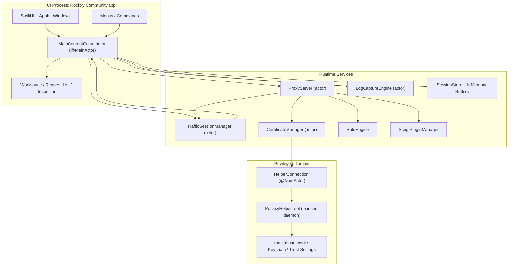
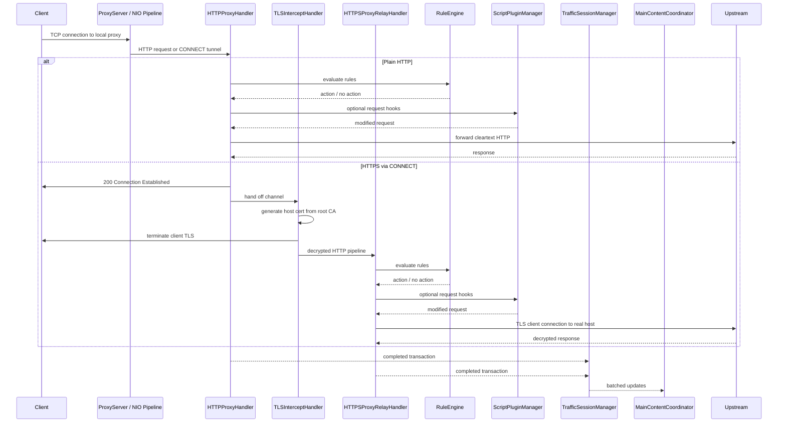
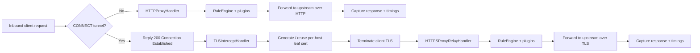
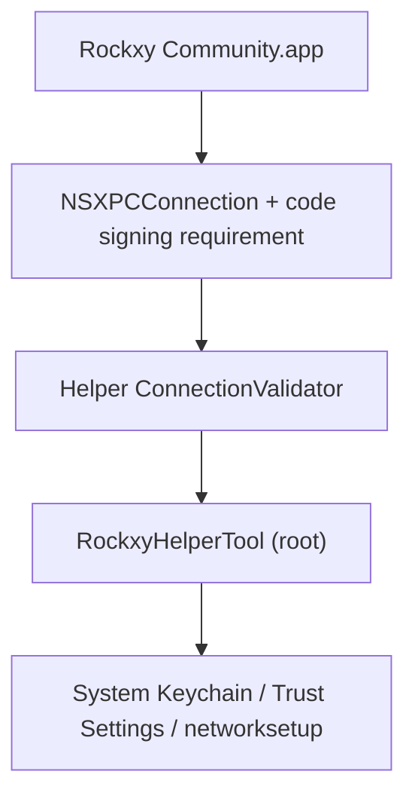

<p align="center">
  
</p>

<h1 align="center">Rockxy</h1>

<p align="center">
  <a href="README.md">English</a> |
  <a href="README.vi.md">Tiếng Việt</a> |
  <a href="README.zh.md">中文</a> |
  <a href="README.ja.md">日本語</a> |
  <a href="README.ko.md">한국어</a> |
  <a href="README.fr.md">Français</a> |
  <a href="README.de.md">Deutsch</a>
</p>

<p align="center">
  <strong>macOS 向けオープンソース HTTP デバッグプロキシ。</strong>
</p>

<p align="center">
  HTTP/HTTPS トラフィックの傍受、API リクエストの検査、WebSocket 接続のデバッグ、GraphQL クエリの解析が可能です。<br>
  Swift で構築。SwiftNIO、SwiftUI、AppKit を使用しています。
</p>

<p align="center">
  <a href="#"></a>
  <a href="#"></a>
  <a href="LICENSE"></a>
  <a href="CONTRIBUTING.md"></a>
  <a href="https://github.com/sponsors/LocNguyenHuu"></a>
</p>

<p align="center">
  
</p>

---

> **ステータス**: アクティブ開発中。コアプロキシエンジン、HTTPS インターセプト、ルールシステム、プラグインエコシステム、Inspector UI は動作しています。進捗は [CHANGELOG.md](CHANGELOG.md) を参照してください。

<!-- BEGIN GENERATED: latest-release -->
## 最新リリース

**v0.5.0** — 2026-04-10

### 追加

- Security hardening, docs honesty, trust recovery, helper lifecycle, architecture cleanup

### 修正

- Wire JSONInspectorView into response body tab, deterministic tab selection
- Code review follow-up — thread safety, fail-closed backup, honest docs, UI polish

### 変更

- Sync changelog release surfaces

完全なリリース履歴は [CHANGELOG.md](CHANGELOG.md) を参照してください。
<!-- END GENERATED: latest-release -->

## 機能

### ネットワークトラフィックのキャプチャ
- **HTTP/HTTPS プロキシサーバー** — SwiftNIO ベースのインターセプトプロキシ（CONNECT トンネル対応）
- **SSL/TLS インターセプト** — ホスト単位の証明書自動生成による MITM 復号（LRU キャッシュ最大約 1000）
- **WebSocket デバッグ** — 双方向フレームのキャプチャと検査
- **GraphQL 検出** — operation 名の自動抽出とクエリ検査
- **プロセス識別** — `lsof` によるポートマッピングと User-Agent 解析で、各リクエストの送信元アプリ（Safari、Chrome、curl、Slack、Postman など）を特定

### リクエスト/レスポンス Inspector
- **JSON ビューア** — 折りたたみ可能なツリー表示とシンタックスハイライト
- **Hex Inspector** — 非テキストコンテンツのバイナリ body 表示
- **Timing ウォーターフォール** — DNS、TCP 接続、TLS ハンドシェイク、TTFB、転送フェーズをリクエスト単位で可視化
- **ヘッダー、Cookie、クエリパラメータ、認証情報** — タブ式 Inspector（raw 表示オプション付き）
- **カスタムヘッダー列** — 追加のリクエスト/レスポンスヘッダーを列として表示

### ワークスペースと生産性
- **ワークスペースタブ** — 独立したフィルターとフォーカスを持つキャプチャワークスペース
- **お気に入り** — よく使うホストやリクエストをピン留めして素早くアクセス
- **タイムラインビュー** — 選択したサブセットのリクエストシーケンスを時系列表示

### トラフィック操作と Mock API
- **Map Local** — ローカルファイルからレスポンスを返す（サーバーコードを変更せずに API レスポンスをモック）
- **Map Remote** — リクエストを別の host/port/path にリダイレクト（API ゲートウェイのテスト、staging と production の切り替え）
- **Breakpoints** — リクエストまたはレスポンスを途中で一時停止し、URL/ヘッダー/body/ステータスを編集してから転送または中断
- **Block List** — URL パターン（ワイルドカードまたは正規表現）でリクエストをブロック
- **Throttle** — リクエスト転送を遅延させて低速ネットワークをシミュレーション
- **Modify Headers** — HTTP ヘッダーの追加、削除、置換をリアルタイムで実行
- **Allow List** — 指定したドメインやアプリのみキャプチャしてノイズを削減
- **Bypass Proxy** — システムプロキシ有効時に特定ホストをプロキシから除外
- **SSL Proxying ルール** — ドメイン単位の TLS インターセプト制御

### デバッグと分析
- **OSLog 連携** — macOS のシステムログをキャプチャし、タイムスタンプでネットワークリクエストと関連付け
- **並列比較** — キャプチャした 2 つのリクエスト/レスポンスを横並びで比較
- **リクエストタイムライン** — リクエストシーケンスとタイミングのウォーターフォール表示
- **認証情報のマスキング** — キャプチャログ内の Bearer トークンとパスワードを自動的にマスク

### 拡張性
- **JavaScript プラグインシステム** — カスタムスクリプトで Rockxy を拡張（JavaScriptCore ランタイム、5 秒タイムアウトのサンドボックス）
- **リクエスト/レスポンスフック** — プラグインがプロキシパイプライン内のトラフィックを検査・変更可能
- **プラグイン設定 UI** — プラグインマニフェストから設定フォームを自動生成
- **エクスポート形式** — cURL、HAR、raw HTTP、JSON としてコピー
- **Compose + リプレイ** — リクエストを編集して再送信、またはキャプチャしたトラフィックを再生
- **インポートレビュー** — HAR/セッションのインポート前に内容を検証

### macOS ネイティブ体験
- **ネイティブ SwiftUI + AppKit** — Electron なし、Web View なし、クロスプラットフォームの妥協なし
- **NSTableView リクエスト一覧** — 仮想スクロールにより 100k+ 件のキャプチャでもラグなし
- **実アプリアイコン** — `NSWorkspace` の bundle ID ルックアップで解決
- **システムプロキシ連携** — 特権 helper デーモンによりパスワード不要のプロキシ設定（SMAppService）
- **ダークモード** — システムのセマンティックカラーによる完全対応
- **キーボードショートカット** — Cmd+Shift+R（開始）、Cmd+.（停止）、Cmd+K（クリア）など

## ユースケース

- **iOS / macOS アプリのデバッグ** — Simulator や実機で動作するアプリの API 呼び出しを検査
- **REST API テスト** — 別のツールに切り替えることなく、正確なリクエスト/レスポンスのペアを確認
- **GraphQL デバッグ** — operation 名、変数、レスポンスを一目で確認
- **Mock API レスポンス** — エンドポイントにローカルファイルをマップし、オフライン開発やエッジケースのテストに活用
- **WebSocket 検査** — リアルタイム接続（チャットアプリ、ライブフィード、ゲームプロトコル）のデバッグ
- **パフォーマンスプロファイリング** — 遅いエンドポイント、大きなペイロード、冗長な API 呼び出しを特定
- **SSL/TLS デバッグ** — ドメイン単位のインターセプト制御で暗号化された HTTPS トラフィックを検査
- **ネットワークトラフィックの記録** — HTTP セッションをキャプチャしてリプレイし、回帰テストに活用
- **API のリバースエンジニアリング** — サードパーティアプリの未公開 API の挙動を把握
- **CI/CD 連携** — 自動 API コントラクトテスト用のヘッドレスプロキシ（予定）

## Rockxy vs Proxyman vs Charles Proxy

オープンソースの Proxyman 代替、または Charles Proxy 代替をお探しですか？ Rockxy との比較は以下の通りです。

| 機能 | Rockxy | Proxyman | Charles Proxy |
|---------|--------|----------|---------------|
| **ライセンス** | オープンソース（AGPL-3.0） | プロプライエタリ（フリーミアム） | プロプライエタリ（有料） |
| **価格** | 無料 | 無料枠 + $69/年 | $50 買い切り |
| **プラットフォーム** | macOS | macOS、iOS、Windows | macOS、Windows、Linux |
| **ソースコード** | GitHub で完全公開 | 非公開 | 非公開 |
| **技術** | Swift + SwiftNIO（ネイティブ） | Swift + AppKit（ネイティブ） | Java（クロスプラットフォーム） |
| **HTTP/HTTPS インターセプト** | はい | はい | はい |
| **WebSocket デバッグ** | はい | はい | はい |
| **GraphQL 検出** | はい（自動検出） | はい | いいえ |
| **Map Local** | はい | はい | はい |
| **Map Remote** | はい | はい | はい |
| **Breakpoints** | はい | はい | はい |
| **Block List** | はい | はい | はい |
| **Modify Headers** | はい | はい | はい（rewrite） |
| **Throttle / Network Conditions** | はい | はい | はい |
| **リクエスト差分** | はい（並列表示） | はい | いいえ |
| **JavaScript プラグイン** | はい（JSCore サンドボックス） | はい（Scripting） | いいえ |
| **リクエストリプレイ** | はい（Repeat + Edit） | はい | はい |
| **HAR インポート/エクスポート** | はい | はい | いいえ（独自形式） |
| **OSLog 連携** | はい | いいえ | いいえ |
| **プロセス識別** | はい（アプリ別リクエスト判定） | はい | いいえ |
| **JSON ツリービューア** | はい | はい | はい |
| **Hex Inspector** | はい | はい | はい |
| **Timing ウォーターフォール** | はい | はい | はい |
| **仮想スクロール（100k+ 行）** | はい（NSTableView） | はい | 大量データで低速 |
| **特権 helper（sudo 不要）** | はい（SMAppService） | はい | いいえ（都度プロンプト） |
| **ダークモード** | はい | はい | 一部 |
| **セルフホスト / 監査可能** | はい | いいえ | いいえ |
| **コミュニティ貢献** | PR 受付中 | いいえ | いいえ |

**Rockxy を選ぶ理由**
- ライセンス制限のない**無料のオープンソース** HTTP デバッグプロキシが欲しい
- トラフィックを傍受するツールの**ソースコードを監査**したい
- **機能の追加**やワークフローに合わせたカスタマイズをしたい
- macOS アプリのログとネットワークトラフィックを紐付ける **OSLog 連携**が必要
- Java ランタイムのオーバーヘッドなしに**ネイティブ macOS 体験**を求める

## 要件

- macOS 14.0+（Sonoma 以降）
- Xcode 16+
- Swift 5.9

## クイックスタート

```bash
git clone https://github.com/LocNguyenHuu/Rockxy.git
cd Rockxy
xcodebuild -project Rockxy.xcodeproj -scheme Rockxy -configuration Debug build
```

または Xcode で `Rockxy.xcodeproj` を開いて実行してください。

初回起動時、Welcome ウィンドウで以下の手順を案内します：
1. ルート CA 証明書の生成と信頼設定
2. システムプロキシ制御用の特権 helper ツールをインストール
3. システムプロキシを有効化
4. プロキシサーバーを起動

## アーキテクチャ

### システム概要

Rockxy は 3 つの信頼・実行ドメインに分かれています。

1. **UI + オーケストレーション層** — SwiftUI/AppKit のウィンドウ、Inspector、メニュー、および `MainContentCoordinator`
2. **プロキシ/ランタイム層** — SwiftNIO チャネルハンドラ、証明書発行、リクエスト変換、ストレージ、プラグイン
3. **特権 helper 層** — 昇格権限が必要なシステムレベルのプロキシおよび証明書操作のみを担当する launchd デーモン

設計目標は、パケット処理をメインスレッドから分離し、特権操作をアプリプロセスの外に配置し、明示的な actor または `@MainActor` 境界を通じてユーザー向けの状態を同期することです。

### コンポーネントマップ



### ランタイム層

| レイヤー | 主な型 | 役割 |
|-------|------------|----------------|
| **Presentation** | `MainContentCoordinator`、`ContentView`、Inspector/リクエスト一覧/サイドバー view | ユーザー向け状態の保持、コマンドのルーティング、プロキシ/ログデータの SwiftUI/AppKit へのバインド |
| **Capture / transport** | `ProxyServer`、`HTTPProxyHandler`、`TLSInterceptHandler`、`HTTPSProxyRelayHandler` | プロキシトラフィックの受信、CONNECT 処理、MITM TLS インターセプト、上流への転送 |
| **Mutation / policy** | `RuleEngine`、`BreakpointRequestBuilder`、`AllowListManager`、`NoCacheHeaderMutator`、`MapLocalDirectoryResolver` | 転送または保存の前にリクエスト/レスポンスルールと現在のデバッグポリシーを適用 |
| **Certificate / trust** | `CertificateManager`、`RootCAGenerator`、`HostCertGenerator`、`CertificateStore`、`KeychainHelper` | ルート CA の生成と永続化、ホスト証明書のキャッシュ、信頼状態の検証、helper/アプリ経由の信頼インストール |
| **Storage / session** | `TrafficSessionManager`、`LogCaptureEngine`、`SessionStore`、インメモリバッファ | ライブデータのバッファリング、選択状態の SQLite への永続化、UI へのバッチ更新 |
| **Observability / analysis** | GraphQL 検出、content-type 検出、ログ相関 | トランスポート処理と並行またはその後にキャプチャデータを補強 |
| **特権システム統合** | `HelperConnection`、`RockxyHelperTool`、共有 XPC プロトコル | 明示的な信頼チェックに基づくシステムプロキシ設定と特権証明書操作の適用 |

### プロキシリクエストのライフサイクル



### HTTP vs HTTPS フロー



### 並行性モデル

- `ProxyServer` は bind や shutdown などのライフサイクル遷移を管理する actor です。
- NIO チャネルハンドラは event-loop スレッド上で動作し、必要な場合のみ actor 隔離サービスにブリッジします。
- `CertificateManager`、`TrafficSessionManager`、および関連サービスは、手動ロックの代わりに actor 隔離を使用して長寿命の共有状態を管理します。
- `MainContentCoordinator` は SwiftUI/AppKit の同期境界であるため `@MainActor` です。
- 高トラフィック時のメインスレッド負荷を避けるため、UI への配信はトランザクション単位ではなくバッチ化されています。

### コアサブシステム

| サブシステム | 場所 | 役割 |
|-----------|----------|--------------|
| **Proxy Engine** | `Core/ProxyEngine/` | SwiftNIO の `ServerBootstrap`、接続単位のチャネルパイプライン、CONNECT 処理、TLS ハンドオフ、HTTP/HTTPS 転送 |
| **Certificate** | `Core/Certificate/` | ルート CA のライフサイクル、ホスト証明書の発行、信頼チェック、ディスク + Keychain への永続化、ホスト証明書キャッシュ |
| **Rule Engine** | `Core/RuleEngine/` | block、map local、map remote、throttle、modify headers、breakpoint の順序付きルール評価 |
| **Traffic Capture** | `Core/TrafficCapture/` | セッションバッチ処理、allow-list ポリシー、リプレイ対応、UI へのプロキシ状態の引き渡し |
| **Storage** | `Core/Storage/` | SQLite による永続化、インメモリセッション/ログバッファ、大きな body のオフロード |
| **Detection / enrichment** | `Core/Detection/` | GraphQL 検出、content type 検出、API エンドポイントのグルーピング |
| **Plugins** | `Core/Plugins/` | JavaScriptCore ベースのリクエスト/レスポンスフック実行とプラグインメタデータ/設定のサポート |
| **Helper Tool** | `RockxyHelperTool/`、`Shared/` | プロキシオーバーライド、バイパスドメイン設定、証明書のインストール/削除を行う特権 XPC サービス |

### セキュリティアーキテクチャ

> **脆弱性の報告:** セキュリティの問題を発見した場合は、非公開で報告してください。手順は [SECURITY.md](SECURITY.md) を参照してください。

Rockxy は TLS を終端し、機微なトラフィックを保存し、root 権限の helper と通信するため、多層セキュリティモデルを採用しています。



#### セキュリティ境界

| 境界 | リスク | 現行の対策 |
|----------|------|-----------------|
| **App ↔ helper** | 信頼されていないアプリによる特権プロキシ/証明書操作の試行 | `NSXPCConnection` による code-signing 要件、helper 側の接続検証と証明書チェーン比較 |
| **TLS インターセプト** | 無効または古いルート CA による信頼の崩壊や紛らわしい MITM 状態 | 明示的なルート CA ライフサイクル、信頼チェック、ルート指紋追跡、アクティブなルートからのみホスト証明書を発行 |
| **リクエスト body の処理** | 巨大なリクエスト/レスポンス body によるメモリ枯渇 | リクエスト body 100 MB 制限（413 で拒否）、URI 長 8 KB 制限（414 で拒否）、WebSocket フレーム制限（10 MB/フレーム、100 MB/接続） |
| **ルールによるローカルファイル配信** | Map Local ディレクトリルールを通じたパストラバーサルやシンボリックリンク脱出 | fd ベースのファイル読み込み（TOCTOU を排除）、シンボリックリンク解決、ルートパス内の制約チェック |
| **ルール正規表現パターン** | 病的な正規表現による ReDoS でプロキシがフリーズ | コンパイル時の正規表現検証、プリコンパイルパターンキャッシュ、500 文字のパターン長制限、8 KB の入力上限 |
| **ブレークポイントでのリクエスト編集** | URL/ヘッダー/body 編集後の不正なリクエスト転送 | `BreakpointRequestBuilder` による一元的なリクエスト再構築、authority の保持、scheme の正規化、content-length の再計算 |
| **プラグイン実行** | スクリプトによる安全でない・非決定的なトラフィック変更 | JavaScriptCore ブリッジ、制限されたフック API、タイムアウト強制、プラグイン ID/キーの検証、ファイルシステム/ネットワークへの直接アクセス不可 |
| **保存トラフィック** | 機微なリクエスト/レスポンス body の長期保持や弱いパーミッション | インメモリバッファ + ディスク/SQLite 永続化、0o600 パーミッションでの大容量 body オフロード、読み込み/削除時のパス制約、ログ内の認証情報マスキング |
| **ヘッダーインジェクション** | MapRemote ホストヘッダー操作による CRLF インジェクション | 転送前にヘッダー値のサニタイズで制御文字を除去 |
| **Helper 入力検証** | networksetup に渡される不正なドメインやサービス名 | ASCII 限定のバイパスドメイン検証、サービス名のサニタイズ、プロキシタイプのホワイトリスト、ドメイン数の上限 |

#### Helper ツールの信頼モデル

Helper は `SMAppService.daemon()` で登録される launchd デーモン（`com.amunx.Rockxy.HelperTool`）として動作します。これにより、アプリプロセスからの `networksetup` のパスワードプロンプトを繰り返すことなく、プロキシオーバーライドと一部の証明書操作を実行できます。

多層防御には以下が含まれます：

- アプリ側の特権 XPC 接続セットアップ
- `ConnectionValidator` による helper 側の呼び出し元検証（ハードコードされた bundle identifier）
- code-signing 要件の適用（`anchor apple generic`）
- bundle ID やチーム ID 文字列だけに依存しない証明書チェーン比較
- 状態変更操作（プロキシ変更、証明書インストール）の helper 側レート制限
- すべての helper パラメータ（バイパスドメイン、サービス名、プロキシタイプ）の入力検証
- 制限付きパーミッション（0o600）での一時ファイルのアトミック作成
- クラッシュリカバリ用の明示的なプロキシバックアップ/リストアパス

#### 証明書の信頼モデル

- ルート CA の生成と永続化は `CertificateManager` が担当します。
- アプリがルート CA の作成、読み込み、信頼状態の検証を管理します。
- helper は特権 Keychain/システムインストール操作を補助しますが、信頼にはアプリから参照可能な検証パスがあります。
- ホスト証明書は現在のルートからオンデマンドで生成され、高コストな発行の繰り返しを避けるためキャッシュされます。
- ルート指紋の追跡により、古い証明書をクリーンアップし、「古い Rockxy ルートが複数インストールされている」状態の蓄積を防ぎます。

#### 実運用上の注意

- Rockxy は機微なトラフィックにアクセスする開発ツールです。必要以上にシステムプロキシのオーバーライドを有効化したままにしないでください。
- ルート CA のインストールにより、そのルートを信頼するクライアントでのみ HTTPS インターセプトが有効になります。
- 保存セッション、エクスポート、プラグインコードは、機微なプロジェクト成果物として扱うべきです。

## プロジェクト構成

```
Rockxy/
├── Core/
│   ├── ProxyEngine/       # SwiftNIO server, HTTP/TLS/WS handlers, helper client
│   ├── Certificate/       # X.509 generation, root CA, Keychain integration
│   ├── RuleEngine/        # Rule matching and action execution
│   ├── LogEngine/         # OSLog + process log capture and correlation
│   ├── TrafficCapture/    # Session manager, system proxy, request replay
│   ├── Storage/           # SQLite store, in-memory buffer, settings
│   ├── Detection/         # Content type, GraphQL, API grouping
│   ├── Plugins/           # Plugin discovery, JS runtime, manifest parsing
│   ├── Services/          # Window management, notifications
│   └── Utilities/         # Body decoder, input validation, formatters
├── Views/
│   ├── Main/              # Main window, coordinator extensions
│   ├── RequestList/       # NSTableView-backed request list (100k+ rows)
│   ├── Inspector/         # Request/response tabs, JSON tree, hex display
│   ├── Sidebar/           # Domain tree, app grouping, favorites
│   ├── Toolbar/           # Status indicators, control buttons
│   ├── Welcome/           # Setup wizard, certificate checklist
│   ├── Settings/          # General, Proxy, SSL Proxying, Privacy tabs
│   ├── Rules/             # Rule list, add/edit dialogs
│   ├── Compose/           # Edit and Repeat request editor
│   ├── Diff/              # Side-by-side transaction comparison
│   ├── Scripting/         # Code editor, plugin console
│   ├── Timeline/          # Request waterfall visualization
│   ├── Breakpoint/        # Breakpoint edit window
│   └── Components/        # Reusable: StatusCodeBadge, FilterPill, etc.
├── Models/
│   ├── Network/           # HTTPTransaction, Request/Response, TimingInfo, WebSocket
│   ├── Log/               # LogEntry, LogLevel, LogSource
│   ├── Certificate/       # RootCA, RootCAStatusSnapshot
│   ├── Rules/             # ProxyRule, RuleAction
│   ├── Settings/          # AppSettings, ProxySettings
│   ├── UI/                # SidebarItem, FilterState
│   └── Plugins/           # PluginInfo, PluginConfig, PluginManifest
├── ViewModels/
├── Extensions/
└── Theme/

RockxyHelperTool/              # Privileged launchd daemon (runs as root)
├── main.swift                 # Entry point, XPC listener
├── HelperDelegate.swift       # Connection validation, disconnect handling
├── HelperService.swift        # Protocol impl, rate limiting, port validation
├── ConnectionValidator.swift  # Certificate chain extraction & comparison
├── CrashRecovery.swift        # Backup/restore proxy settings
└── ProxyConfigurator.swift    # networksetup wrapper

Shared/
└── RockxyHelperProtocol.swift # @objc XPC protocol (app ↔ helper)

RockxyTests/                   # Swift Testing framework (@Suite, @Test, #expect)
├── Core/                      # Rule engine, certificate, plugin, storage, proxy tests
├── ViewModels/                # WelcomeViewModel tests
└── Helpers/                   # TestFixtures factory methods

docs/                          # Documentation (Mintlify format)
.github/workflows/             # CI: lint → build (arm64 + x86_64) → release
```

## 技術スタック

| レイヤー | 技術 |
|-------|-----------|
| UI フレームワーク | SwiftUI + AppKit（NSTableView、NSViewRepresentable） |
| ネットワーク | [SwiftNIO](https://github.com/apple/swift-nio) 2.95 + [SwiftNIO SSL](https://github.com/apple/swift-nio-ssl) 2.36 |
| 証明書 | [swift-certificates](https://github.com/apple/swift-certificates) 1.18 + [swift-crypto](https://github.com/apple/swift-crypto) 4.2 |
| データベース | [SQLite.swift](https://github.com/stephencelis/SQLite.swift) 0.16 |
| 並行性 | Swift Actors、構造化並行性、@MainActor |
| プラグイン | JavaScriptCore（macOS 内蔵フレームワーク） |
| Helper IPC | XPC Services + SMAppService（macOS 13+） |
| テスト | Swift Testing framework（@Suite、@Test、#expect） |
| CI/CD | GitHub Actions（SwiftLint → arm64/x86_64 並列ビルド → release） |

## ソースからビルド

### 開発ビルド

```bash
git clone https://github.com/LocNguyenHuu/Rockxy.git
cd Rockxy
./scripts/setup-developer.sh   # ローカル署名用の Configuration/Developer.xcconfig を生成
xcodebuild -project Rockxy.xcodeproj -scheme Rockxy -configuration Debug build
```

### リリースビルド

```bash
# Apple Silicon (M1/M2/M3/M4)
xcodebuild -project Rockxy.xcodeproj -scheme Rockxy -configuration Release -arch arm64 build

# Intel
xcodebuild -project Rockxy.xcodeproj -scheme Rockxy -configuration Release -arch x86_64 build
```

### テストの実行

```bash
# 全テスト
xcodebuild -project Rockxy.xcodeproj -scheme Rockxy test

# 特定のテストクラス
xcodebuild -project Rockxy.xcodeproj -scheme Rockxy test -only-testing:RockxyTests/CertificateTests

# 特定のテストメソッド
xcodebuild -project Rockxy.xcodeproj -scheme Rockxy test -only-testing:RockxyTests/RuleEngineTests/testWildcardMatching
```

### Lint とフォーマット

```bash
brew install swiftlint swiftformat

swiftlint lint --strict    # 違反ゼロ必須
swiftformat .              # 自動フォーマット
```

### Helper ツールに関する注意

`RockxyHelperTool/` または `Shared/RockxyHelperProtocol.swift` のコードを変更した場合、アプリの再ビルドだけでは反映されません。古い helper をアンインストールし、アプリの Helper Manager から新しい helper を再インストールする必要があります。

## 設計判断

### URLSession ではなく SwiftNIO を使う理由

URLSession は高レベルの HTTP クライアントです。Rockxy は接続の受け付け、HTTP の解析、CONNECT トンネルを介した MITM TLS インターセプト、トラフィックの転送が可能な低レベル TCP サーバーが必要であり、すべてソケットの直接制御が求められます。SwiftNIO は、これを純粋な Swift で実現するイベント駆動のノンブロッキング I/O 基盤を提供します。

### リクエスト一覧に NSTableView を使う理由

SwiftUI の `List` は 100k+ 行の仮想スクロールに対応できません。リクエスト一覧では `NSTableView` を `NSViewRepresentable` でラップし、トラフィック量に関係なく O(1) のスクロール性能を実現しています。

### 特権 helper デーモンの理由

macOS では `networksetup` の呼び出しごとに管理者認証が必要です。helper ツール（`SMAppService.daemon()`）は root として動作し、証明書チェーン比較で呼び出し元を検証することで、セキュリティを維持しつつパスワードプロンプトの繰り返しを排除します。

### Actor ベースの並行性モデル

プロキシサーバー、セッションマネージャー、証明書マネージャーはすべて Swift actor です。手動ロックなしでデータ競合を排除します。coordinator は actor 隔離の状態をバッチ更新（250ms ごと）で `@MainActor` にブリッジし、SwiftUI から利用可能にします。

### プラグインのサンドボックス

JavaScript プラグインは、制御されたブリッジ API（`$rockxy`）を介して JavaScriptCore 上で動作します。各スクリプト実行には 5 秒のタイムアウトがあります。プラグインはリクエストの検査と変更が可能ですが、ファイルシステムやネットワークに直接アクセスすることはできません。

## パフォーマンス

- **100k+ リクエスト** — NSTableView の仮想スクロールとセル再利用により UI のラグなし
- **リングバッファ退避** — 50k トランザクション到達時に最古の 10% を SQLite へ移動または破棄
- **body のオフロード** — 1MB 超のレスポンス/リクエスト body はディスクに保存し、オンデマンドで読み込み
- **UI バッチ更新** — プロキシのトランザクションを 250ms または 50 件ごとにバッチ化して UI に配信
- **文字列のパフォーマンス** — 大きな body には `String.count`（O(n)）ではなく `NSString.length`（O(1)）を使用
- **ログバッファ** — 100k 件をインメモリに保持、超過分は SQLite へ
- **並列ビルド** — `System.coreCount` の NIO event loop スレッド

## ストレージ

| データ | 仕組み | 場所 |
|------|-----------|----------|
| ユーザー設定 | UserDefaults | `AppSettingsStorage` |
| アクティブセッション | インメモリリングバッファ | `InMemorySessionBuffer` |
| 保存セッション | SQLite | `SessionStore` |
| ルート CA 秘密鍵 | macOS Keychain | `KeychainHelper` |
| ルール | JSON ファイル | `RuleStore` |
| 大きな body | ディスクファイル | `~/Library/Application Support/Rockxy/bodies/` |
| ログエントリ | SQLite | `SessionStore`（log_entries テーブル） |
| プロキシバックアップ | Plist（0o600） | `/Library/Application Support/com.amunx.Rockxy/proxy-backup.plist` |
| プラグイン | JS ファイル + manifest | `~/Library/Application Support/Rockxy/Plugins/` |

## コードスタイル

詳細なルールは `.swiftlint.yml` と `.swiftformat` に定義されています。主なポイント：

- 4 スペースインデント、目標行幅 120 文字
- すべての宣言に明示的なアクセス制御
- 強制アンラップ（`!`）や強制キャスト（`as!`）は禁止 — `guard let`、`if let`、`as?` を使用
- ログは OSLog のみ。`print()` は使用禁止
- ユーザー向け文字列には `String(localized:)`
- コミットメッセージは [Conventional Commits](https://www.conventionalcommits.org/) に準拠

### ファイルサイズ制限

| 指標 | Warning | Error |
|--------|---------|-------|
| ファイル長 | 1200 行 | 1800 行 |
| 型本体 | 1100 行 | 1500 行 |
| 関数本体 | 160 行 | 250 行 |
| サイクロマティック複雑度 | 40 | 60 |

上限に近づいた場合は、ドメインロジックごとに `TypeName+Category.swift` の extension ファイルに分割してください。

## CI/CD

GitHub Actions ワークフロー（手動ディスパッチ、オプションの channel パラメータ付き）：

1. **Lint** — macOS 14 で `swiftlint lint --strict`
2. **Build** — Xcode 16 で arm64 と x86_64 のリリースビルドを並列実行
3. **Artifacts** — 署名済みビルド成果物を配布用にアップロード

## ロードマップ

### リリース済み

- [x] HAR ファイルのインポートとエクスポート
- [x] リクエストリプレイ（Repeat および Edit and Repeat）
- [x] ネイティブ `.rockxysession` セッションファイル（保存、開く、メタデータ）
- [x] GraphQL-over-HTTP の検出と検査
- [x] JavaScript スクリプティング（スクリプトの作成、編集、テスト、有効化/無効化）
- [x] リクエストの横並び比較
- [x] セキュリティ強化（body サイズ制限、正規表現検証、パストラバーサル対策、入力検証）
- [x] キャプチャログ内の認証情報マスキング

### 予定

- [ ] エラーグルーピングと分析ダッシュボード（HTTP 4xx/5xx のクラスタリング、レイテンシメトリクス）
- [ ] HTTP/2 および HTTP/3 対応
- [ ] シーケンス記録（依存リクエストのチェーンをリプレイ）
- [ ] リモートデバイスプロキシ（USB/Wi-Fi 経由の iOS デバイスデバッグ）
- [ ] CI/CD パイプライン統合向けヘッドレスモード
- [ ] gRPC / Protocol Buffers の検査
- [ ] ネットワーク条件シミュレーション（レイテンシ、パケットロス、帯域制限）

## コントリビュート

コントリビュートを歓迎します。バグ修正、新機能、ドキュメント、UX フィードバックなど、あらゆる貢献が Rockxy をより良くします。参加前に [Code of Conduct](CODE_OF_CONDUCT.md) をお読みください。

**始め方：**

1. リポジトリを fork して clone
2. `develop` から機能ブランチを作成（`feat/your-change` または `fix/your-fix`）
3. 変更を加え、`swiftlint lint --strict` をパスすることを確認
4. 変更内容と理由を明確に記述した Pull Request を作成

詳細なセットアップ手順、コードスタイル、コミット規約、PR チェックリストの全体については [CONTRIBUTING.md](CONTRIBUTING.md) を参照してください。

**貢献の方法：**

- **コード** — バグ修正、新機能、パフォーマンス改善
- **テスト** — テストカバレッジの拡大、エッジケースの追加、fixtures の改善
- **ドキュメント** — `docs/` の改善、誤字修正、サンプルの追加
- **バグ報告** — macOS バージョンと再現手順を含む明確なイシューの提出
- **UX フィードバック** — Inspector、サイドバー、ツールバーのワークフロー改善提案

初心者向けの課題は GitHub で [`good first issue`](https://github.com/LocNguyenHuu/Rockxy/labels/good%20first%20issue) ラベルが付いています。

Pull Request の提出をもって、[Contributor License Agreement](CLA.md) に同意したものとみなされます。

## サポート

- [GitHub Sponsors](https://github.com/sponsors/LocNguyenHuu) — Rockxy の開発を支援
- [GitHub Issues](https://github.com/LocNguyenHuu/Rockxy/issues) — バグ報告と機能リクエスト
- [GitHub Discussions](https://github.com/LocNguyenHuu/Rockxy/discussions) — 質問とコミュニティ交流
- **Email** — [rockxyapp@gmail.com](mailto:rockxyapp@gmail.com)
- **セキュリティの問題** — 責任ある開示については [SECURITY.md](SECURITY.md) を参照

## ライセンス

[GNU Affero General Public License v3.0](LICENSE) — Copyright 2024–2026 Rockxy Contributors.

---

**Swift、SwiftNIO、SwiftUI、AppKit で構築。**
