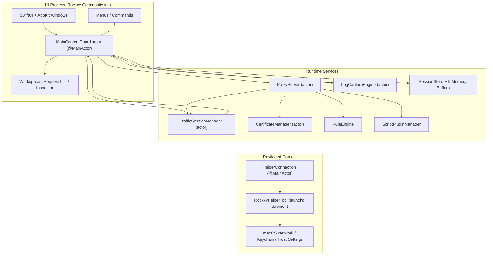
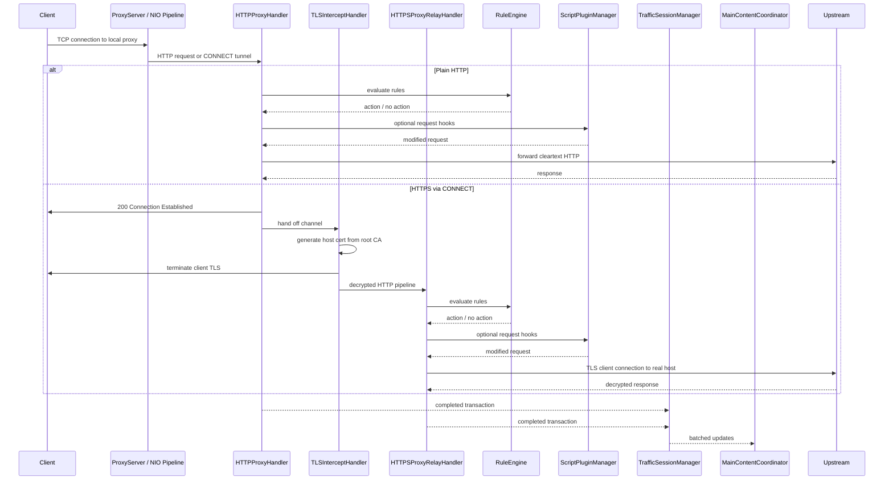
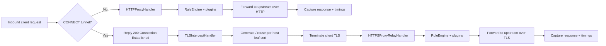
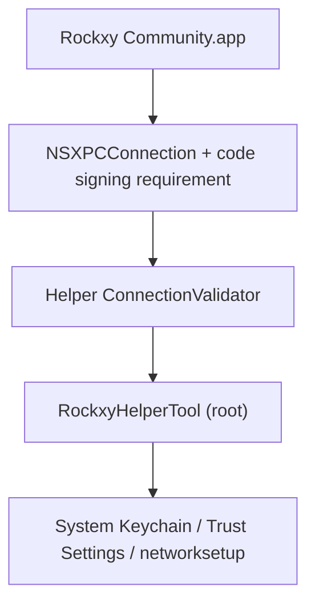

<p align="center">
  
</p>

<h1 align="center">Rockxy</h1>

<p align="center">
  <a href="README.md">English</a> |
  <a href="README.vi.md">Tiếng Việt</a> |
  <a href="README.zh.md">中文</a> |
  <a href="README.ja.md">日本語</a> |
  <a href="README.ko.md">한국어</a> |
  <a href="README.fr.md">Français</a> |
  <a href="README.de.md">Deutsch</a>
</p>

<p align="center">
  <strong>macOS용 오픈소스 HTTP 디버깅 프록시.</strong>
</p>

<p align="center">
  HTTP/HTTPS 트래픽을 가로채고, API 요청을 검사하며, WebSocket 연결을 디버깅하고, GraphQL 쿼리를 분석합니다.<br>
  Swift로 개발되었으며, SwiftNIO, SwiftUI, AppKit을 사용합니다.
</p>

<p align="center">
  <a href="#"></a>
  <a href="#"></a>
  <a href="LICENSE"></a>
  <a href="CONTRIBUTING.md"></a>
  <a href="https://github.com/sponsors/LocNguyenHuu"></a>
</p>

<p align="center">
  
</p>

---

> **상태**: 활발히 개발 중입니다. 핵심 프록시 엔진, HTTPS 가로채기, 규칙 시스템, 플러그인 생태계, Inspector UI가 동작합니다. 진행 상황은 [CHANGELOG.md](CHANGELOG.md)를 참고하세요.

<!-- BEGIN GENERATED: latest-release -->
## 최신 릴리스

**v0.5.0** — 2026-04-10

### 추가

- Security hardening, docs honesty, trust recovery, helper lifecycle, architecture cleanup

### 수정

- Wire JSONInspectorView into response body tab, deterministic tab selection
- Code review follow-up — thread safety, fail-closed backup, honest docs, UI polish

### 변경

- Sync changelog release surfaces

전체 릴리스 기록은 [CHANGELOG.md](CHANGELOG.md)에서 확인하세요.
<!-- END GENERATED: latest-release -->

## 기능

### 네트워크 트래픽 캡처
- **HTTP/HTTPS 프록시 서버** — SwiftNIO 기반 인터셉팅 프록시, CONNECT 터널 지원
- **SSL/TLS 가로채기** — 호스트별 자동 생성 인증서를 이용한 MITM 복호화 (LRU 캐시 ~1000)
- **WebSocket 디버깅** — 양방향 프레임 캡처 및 검사
- **GraphQL 감지** — operation 이름 자동 추출 및 쿼리 검사
- **프로세스 식별** — `lsof` 포트 매핑 + User-Agent 파싱으로 각 요청의 출처 앱(Safari, Chrome, curl, Slack, Postman 등) 확인

### 요청 & 응답 Inspector
- **JSON 뷰어** — 접기/펼치기 트리 뷰와 구문 강조
- **Hex Inspector** — 텍스트가 아닌 바이너리 body 표시
- **Timing waterfall** — DNS, TCP 연결, TLS 핸드셰이크, TTFB, 전송 단계를 요청별로 시각화
- **Headers, cookies, query params, auth** — 탭 방식 Inspector와 raw 보기 옵션
- **사용자 지정 헤더 열** — 추가 요청/응답 헤더를 열로 표시

### 워크스페이스 & 생산성
- **워크스페이스 탭** — 독립적인 필터와 포커스를 가진 별도 캡처 워크스페이스
- **즐겨찾기** — 자주 사용하는 호스트나 요청을 고정하여 빠르게 접근
- **타임라인 뷰** — 선택한 요청 집합의 시각적 시퀀스 타임라인

### 트래픽 조작 & Mock API
- **Map Local** — 로컬 파일로 응답 제공 (서버 코드 수정 없이 Mock API 응답 가능)
- **Map Remote** — 요청을 다른 host/port/path로 리다이렉트 (API 게이트웨이 테스트, staging ↔ production 전환)
- **Breakpoints** — 요청 또는 응답을 도중에 일시 중지하고, URL/headers/body/status를 수정한 뒤 전달 또는 중단
- **Block List** — URL 패턴(와일드카드 또는 정규식)으로 요청 차단
- **Throttle** — 요청 전달 지연으로 느린 네트워크 시뮬레이션
- **Modify Headers** — HTTP 헤더를 실시간으로 추가, 삭제, 교체
- **Allow List** — 선택한 도메인이나 앱만 캡처하여 노이즈 감소
- **Bypass Proxy** — 시스템 프록시가 활성화된 상태에서 특정 호스트를 프록시에서 제외
- **SSL Proxying 규칙** — 도메인별 TLS 가로채기 제어

### 디버깅 & 분석
- **OSLog 통합** — macOS 시스템 로그를 캡처하고 타임스탬프로 네트워크 요청과 연관
- **나란히 비교** — 캡처된 두 요청/응답을 사이드 바이 사이드 비교
- **요청 타임라인** — 요청 시퀀스와 타이밍의 시각적 워터폴
- **자격 증명 마스킹** — 캡처된 로그에서 Bearer 토큰과 비밀번호를 자동 마스킹

### 확장성
- **JavaScript 플러그인 시스템** — JavaScriptCore 런타임으로 커스텀 스크립트 확장 (5초 타임아웃 샌드박스)
- **요청/응답 훅** — 플러그인이 프록시 파이프라인에서 트래픽을 검사하고 수정 가능
- **플러그인 설정 UI** — 플러그인 manifest에서 설정 폼 자동 생성
- **내보내기 형식** — cURL, HAR, raw HTTP, JSON으로 복사
- **Compose + 재생** — 요청을 편집하여 재전송하거나 캡처된 트래픽을 재생
- **Import 리뷰** — HAR/세션 가져오기 전에 사전 검토

### macOS 네이티브 경험
- **네이티브 SwiftUI + AppKit** — Electron 없음, 웹 뷰 없음, 크로스 플랫폼 타협 없음
- **NSTableView 요청 목록** — 100k+ 캡처 요청도 랙 없이 가상 스크롤
- **실제 앱 아이콘** — `NSWorkspace` 번들 ID 조회로 확인
- **시스템 프록시 통합** — 특권 helper 데몬으로 비밀번호 없이 프록시 설정 (SMAppService)
- **다크 모드** — 시스템 시맨틱 컬러를 사용한 완전 지원
- **키보드 단축키** — Cmd+Shift+R (시작), Cmd+. (정지), Cmd+K (지우기) 등

## 사용 사례

- **iOS / macOS 앱 디버깅** — 시뮬레이터나 실기기에서 실행 중인 앱의 API 호출 검사
- **REST API 테스트** — 별도 도구 없이 정확한 요청/응답 쌍 확인
- **GraphQL 디버깅** — operation 이름, 변수, 응답을 한눈에 확인
- **Mock API 응답** — 오프라인 개발이나 엣지 케이스 테스트를 위해 로컬 파일을 엔드포인트에 매핑
- **WebSocket 검사** — 실시간 연결(채팅 앱, 라이브 피드, 게임 프로토콜) 디버깅
- **성능 프로파일링** — 느린 엔드포인트, 큰 페이로드, 중복 API 호출 식별
- **SSL/TLS 디버깅** — 도메인별 가로채기 제어로 암호화된 HTTPS 트래픽 검사
- **네트워크 트래픽 녹화** — 회귀 테스트를 위한 HTTP 세션 캡처 및 재생
- **API 리버스 엔지니어링** — 서드파티 앱의 문서화되지 않은 API 동작 분석
- **CI/CD 통합** — 자동화된 API 계약 테스트를 위한 헤드리스 프록시 (예정)

## Rockxy vs Proxyman vs Charles Proxy

오픈소스 Proxyman 대안 또는 Charles Proxy 대안을 찾고 계신가요? Rockxy와의 비교표입니다:

| 기능 | Rockxy | Proxyman | Charles Proxy |
|------|--------|----------|---------------|
| **라이선스** | 오픈소스 (AGPL-3.0) | 프리미엄 (freemium) | 유료 (paid) |
| **가격** | 무료 | 무료 티어 + $69/년 | $50 일회성 |
| **플랫폼** | macOS | macOS, iOS, Windows | macOS, Windows, Linux |
| **소스 코드** | GitHub에서 전체 공개 | 비공개 | 비공개 |
| **기술 스택** | Swift + SwiftNIO (네이티브) | Swift + AppKit (네이티브) | Java (크로스 플랫폼) |
| **HTTP/HTTPS 가로채기** | 예 | 예 | 예 |
| **WebSocket 디버깅** | 예 | 예 | 예 |
| **GraphQL 감지** | 예 (자동 감지) | 예 | 아니오 |
| **Map Local** | 예 | 예 | 예 |
| **Map Remote** | 예 | 예 | 예 |
| **Breakpoints** | 예 | 예 | 예 |
| **Block List** | 예 | 예 | 예 |
| **Modify Headers** | 예 | 예 | 예 (rewrite) |
| **Throttle / 네트워크 조건** | 예 | 예 | 예 |
| **요청 비교** | 예 (나란히) | 예 | 아니오 |
| **JavaScript 플러그인** | 예 (JSCore 샌드박스) | 예 (Scripting) | 아니오 |
| **요청 재생** | 예 (Repeat + Edit) | 예 | 예 |
| **HAR import/export** | 예 | 예 | 아니오 (자체 형식) |
| **OSLog 통합** | 예 | 아니오 | 아니오 |
| **프로세스 식별** | 예 (요청별 앱 확인) | 예 | 아니오 |
| **JSON 트리 뷰어** | 예 | 예 | 예 |
| **Hex Inspector** | 예 | 예 | 예 |
| **Timing waterfall** | 예 | 예 | 예 |
| **가상 스크롤 (100k+ 행)** | 예 (NSTableView) | 예 | 대량 처리 시 느림 |
| **특권 helper (sudo 불필요)** | 예 (SMAppService) | 예 | 아니오 (반복 프롬프트) |
| **다크 모드** | 예 | 예 | 일부 |
| **셀프 호스팅 / 감사 가능** | 예 | 아니오 | 아니오 |
| **커뮤니티 기여** | PR 환영 | 아니오 | 아니오 |

**왜 Rockxy를 선택해야 할까요?**
- 라이선스 제한 없는 **무료 오픈소스** HTTP 디버깅 프록시를 원할 때
- 트래픽을 가로채는 도구의 **소스 코드를 직접 감사**하고 싶을 때
- 직접 **기능을 기여**하거나 워크플로에 맞게 도구를 커스터마이즈하고 싶을 때
- 네트워크 트래픽과 함께 macOS 앱 로그를 디버깅하기 위한 **OSLog 연관** 기능이 필요할 때
- Java 런타임 오버헤드 없는 **네이티브 macOS 경험**을 원할 때

## 요구 사항

- macOS 14.0+ (Sonoma 이상)
- Xcode 16+
- Swift 5.9

## 빠른 시작

```bash
git clone https://github.com/LocNguyenHuu/Rockxy.git
cd Rockxy
xcodebuild -project Rockxy.xcodeproj -scheme Rockxy -configuration Debug build
```

또는 Xcode에서 `Rockxy.xcodeproj`를 열고 Run을 누르세요.

처음 실행하면 Welcome 윈도우가 다음 과정을 안내합니다:
1. 루트 CA 인증서 생성 및 신뢰 설정
2. 시스템 프록시 제어를 위한 특권 helper 도구 설치
3. 시스템 프록시 활성화
4. 프록시 서버 시작

## 아키텍처

### 시스템 개요

Rockxy는 세 가지 신뢰 및 실행 도메인으로 구분됩니다:

1. **UI + 오케스트레이션 계층** — SwiftUI/AppKit 윈도우, Inspector, 메뉴, `MainContentCoordinator`
2. **프록시/런타임 계층** — SwiftNIO 채널 핸들러, 인증서 발급, 요청 변조, 스토리지, 플러그인
3. **특권 helper 계층** — 시스템 수준 프록시 및 인증서 작업에 필요한 권한 상승을 위한 별도의 launchd 데몬

설계 목표는 패킷 처리를 메인 스레드에서 분리하고, 특권 작업을 앱 프로세스 외부에서 수행하며, 사용자 대면 상태를 명시적인 actor 또는 `@MainActor` 경계를 통해 동기화하는 것입니다.

### 컴포넌트 맵



### 런타임 계층

| 계층 | 주요 타입 | 역할 |
|------|----------|------|
| **프레젠테이션** | `MainContentCoordinator`, `ContentView`, Inspector/요청 목록/사이드바 뷰 | 사용자 대면 상태 보유, 커맨드 라우팅, 프록시/로그 데이터를 SwiftUI/AppKit에 바인딩 |
| **캡처 / 트랜스포트** | `ProxyServer`, `HTTPProxyHandler`, `TLSInterceptHandler`, `HTTPSProxyRelayHandler` | 프록시 트래픽 수신, CONNECT 처리, MITM TLS 가로채기, 업스트림 포워딩 |
| **변조 / 정책** | `RuleEngine`, `BreakpointRequestBuilder`, `AllowListManager`, `NoCacheHeaderMutator`, `MapLocalDirectoryResolver` | 포워딩 또는 저장 전에 요청/응답 규칙과 현재 디버깅 정책 적용 |
| **인증서 / 신뢰** | `CertificateManager`, `RootCAGenerator`, `HostCertGenerator`, `CertificateStore`, `KeychainHelper` | 루트 CA 생성 및 저장, 호스트 인증서 캐싱, 신뢰 상태 검증, helper/앱 플로우를 통한 신뢰 설치 |
| **스토리지 / 세션** | `TrafficSessionManager`, `LogCaptureEngine`, `SessionStore`, 인메모리 버퍼 | 실시간 데이터 버퍼링, 선택적 상태를 SQLite에 영속화, UI에 배치 업데이트 |
| **관측 / 분석** | GraphQL 감지, content-type 감지, 로그 연관 | 트랜스포트 처리 중 또는 이후에 캡처된 트래픽 보강 |
| **특권 시스템 통합** | `HelperConnection`, `RockxyHelperTool`, 공유 XPC 프로토콜 | 명시적 신뢰 검사를 통해 시스템 프록시 설정 및 특권 인증서 작업 적용 |

### 프록시 요청 라이프사이클



### HTTP vs HTTPS 플로우



### 동시성 모델

- `ProxyServer`는 bind, shutdown 등 라이프사이클 전환을 소유하는 actor입니다.
- NIO 채널 핸들러는 이벤트 루프 스레드에서 실행되며, 필요한 경우에만 actor 격리 서비스로 브릿지합니다.
- `CertificateManager`, `TrafficSessionManager` 및 관련 서비스는 수동 잠금 대신 actor 격리를 사용하여 장기 공유 상태를 관리합니다.
- `MainContentCoordinator`는 SwiftUI/AppKit의 동기화 경계이므로 `@MainActor`입니다.
- UI 전달은 높은 트래픽 상황에서 메인 스레드 부하를 방지하기 위해 트랜잭션 단위가 아닌 배치 단위로 수행됩니다.

### 핵심 서브시스템

| 서브시스템 | 위치 | 역할 |
|-----------|------|------|
| **Proxy Engine** | `Core/ProxyEngine/` | SwiftNIO `ServerBootstrap`, 연결별 채널 파이프라인, CONNECT 처리, TLS 핸드오프, HTTP/HTTPS 포워딩 |
| **Certificate** | `Core/Certificate/` | 루트 CA 라이프사이클, 호스트 인증서 발급, 신뢰 검사, 디스크 + 키체인 영속화, 호스트 인증서 캐시 |
| **Rule Engine** | `Core/RuleEngine/` | block, map local, map remote, throttle, modify headers, breakpoint에 대한 순서화된 규칙 평가 |
| **Traffic Capture** | `Core/TrafficCapture/` | 세션 배칭, allow-list 정책, 재생 지원, UI로의 프록시 상태 전달 |
| **Storage** | `Core/Storage/` | SQLite 기반 영속화, 인메모리 세션/로그 버퍼, 대용량 body 오프로드 |
| **Detection / enrichment** | `Core/Detection/` | GraphQL 감지, content type 감지, API 엔드포인트 그루핑 |
| **Plugins** | `Core/Plugins/` | JavaScriptCore 기반 요청/응답 훅 실행 및 플러그인 메타데이터/설정 지원 |
| **Helper Tool** | `RockxyHelperTool/`, `Shared/` | 프록시 오버라이드, bypass 도메인 설정, 인증서 설치/제거 지원을 위한 특권 XPC 서비스 |

### 보안 아키텍처

> **취약점 보고:** 보안 이슈를 발견하셨다면 비공개로 보고해 주세요. 공개 절차는 [SECURITY.md](SECURITY.md)를 참고하세요.

Rockxy는 TLS를 종단하고, 민감한 트래픽을 저장하며, root 특권 helper와 통신하기 때문에 계층적 보안 모델을 사용합니다.



#### 보안 경계

| 경계 | 위험 | 현재 제어 |
|------|------|----------|
| **앱 ↔ helper** | 신뢰할 수 없는 앱이 특권 프록시/인증서 작업 호출 시도 | 코드 서명 요구사항이 포함된 `NSXPCConnection`과 helper 측 연결 유효성 검사 및 인증서 체인 비교 |
| **TLS 가로채기** | 유효하지 않거나 오래된 루트 CA가 신뢰 이상이나 혼란스러운 MITM 상태 유발 | 명시적 루트 CA 라이프사이클, 신뢰 검사, 루트 핑거프린트 추적, 활성 루트에서만 호스트별 인증서 발급 |
| **요청 body 처리** | 과대 요청/응답 body로 인한 메모리 고갈 | 100 MB 요청 body 제한 (413 거부), 8 KB URI 길이 제한 (414 거부), WebSocket 프레임 제한 (10 MB/프레임, 100 MB/연결) |
| **규칙 기반 로컬 파일 서빙** | Map Local 디렉토리 규칙을 통한 경로 탐색 또는 심볼릭 링크 이탈 | fd 기반 파일 로딩 (TOCTOU 제거), 심볼릭 링크 해석, 루트 경로 격리 검사 |
| **규칙 regex 패턴** | 병리적 regex로 프록시 동결되는 ReDoS | 컴파일 시간 regex 검증, 사전 컴파일된 패턴 캐시, 500자 패턴 길이 제한, 8 KB 입력 제한 |
| **Breakpoint에서 편집된 요청** | URL/헤더/body 편집 후 비정상 요청 포워딩 | `BreakpointRequestBuilder`에서 중앙 집중식 요청 재구성, authority 보존, scheme 정규화, content-length 조정 |
| **플러그인 실행** | 스크립트가 안전하지 않거나 비결정적 방식으로 트래픽 변조 | JavaScriptCore 브릿지, 제한된 훅 API, 타임아웃 강제, 플러그인 ID/키 검증, 파일시스템/네트워크 직접 접근 불가 |
| **저장된 트래픽** | 민감한 요청/응답 body가 너무 오래 보관되거나 약한 권한으로 저장 | 인메모리 버퍼링 + 디스크/SQLite 영속화, 0o600 파일 권한으로 대용량 body 오프로드, 로드/삭제 시 경로 격리, 로그 자격 증명 마스킹 |
| **헤더 삽입** | MapRemote host 헤더 조작을 통한 CRLF 삽입 | 포워딩 전 제어 문자를 제거하는 헤더 값 정제 |
| **Helper 입력 검증** | networksetup에 전달되는 비정상 도메인 또는 서비스 이름 | ASCII 전용 bypass 도메인 검증, 서비스 이름 정제, 프록시 타입 화이트리스트, 도메인 수 제한 |

#### Helper 도구 신뢰 모델

Helper는 `SMAppService.daemon()`으로 등록된 launchd 데몬(`com.amunx.Rockxy.HelperTool`)으로 실행됩니다. 앱 프로세스에서 반복되는 `networksetup` 비밀번호 프롬프트 없이 프록시 오버라이드 및 일부 인증서 작업을 수행하기 위해 존재합니다.

심층 방어 체계:

- 앱 측 특권 XPC 연결 설정
- helper 측 `ConnectionValidator`에서 하드코딩된 번들 식별자로 호출자 검증
- 코드 서명 요구사항 적용 (`anchor apple generic`)
- 번들 ID나 팀 ID 문자열에만 의존하지 않는 인증서 체인 비교
- 상태 변경 작업(프록시 변경, 인증서 설치)에 대한 helper 측 속도 제한
- 모든 helper 매개변수(bypass 도메인, 서비스 이름, 프록시 타입)에 대한 입력 검증
- 제한된 권한(0o600)으로 원자적 임시 파일 생성
- 크래시 복구를 위한 명시적 프록시 백업/복원 경로

#### 인증서 신뢰 모델

- 루트 CA 생성 및 영속화는 `CertificateManager`에 위치합니다.
- 앱이 루트 CA 생성, 로딩, 신뢰 상태 검증을 소유합니다.
- Helper는 특권 키체인/시스템 설치 작업을 지원할 수 있지만, 신뢰에는 여전히 앱에서 확인 가능한 검증 경로가 존재합니다.
- 호스트 인증서는 현재 루트에서 온디맨드로 생성되며, 비용이 높은 반복 발급을 피하기 위해 캐시됩니다.
- 루트 핑거프린트 추적은 오래된 인증서를 정리하고 "여러 개의 오래된 Rockxy 루트가 설치된" 상태를 줄이는 데 사용됩니다.

#### 실용적 보안 참고 사항

- Rockxy는 민감한 트래픽에 접근하는 개발자 도구로 취급해야 합니다. 시스템 프록시 오버라이드를 필요 이상 오래 활성화하지 마세요.
- 루트 CA 설치는 해당 루트를 신뢰하는 클라이언트에 대해서만 HTTPS 가로채기를 활성화합니다.
- 저장된 세션, 내보내기 파일, 플러그인 코드는 잠재적으로 민감한 프로젝트 산출물로 취급해야 합니다.

## 프로젝트 구조

```
Rockxy/
├── Core/
│   ├── ProxyEngine/       # SwiftNIO 서버, HTTP/TLS/WS 핸들러, helper 클라이언트
│   ├── Certificate/       # X.509 생성, 루트 CA, 키체인 통합
│   ├── RuleEngine/        # 규칙 매칭 및 액션 실행
│   ├── LogEngine/         # OSLog + 프로세스 로그 캡처 및 연관
│   ├── TrafficCapture/    # 세션 매니저, 시스템 프록시, 요청 재생
│   ├── Storage/           # SQLite 스토어, 인메모리 버퍼, 설정
│   ├── Detection/         # Content type, GraphQL, API 그루핑
│   ├── Plugins/           # 플러그인 디스커버리, JS 런타임, manifest 파싱
│   ├── Services/          # 윈도우 관리, 알림
│   └── Utilities/         # Body 디코더, 입력 검증, 포매터
├── Views/
│   ├── Main/              # 메인 윈도우, coordinator 확장
│   ├── RequestList/       # NSTableView 기반 요청 목록 (100k+ 행)
│   ├── Inspector/         # 요청/응답 탭, JSON 트리, hex 표시
│   ├── Sidebar/           # 도메인 트리, 앱 그루핑, 즐겨찾기
│   ├── Toolbar/           # 상태 인디케이터, 제어 버튼
│   ├── Welcome/           # 설정 마법사, 인증서 체크리스트
│   ├── Settings/          # General, Proxy, SSL Proxying, Privacy 탭
│   ├── Rules/             # 규칙 목록, 추가/편집 다이얼로그
│   ├── Compose/           # Edit and Repeat 요청 에디터
│   ├── Diff/              # 사이드 바이 사이드 트랜잭션 비교
│   ├── Scripting/         # 코드 에디터, 플러그인 콘솔
│   ├── Timeline/          # 요청 워터폴 시각화
│   ├── Breakpoint/        # Breakpoint 편집 윈도우
│   └── Components/        # 재사용: StatusCodeBadge, FilterPill 등
├── Models/
│   ├── Network/           # HTTPTransaction, Request/Response, TimingInfo, WebSocket
│   ├── Log/               # LogEntry, LogLevel, LogSource
│   ├── Certificate/       # RootCA, RootCAStatusSnapshot
│   ├── Rules/             # ProxyRule, RuleAction
│   ├── Settings/          # AppSettings, ProxySettings
│   ├── UI/                # SidebarItem, FilterState
│   └── Plugins/           # PluginInfo, PluginConfig, PluginManifest
├── ViewModels/
├── Extensions/
└── Theme/

RockxyHelperTool/              # 특권 launchd 데몬 (root로 실행)
├── main.swift                 # 진입점, XPC 리스너
├── HelperDelegate.swift       # 연결 유효성 검사, 연결 해제 처리
├── HelperService.swift        # 프로토콜 구현, 속도 제한, 포트 검증
├── ConnectionValidator.swift  # 인증서 체인 추출 및 비교
├── CrashRecovery.swift        # 프록시 설정 백업/복원
└── ProxyConfigurator.swift    # networksetup 래퍼

Shared/
└── RockxyHelperProtocol.swift # @objc XPC 프로토콜 (앱 ↔ helper)

RockxyTests/                   # Swift Testing 프레임워크 (@Suite, @Test, #expect)
├── Core/                      # Rule engine, certificate, plugin, storage, proxy 테스트
├── ViewModels/                # WelcomeViewModel 테스트
└── Helpers/                   # TestFixtures 팩토리 메서드

docs/                          # 문서 (Mintlify 형식)
.github/workflows/             # CI: lint → build (arm64 + x86_64) → release
```

## 기술 스택

| 계층 | 기술 |
|------|------|
| UI 프레임워크 | SwiftUI + AppKit (NSTableView, NSViewRepresentable) |
| 네트워킹 | [SwiftNIO](https://github.com/apple/swift-nio) 2.95 + [SwiftNIO SSL](https://github.com/apple/swift-nio-ssl) 2.36 |
| 인증서 | [swift-certificates](https://github.com/apple/swift-certificates) 1.18 + [swift-crypto](https://github.com/apple/swift-crypto) 4.2 |
| 데이터베이스 | [SQLite.swift](https://github.com/stephencelis/SQLite.swift) 0.16 |
| 동시성 | Swift Actors, 구조적 동시성, @MainActor |
| 플러그인 | JavaScriptCore (macOS 내장 프레임워크) |
| Helper IPC | XPC Services + SMAppService (macOS 13+) |
| 테스트 | Swift Testing 프레임워크 (@Suite, @Test, #expect) |
| CI/CD | GitHub Actions (SwiftLint → 병렬 arm64/x86_64 빌드 → release) |

## 소스에서 빌드하기

### 개발 빌드

```bash
git clone https://github.com/LocNguyenHuu/Rockxy.git
cd Rockxy
./scripts/setup-developer.sh   # 로컬 서명을 위한 Configuration/Developer.xcconfig 생성
xcodebuild -project Rockxy.xcodeproj -scheme Rockxy -configuration Debug build
```

### 릴리스 빌드

```bash
# Apple Silicon (M1/M2/M3/M4)
xcodebuild -project Rockxy.xcodeproj -scheme Rockxy -configuration Release -arch arm64 build

# Intel
xcodebuild -project Rockxy.xcodeproj -scheme Rockxy -configuration Release -arch x86_64 build
```

### 테스트 실행

```bash
# 전체 테스트
xcodebuild -project Rockxy.xcodeproj -scheme Rockxy test

# 특정 테스트 클래스
xcodebuild -project Rockxy.xcodeproj -scheme Rockxy test -only-testing:RockxyTests/CertificateTests

# 특정 테스트 메서드
xcodebuild -project Rockxy.xcodeproj -scheme Rockxy test -only-testing:RockxyTests/RuleEngineTests/testWildcardMatching
```

### 린트 및 포맷팅

```bash
brew install swiftlint swiftformat

swiftlint lint --strict    # 위반 사항 0건이어야 통과
swiftformat .              # 자동 포맷
```

### Helper 도구 참고 사항

`RockxyHelperTool/` 또는 `Shared/RockxyHelperProtocol.swift`의 코드를 변경한 경우, 앱 재빌드만으로는 충분하지 않습니다. 앱의 helper 매니저를 통해 이전 helper를 제거하고 새로 설치해야 변경 사항이 반영됩니다.

## 설계 결정

### URLSession 대신 SwiftNIO를 선택한 이유

URLSession은 고수준 HTTP 클라이언트입니다. Rockxy에는 연결을 수락하고, HTTP를 파싱하고, CONNECT 터널을 통한 MITM TLS 가로채기를 수행하며, 트래픽을 포워딩할 수 있는 저수준 TCP 서버가 필요합니다. 이 모든 것은 직접적인 소켓 제어가 필요한 작업입니다. SwiftNIO는 이를 순수 Swift로 가능하게 하는 이벤트 구동, 논블로킹 I/O 기반을 제공합니다.

### 요청 목록에 NSTableView를 사용하는 이유

SwiftUI `List`는 100k+ 행의 가상 스크롤을 처리할 수 없습니다. 요청 목록은 트래픽 양에 관계없이 O(1) 스크롤 성능을 위해 `NSViewRepresentable`으로 감싼 `NSTableView`를 사용합니다.

### 특권 Helper 데몬이 필요한 이유

macOS는 각 `networksetup` 호출에 관리자 인증을 요구합니다. Helper 도구(`SMAppService.daemon()`)는 root로 실행되며 인증서 체인 비교로 호출자를 검증하여, 보안을 유지하면서 반복되는 비밀번호 프롬프트를 제거합니다.

### Actor 기반 동시성 모델

프록시 서버, 세션 매니저, 인증서 매니저는 모두 Swift actor입니다. 이를 통해 수동 잠금 없이 데이터 레이스를 제거합니다. Coordinator는 배치 업데이트(250ms마다)를 통해 actor 격리 상태를 SwiftUI 소비를 위한 `@MainActor`로 브릿지합니다.

### 플러그인 샌드박스

JavaScript 플러그인은 제어된 브릿지 API(`$rockxy`)를 통해 JavaScriptCore에서 실행됩니다. 각 스크립트 실행에는 5초 타임아웃이 적용됩니다. 플러그인은 요청을 검사하고 수정할 수 있지만, 파일시스템이나 네트워크에 직접 접근할 수 없습니다.

## 성능

- **100k+ 요청** — NSTableView 가상 스크롤과 셀 재사용으로 UI 랙 없음
- **링 버퍼 정리** — 50k 트랜잭션 도달 시 가장 오래된 10%를 SQLite로 이동 또는 폐기
- **Body 오프로드** — 1MB 이상의 응답/요청 body는 디스크에 저장, 온디맨드 로딩
- **배치 UI 업데이트** — 프록시 트랜잭션을 250ms 또는 50개 항목마다 배치로 UI에 전달
- **문자열 성능** — 대용량 body에 `String.count` (O(n)) 대신 `NSString.length` (O(1)) 사용
- **로그 버퍼** — 인메모리 100k 항목, 초과분은 SQLite로 이동
- **동시 빌드** — `System.coreCount` NIO 이벤트 루프 스레드

## 스토리지

| 데이터 | 메커니즘 | 위치 |
|--------|---------|------|
| 사용자 설정 | UserDefaults | `AppSettingsStorage` |
| 활성 세션 | 인메모리 링 버퍼 | `InMemorySessionBuffer` |
| 저장된 세션 | SQLite | `SessionStore` |
| 루트 CA 개인키 | macOS 키체인 | `KeychainHelper` |
| 규칙 | JSON 파일 | `RuleStore` |
| 대용량 body | 디스크 파일 | `~/Library/Application Support/Rockxy/bodies/` |
| 로그 항목 | SQLite | `SessionStore` (log_entries 테이블) |
| 프록시 백업 | Plist (0o600) | `/Library/Application Support/com.amunx.Rockxy/proxy-backup.plist` |
| 플러그인 | JS 파일 + manifest | `~/Library/Application Support/Rockxy/Plugins/` |

## 코드 스타일

전체 규칙은 `.swiftlint.yml`과 `.swiftformat`에 정의되어 있습니다. 주요 사항:

- 4칸 들여쓰기, 120자 목표 줄 너비
- 모든 선언에 명시적 접근 제어
- 강제 언래핑(`!`) 또는 강제 캐스팅(`as!`) 금지 — `guard let`, `if let`, `as?` 사용
- 모든 로깅에 OSLog 사용, `print()` 금지
- 사용자 대면 문자열에 `String(localized:)` 사용
- 커밋 메시지는 [Conventional Commits](https://www.conventionalcommits.org/) 준수

### 파일 크기 제한

| 항목 | 경고 | 에러 |
|------|------|------|
| 파일 길이 | 1200줄 | 1800줄 |
| 타입 body | 1100줄 | 1500줄 |
| 함수 body | 160줄 | 250줄 |
| 순환 복잡도 | 40 | 60 |

제한에 근접하면 도메인 로직별로 그루핑하여 `TypeName+Category.swift` 확장 파일로 분리합니다.

## CI/CD

GitHub Actions 워크플로우 (수동 디스패치, 선택적 channel 매개변수):

1. **Lint** — macOS 14에서 `swiftlint lint --strict` 실행
2. **Build** — Xcode 16으로 arm64 및 x86_64 릴리스 빌드 병렬 실행
3. **Artifacts** — 서명된 빌드 아티팩트를 배포용으로 업로드

## 로드맵

### 완료됨

- [x] HAR 파일 가져오기 및 내보내기
- [x] 요청 재생 (Repeat and Edit and Repeat)
- [x] 네이티브 `.rockxysession` 세션 파일 (저장, 열기, 메타데이터)
- [x] GraphQL-over-HTTP 감지 및 검사
- [x] JavaScript 스크립팅 (생성, 편집, 테스트, 활성화/비활성화)
- [x] 사이드 바이 사이드 요청 비교
- [x] 보안 강화 (body 크기 제한, regex 검증, 경로 탐색 방지, 입력 검증)
- [x] 캡처 로그의 자격 증명 마스킹

### 계획됨

- [ ] 에러 그루핑 및 분석 대시보드 (HTTP 4xx/5xx 클러스터링, 지연 시간 메트릭)
- [ ] HTTP/2 및 HTTP/3 지원
- [ ] 시퀀스 녹화 (의존 관계가 있는 요청 체인 재생)
- [ ] 원격 디바이스 프록시 (USB/Wi-Fi를 통한 iOS 디바이스 디버깅)
- [ ] CI/CD 파이프라인 통합을 위한 헤드리스 모드
- [ ] gRPC / Protocol Buffers 검사
- [ ] 네트워크 조건 시뮬레이션 (지연, 패킷 손실, 대역폭 제한)

## 기여하기

기여를 환영합니다. 버그 수정, 새 기능, 문서, UX 피드백 등 모든 기여가 Rockxy를 더 좋게 만듭니다. 참여 전에 [행동 강령](CODE_OF_CONDUCT.md)을 읽어주세요.

**시작하기:**

1. 저장소를 포크하고 클론합니다
2. `develop`에서 기능 브랜치를 생성합니다 (`feat/your-change` 또는 `fix/your-fix`)
3. 변경 사항을 작성하고, `swiftlint lint --strict`가 통과하는지 확인합니다
4. 변경 내용과 이유를 명확히 설명하는 pull request를 엽니다

자세한 설정 방법, 코드 스타일, 커밋 컨벤션, PR 체크리스트는 [CONTRIBUTING.md](CONTRIBUTING.md)를 참고하세요.

**기여 방법:**

- **코드** — 버그 수정, 새 기능, 성능 개선
- **테스트** — 테스트 커버리지 확장, 엣지 케이스 추가, 픽스처 개선
- **문서** — `docs/`의 문서 개선, 오타 수정, 예제 추가
- **버그 리포트** — macOS 버전과 재현 절차를 포함한 명확한 이슈 등록
- **UX 피드백** — Inspector, 사이드바, 툴바 워크플로우 개선 제안

좋은 첫 이슈는 GitHub에서 [`good first issue`](https://github.com/LocNguyenHuu/Rockxy/labels/good%20first%20issue) 라벨로 표시되어 있습니다.

Pull request를 여는 것은 [기여자 라이선스 동의서](CLA.md)에 동의하는 것을 의미합니다.

## 지원

- [GitHub Sponsors](https://github.com/sponsors/LocNguyenHuu) — Rockxy 개발 후원
- [GitHub Issues](https://github.com/LocNguyenHuu/Rockxy/issues) — 버그 리포트 및 기능 요청
- [GitHub Discussions](https://github.com/LocNguyenHuu/Rockxy/discussions) — 질문 및 커뮤니티 대화
- **이메일** — [rockxyapp@gmail.com](mailto:rockxyapp@gmail.com)
- **보안 이슈** — 책임 있는 공개 절차는 [SECURITY.md](SECURITY.md)를 참고하세요

## 라이선스

[GNU Affero General Public License v3.0](LICENSE) — Copyright 2024–2026 Rockxy Contributors.

---

**Swift, SwiftNIO, SwiftUI, AppKit으로 만들었습니다.**
