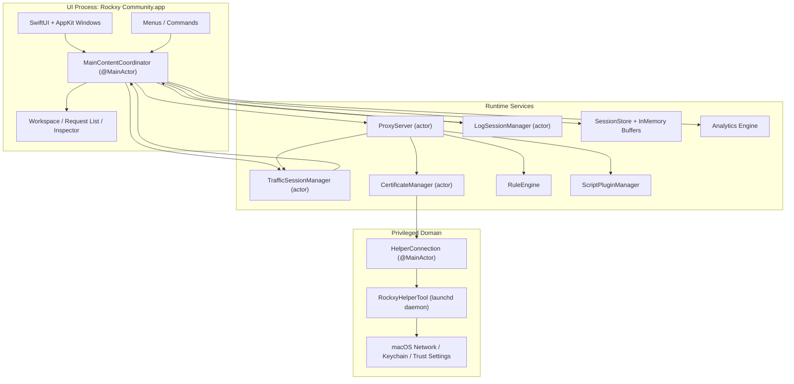
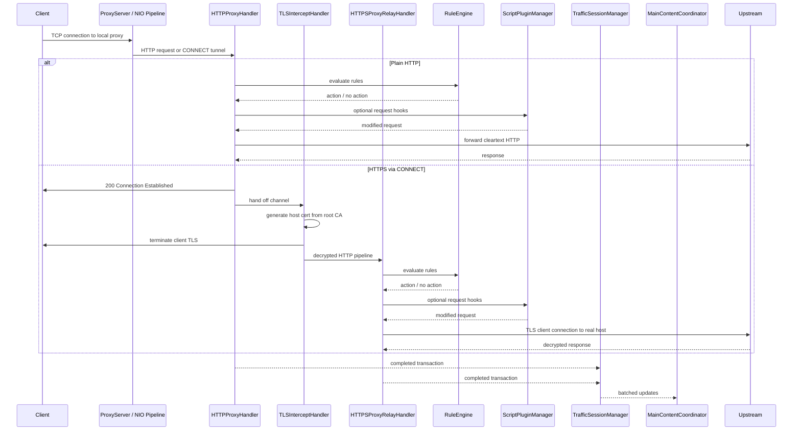
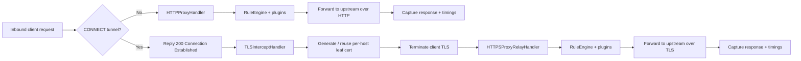
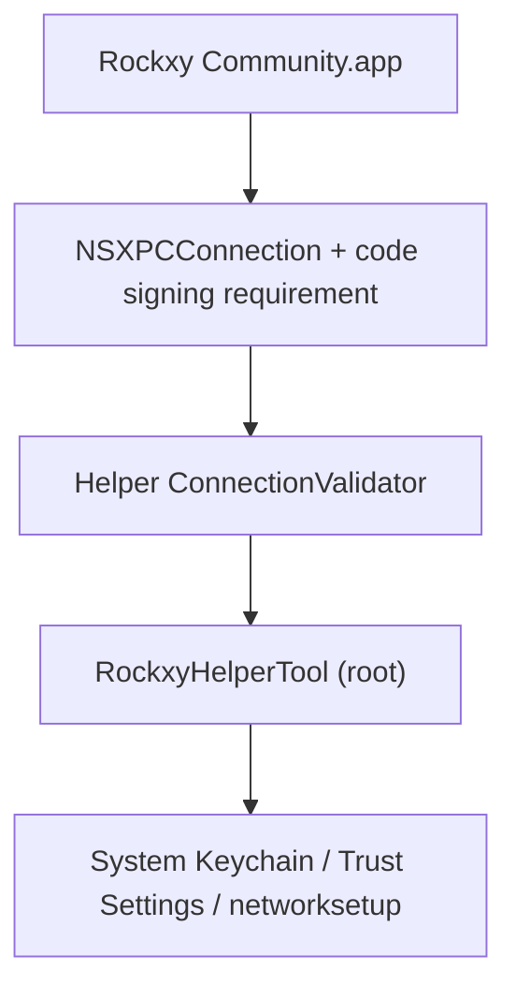

<p align="center">
  
</p>

<h1 align="center">Rockxy</h1>

<p align="center">
  <a href="README.md">English</a> |
  <a href="README.vi.md">Tiếng Việt</a> |
  <a href="README.zh.md">中文</a> |
  <a href="README.ja.md">日本語</a> |
  <a href="README.ko.md">한국어</a> |
  <a href="README.fr.md">Français</a> |
  <a href="README.de.md">Deutsch</a>
</p>

<p align="center">
  <strong>Open-source HTTP debugging proxy for macOS.</strong>
</p>

<p align="center">
  Intercept HTTP/HTTPS traffic, inspect API requests, debug WebSocket connections, and analyze GraphQL queries.<br>
  Built in Swift with SwiftNIO, SwiftUI, and AppKit.
</p>

<p align="center">
  <a href="#"></a>
  <a href="#"></a>
  <a href="LICENSE"></a>
  <a href="CONTRIBUTING.md"></a>
  <a href="https://github.com/sponsors/LocNguyenHuu"></a>
</p>

<p align="center">
  
</p>

---

> **Status**: Active development. Core proxy engine, HTTPS interception, rule system, plugin ecosystem, and inspector UI are functional. See [CHANGELOG.md](CHANGELOG.md) for progress.

## Features

### Network Traffic Capture
- **HTTP/HTTPS proxy server** — SwiftNIO-based intercepting proxy with CONNECT tunnel support
- **SSL/TLS interception** — man-in-the-middle decryption with auto-generated per-host certificates (LRU cache ~1000)
- **WebSocket debugging** — bidirectional frame capture and inspection
- **GraphQL detection** — automatic operation name extraction and query inspection
- **Process identification** — see which app (Safari, Chrome, curl, Slack, Postman, etc.) made each request via `lsof` port mapping + User-Agent parsing

### Request & Response Inspector
- **JSON viewer** — collapsible tree view with syntax highlighting
- **Hex inspector** — binary body display for non-text content
- **Timing waterfall** — DNS, TCP connect, TLS handshake, TTFB, and transfer phases visualized per request
- **Headers, cookies, query params, auth** — tabbed inspector with raw view option

### Traffic Manipulation & Mock API
- **Map Local** — serve responses from local files (mock API responses without modifying server code)
- **Map Remote** — redirect requests to a different host/port/path (API gateway testing, staging ↔ production switching)
- **Breakpoints** — pause requests or responses mid-flight, edit URL/headers/body/status, then forward or abort
- **Block List** — block requests by URL pattern (wildcard or regex)
- **Throttle** — simulate slow network by delaying request forwarding
- **Modify Headers** — add, remove, or replace HTTP headers on the fly

### Debugging & Analysis
- **OSLog integration** — capture macOS system logs and correlate with network requests by timestamp
- **Side-by-side diff** — compare two captured requests/responses
- **Request timeline** — visual waterfall of request sequences and timing
- **Credential redaction** — automatic redaction of Bearer tokens and passwords in captured logs

### Extensibility
- **JavaScript plugin system** — extend Rockxy with custom scripts (JavaScriptCore runtime, 5-second timeout sandbox)
- **Request/response hooks** — plugins can inspect and modify traffic in the proxy pipeline
- **Plugin settings UI** — auto-generated config forms from plugin manifest
- **Export formats** — copy as cURL, HAR, raw HTTP, or JSON

### macOS-Native Experience
- **Native SwiftUI + AppKit** — no Electron, no web views, no cross-platform compromises
- **NSTableView request list** — virtual scrolling handles 100k+ captured requests without lag
- **Real app icons** — resolved via `NSWorkspace` bundle ID lookup
- **System proxy integration** — privileged helper daemon for password-free proxy setup (SMAppService)
- **Dark mode** — full support with system semantic colors
- **Keyboard shortcuts** — Cmd+Shift+R (start), Cmd+. (stop), Cmd+K (clear), and more

## Use Cases

- **iOS / macOS app debugging** — inspect API calls from your app running in Simulator or on device
- **REST API testing** — view exact request/response pairs without switching to a separate tool
- **GraphQL debugging** — see operation names, variables, and responses at a glance
- **Mock API responses** — map local files to endpoints for offline development or edge-case testing
- **WebSocket inspection** — debug real-time connections (chat apps, live feeds, game protocols)
- **Performance profiling** — identify slow endpoints, large payloads, and redundant API calls
- **SSL/TLS debugging** — inspect encrypted HTTPS traffic with per-domain interception control
- **Network traffic recording** — capture and replay HTTP sessions for regression testing
- **Reverse engineering APIs** — understand undocumented API behavior from third-party apps
- **CI/CD integration** — headless proxy for automated API contract testing (planned)

## Rockxy vs Proxyman vs Charles Proxy

Looking for a Proxyman alternative or Charles Proxy alternative that's open-source? Here's how Rockxy compares:

| Feature | Rockxy | Proxyman | Charles Proxy |
|---------|--------|----------|---------------|
| **License** | Open-source (AGPL-3.0) | Proprietary (freemium) | Proprietary (paid) |
| **Price** | Free | Free tier + $69/year | $50 one-time |
| **Platform** | macOS | macOS, iOS, Windows | macOS, Windows, Linux |
| **Source code** | Fully available on GitHub | Closed source | Closed source |
| **Technology** | Swift + SwiftNIO (native) | Swift + AppKit (native) | Java (cross-platform) |
| **HTTP/HTTPS intercept** | Yes | Yes | Yes |
| **WebSocket debugging** | Yes | Yes | Yes |
| **GraphQL detection** | Yes (auto-detect) | Yes | No |
| **Map Local** | Yes | Yes | Yes |
| **Map Remote** | Yes | Yes | Yes |
| **Breakpoints** | Yes | Yes | Yes |
| **Block List** | Yes | Yes | Yes |
| **Modify Headers** | Yes | Yes | Yes (rewrite) |
| **Throttle / Network Conditions** | Yes | Yes | Yes |
| **Request diff** | Yes (side-by-side) | Yes | No |
| **JavaScript plugins** | Yes (JSCore sandbox) | Yes (Scripting) | No |
| **Request replay** | Yes (Repeat + Edit) | Yes | Yes |
| **HAR import/export** | Yes | Yes | No (uses own format) |
| **OSLog integration** | Yes | No | No |
| **Process identification** | Yes (which app per request) | Yes | No |
| **JSON tree viewer** | Yes | Yes | Yes |
| **Hex inspector** | Yes | Yes | Yes |
| **Timing waterfall** | Yes | Yes | Yes |
| **Virtual scroll (100k+ rows)** | Yes (NSTableView) | Yes | Slow at high volume |
| **Privileged helper (no sudo prompts)** | Yes (SMAppService) | Yes | No (repeated prompts) |
| **Dark mode** | Yes | Yes | Partial |
| **Self-hostable / auditable** | Yes | No | No |
| **Community contributions** | Open to PRs | No | No |

**Why choose Rockxy?**
- You want a **free, open-source** HTTP debugging proxy with no license restrictions
- You want to **audit the source code** of the tool intercepting your traffic
- You want to **contribute features** or customize the tool for your workflow
- You need **OSLog correlation** to debug macOS app logs alongside network traffic
- You want a **native macOS experience** without Java runtime overhead

## Requirements

- macOS 14.0+ (Sonoma or later)
- Xcode 16+
- Swift 5.9

## Quick Start

```bash
git clone https://github.com/LocNguyenHuu/Rockxy.git
cd Rockxy
xcodebuild -project Rockxy.xcodeproj -scheme Rockxy -configuration Debug build
```

Or open `Rockxy.xcodeproj` in Xcode and hit Run.

On first launch, the Welcome window guides you through:
1. Generating and trusting the root CA certificate
2. Installing the privileged helper tool for system proxy control
3. Starting the proxy server

## Architecture

### System Overview

Rockxy is split into three trust and execution domains:

1. **UI + orchestration layer** — SwiftUI/AppKit windows, inspectors, menus, and the `MainContentCoordinator`
2. **proxy/runtime layer** — SwiftNIO channel handlers, certificate issuance, request mutation, storage, analytics, and plugins
3. **privileged helper layer** — a separate launchd daemon used only for system-level proxy and certificate operations that require elevated privileges

The design goal is to keep packet processing off the main thread, keep privileged operations outside the app process, and keep user-facing state synchronized through explicit actor or `@MainActor` boundaries.

### Component Map



### Runtime Layers

| Layer | Main Types | Responsibility |
|-------|------------|----------------|
| **Presentation** | `MainContentCoordinator`, `ContentView`, inspector/request-list/sidebar views | Holds user-facing state, routes commands, binds proxy/log data into SwiftUI/AppKit |
| **Capture / transport** | `ProxyServer`, `HTTPProxyHandler`, `TLSInterceptHandler`, `HTTPSProxyRelayHandler` | Accepts proxy traffic, performs CONNECT handling, MITM TLS interception, and upstream forwarding |
| **Mutation / policy** | `RuleEngine`, `BreakpointRequestBuilder`, `AllowListManager`, `NoCacheHeaderMutator`, `MapLocalDirectoryResolver` | Applies request/response rules and current debugging policy before forwarding or storing |
| **Certificate / trust** | `CertificateManager`, `RootCAGenerator`, `HostCertGenerator`, `CertificateStore`, `KeychainHelper` | Generates and persists the root CA, caches host certs, validates trust state, installs trust via helper/app flows |
| **Storage / session** | `TrafficSessionManager`, `LogSessionManager`, `SessionStore`, in-memory buffers | Buffers live data, persists selected state to SQLite, and batches updates to the UI |
| **Observability / analysis** | analytics, GraphQL detection, content-type detection, log correlation | Enriches captured traffic after or alongside transport processing |
| **Privileged system integration** | `HelperConnection`, `RockxyHelperTool`, shared XPC protocol | Applies system proxy settings and privileged certificate operations with explicit trust checks |

### Proxy Request Lifecycle



### HTTP vs HTTPS Flow



### Concurrency Model

- `ProxyServer` is an actor that owns lifecycle transitions such as bind and shutdown.
- NIO channel handlers run on event-loop threads and bridge into actor-isolated services only where needed.
- `CertificateManager`, `TrafficSessionManager`, and related services use actor isolation instead of manual locks for long-lived shared state.
- `MainContentCoordinator` is `@MainActor` because it is the synchronization boundary for SwiftUI/AppKit.
- UI delivery is batched rather than per-transaction to avoid main-thread churn under heavy traffic.

### Core Subsystems

| Subsystem | Location | What It Does |
|-----------|----------|--------------|
| **Proxy Engine** | `Core/ProxyEngine/` | SwiftNIO `ServerBootstrap`, per-connection channel pipeline, CONNECT handling, TLS handoff, HTTP/HTTPS forwarding |
| **Certificate** | `Core/Certificate/` | Root CA lifecycle, host certificate issuance, trust checks, disk + keychain persistence, host cert cache |
| **Rule Engine** | `Core/RuleEngine/` | Ordered rule evaluation for block, map local, map remote, throttle, modify headers, and breakpoint |
| **Traffic Capture** | `Core/TrafficCapture/` | Session batching, allow-list policy, replay support, proxy state handoff to the UI |
| **Storage** | `Core/Storage/` | SQLite-backed persistence, in-memory session/log buffers, large-body offloading |
| **Detection / enrichment** | `Core/Detection/` | GraphQL detection, content type detection, API endpoint grouping |
| **Plugins** | `Core/Plugins/` | JavaScriptCore-based request/response hook execution and plugin metadata/config support |
| **Helper Tool** | `RockxyHelperTool/`, `Shared/` | Privileged XPC service for proxy override, bypass-domain configuration, and certificate install/remove support |

### Security Architecture

> **Reporting vulnerabilities:** If you discover a security issue, please report it privately. See [SECURITY.md](SECURITY.md) for disclosure instructions.

Rockxy uses a layered security model because it terminates TLS, stores sensitive traffic, and communicates with a root-privileged helper.



#### Security boundaries

| Boundary | Risk | Current control |
|----------|------|-----------------|
| **App ↔ helper** | Untrusted app attempts to call privileged proxy/cert operations | `NSXPCConnection` with code-signing requirements plus helper-side connection validation and certificate-chain comparison |
| **TLS interception** | Invalid or stale root CA causes broken trust or confusing MITM state | explicit root CA lifecycle, trust checks, root fingerprint tracking, per-host cert issuance from the active root only |
| **Request body handling** | Memory exhaustion via oversized request/response bodies | 100 MB request body cap (413 rejection), 8 KB URI length cap (414 rejection), WebSocket frame limits (10 MB/frame, 100 MB/connection) |
| **Rule-driven local file serving** | Path traversal or symlink escape through Map Local directory rules | fd-based file loading (eliminates TOCTOU), symlink resolution, rooted path containment checks |
| **Rule regex patterns** | ReDoS from pathological regex freezing the proxy | compile-time regex validation, pre-compiled pattern cache, 500-char pattern length limit, 8 KB input cap |
| **Edited requests at breakpoints** | Malformed request forwarding after URL/header/body edits | centralized request rebuilding in `BreakpointRequestBuilder`, authority preservation, scheme normalization, content-length reconciliation |
| **Plugin execution** | Scripts mutating traffic in unsafe or non-deterministic ways | JavaScriptCore bridge, bounded hook API, timeout enforcement, plugin ID/key validation, no direct filesystem/network access |
| **Stored traffic** | Sensitive request/response bodies kept too long or with weak permissions | in-memory buffering plus disk/SQLite persistence, large-body offload with 0o600 file permissions, path containment on load/delete, log credential redaction |
| **Header injection** | CRLF injection via MapRemote host header manipulation | header value sanitization stripping control characters before forwarding |
| **Helper input validation** | Malformed domains or service names passed to networksetup | ASCII-only bypass domain validation, service name sanitization, proxy type whitelisting, domain count limits |

#### Helper-tool trust model

The helper runs as a launchd daemon (`com.amunx.Rockxy.HelperTool`) registered via `SMAppService.daemon()`. It exists so proxy override and some certificate operations can be done without repeated `networksetup` password prompts from the app process.

Defense-in-depth currently includes:

- app-side privileged XPC connection setup
- helper-side caller validation in `ConnectionValidator` with hardcoded bundle identifier
- code-signing requirement enforcement (`anchor apple generic`)
- certificate-chain comparison so trust is not based only on bundle ID or team ID strings
- helper-side rate limiting for state-changing operations (proxy changes, certificate installs)
- input validation on all helper parameters (bypass domains, service names, proxy types)
- atomic temp file creation with restricted permissions (0o600)
- explicit proxy backup / restore paths for crash recovery

#### Certificate trust model

- Root CA generation and persistence live in `CertificateManager`.
- The app owns root CA creation, loading, and trust-state verification.
- The helper may assist with privileged keychain/system install operations, but trust still has an app-visible verification path.
- Host certificates are generated on demand from the current root and cached to avoid repeated expensive issuance.
- Root fingerprint tracking is used to clean up stale certificates and reduce “multiple old Rockxy roots installed” drift.

#### Practical security notes

- Rockxy should be treated as a developer tool with access to sensitive traffic. Do not leave system proxy override enabled longer than needed.
- Installing the root CA enables HTTPS interception only for clients that trust that root.
- Saved sessions, exports, and plugin code should be treated as potentially sensitive project artifacts.

## Project Structure

```
Rockxy/
├── Core/
│   ├── ProxyEngine/       # SwiftNIO server, HTTP/TLS/WS handlers, helper client
│   ├── Certificate/       # X.509 generation, root CA, Keychain integration
│   ├── RuleEngine/        # Rule matching and action execution
│   ├── LogEngine/         # OSLog + process log capture and correlation
│   ├── TrafficCapture/    # Session manager, system proxy, request replay
│   ├── Storage/           # SQLite store, in-memory buffer, settings
│   ├── Detection/         # Content type, GraphQL, API grouping
│   ├── Plugins/           # Plugin discovery, JS runtime, manifest parsing
│   ├── Services/          # Window management, notifications
│   └── Utilities/         # Body decoder, input validation, formatters
├── Views/
│   ├── Main/              # Main window, coordinator extensions
│   ├── RequestList/       # NSTableView-backed request list (100k+ rows)
│   ├── Inspector/         # Request/response tabs, JSON tree, hex display
│   ├── Sidebar/           # Domain tree, app grouping, favorites
│   ├── Toolbar/           # Status indicators, control buttons
│   ├── Welcome/           # Setup wizard, certificate checklist
│   ├── Settings/          # General, Proxy, SSL Proxying, Privacy tabs
│   ├── Rules/             # Rule list, add/edit dialogs
│   ├── Compose/           # Edit and Repeat request editor
│   ├── Diff/              # Side-by-side transaction comparison
│   ├── Scripting/         # Code editor, plugin console
│   ├── Timeline/          # Request waterfall visualization
│   ├── Breakpoint/        # Breakpoint edit window
│   └── Components/        # Reusable: StatusCodeBadge, FilterPill, etc.
├── Models/
│   ├── Network/           # HTTPTransaction, Request/Response, TimingInfo, WebSocket
│   ├── Log/               # LogEntry, LogLevel, LogSource
│   ├── Analytics/         # ErrorGroup, PerformanceMetric, SessionTrend
│   ├── Certificate/       # RootCA, RootCAStatusSnapshot
│   ├── Rules/             # ProxyRule, RuleAction
│   ├── Settings/          # AppSettings, ProxySettings
│   ├── UI/                # SidebarItem, FilterState
│   └── Plugins/           # PluginInfo, PluginConfig, PluginManifest
├── ViewModels/
├── Extensions/
└── Theme/

RockxyHelperTool/              # Privileged launchd daemon (runs as root)
├── main.swift                 # Entry point, XPC listener
├── HelperDelegate.swift       # Connection validation, disconnect handling
├── HelperService.swift        # Protocol impl, rate limiting, port validation
├── ConnectionValidator.swift  # Certificate chain extraction & comparison
├── CrashRecovery.swift        # Backup/restore proxy settings
└── ProxyConfigurator.swift    # networksetup wrapper

Shared/
└── RockxyHelperProtocol.swift # @objc XPC protocol (app ↔ helper)

RockxyTests/                   # Swift Testing framework (@Suite, @Test, #expect)
├── Core/                      # Rule engine, certificate, plugin, storage, proxy tests
├── ViewModels/                # WelcomeViewModel tests
└── Helpers/                   # TestFixtures factory methods

docs/                          # Documentation (Mintlify format)
.github/workflows/             # CI: lint → build (arm64 + x86_64) → release
```

## Tech Stack

| Layer | Technology |
|-------|-----------|
| UI Framework | SwiftUI + AppKit (NSTableView, NSViewRepresentable) |
| Networking | [SwiftNIO](https://github.com/apple/swift-nio) 2.95 + [SwiftNIO SSL](https://github.com/apple/swift-nio-ssl) 2.36 |
| Certificates | [swift-certificates](https://github.com/apple/swift-certificates) 1.18 + [swift-crypto](https://github.com/apple/swift-crypto) 4.2 |
| Database | [SQLite.swift](https://github.com/stephencelis/SQLite.swift) 0.16 |
| Concurrency | Swift Actors, structured concurrency, @MainActor |
| Plugins | JavaScriptCore (built-in macOS framework) |
| Helper IPC | XPC Services + SMAppService (macOS 13+) |
| Testing | Swift Testing framework (@Suite, @Test, #expect) |
| CI/CD | GitHub Actions (SwiftLint → parallel arm64/x86_64 build → release) |

## Building from Source

### Development Build

```bash
git clone https://github.com/LocNguyenHuu/Rockxy.git
cd Rockxy
xcodebuild -project Rockxy.xcodeproj -scheme Rockxy -configuration Debug build
```

### Release Build

```bash
# Apple Silicon (M1/M2/M3/M4)
xcodebuild -project Rockxy.xcodeproj -scheme Rockxy -configuration Release -arch arm64 build

# Intel
xcodebuild -project Rockxy.xcodeproj -scheme Rockxy -configuration Release -arch x86_64 build
```

### Running Tests

```bash
# All tests
xcodebuild -project Rockxy.xcodeproj -scheme Rockxy test

# Specific test class
xcodebuild -project Rockxy.xcodeproj -scheme Rockxy test -only-testing:RockxyTests/CertificateTests

# Specific test method
xcodebuild -project Rockxy.xcodeproj -scheme Rockxy test -only-testing:RockxyTests/RuleEngineTests/testWildcardMatching
```

### Linting and Formatting

```bash
brew install swiftlint swiftformat

swiftlint lint --strict    # Must pass with zero violations
swiftformat .              # Auto-format
```

## Design Decisions

### Why SwiftNIO Instead of URLSession

URLSession is a high-level HTTP client. Rockxy needs a low-level TCP server that can accept connections, parse HTTP, perform MITM TLS interception via CONNECT tunnels, and forward traffic — all things that require direct socket control. SwiftNIO provides the event-driven, non-blocking I/O foundation that makes this possible in pure Swift.

### Why NSTableView for the Request List

SwiftUI `List` cannot handle 100k+ rows with virtual scrolling. The request list uses `NSTableView` wrapped in `NSViewRepresentable` for O(1) scrolling performance regardless of traffic volume.

### Why a Privileged Helper Daemon

macOS requires admin authentication for each `networksetup` call. The helper tool (`SMAppService.daemon()`) runs as root and validates callers via certificate chain comparison, eliminating repeated password prompts while maintaining security.

### Actor-Based Concurrency Model

The proxy server, session managers, and certificate manager are all Swift actors. This eliminates data races without manual locking. The coordinator bridges actor-isolated state to `@MainActor` for SwiftUI consumption via batched updates (every 250ms).

### Plugin Sandbox

JavaScript plugins run in JavaScriptCore with a controlled bridge API (`$rockxy`). Each script execution has a 5-second timeout. Plugins can inspect and modify requests but cannot access the filesystem or network directly.

## Performance

- **100k+ requests** — NSTableView virtual scrolling with cell reuse, no UI lag
- **Ring buffer eviction** — at 50k transactions, oldest 10% moved to SQLite or discarded
- **Body offloading** — response/request bodies >1MB stored on disk, loaded on-demand
- **Batched UI updates** — proxy transactions batched every 250ms or 50 items before UI delivery
- **String performance** — `NSString.length` (O(1)) instead of `String.count` (O(n)) for large bodies
- **Log buffer** — 100k entries in-memory, overflow to SQLite
- **Concurrent builds** — `System.coreCount` NIO event loop threads

## Storage

| Data | Mechanism | Location |
|------|-----------|----------|
| User preferences | UserDefaults | `AppSettingsStorage` |
| Active sessions | In-memory ring buffer | `InMemorySessionBuffer` |
| Saved sessions | SQLite | `SessionStore` |
| Root CA private key | macOS Keychain | `KeychainHelper` |
| Rules | JSON file | `RuleStore` |
| Large bodies | Disk files | `~/Library/Application Support/Rockxy/bodies/` |
| Log entries | SQLite | `SessionStore` (log_entries table) |
| Proxy backup | Plist (0o600) | `/Library/Application Support/com.amunx.Rockxy/proxy-backup.plist` |
| Plugins | JS files + manifest | `~/Library/Application Support/Rockxy/Plugins/` |

## Code Style

The full rules live in `.swiftlint.yml` and `.swiftformat`. Key points:

- 4-space indentation, 120-char target line width
- Explicit access control on every declaration
- No force unwraps (`!`) or force casts (`as!`) — use `guard let`, `if let`, `as?`
- OSLog for all logging, never `print()`
- `String(localized:)` for user-facing strings
- [Conventional Commits](https://www.conventionalcommits.org/) for commit messages

### File Size Limits

| Metric | Warning | Error |
|--------|---------|-------|
| File length | 1200 lines | 1800 lines |
| Type body | 1100 lines | 1500 lines |
| Function body | 160 lines | 250 lines |
| Cyclomatic complexity | 40 | 60 |

When approaching limits, extract into `TypeName+Category.swift` extension files grouped by domain logic.

## CI/CD

GitHub Actions workflow (manual dispatch with optional channel parameter):

1. **Lint** — `swiftlint lint --strict` on macOS 14
2. **Build** — parallel arm64 and x86_64 release builds with Xcode 16
3. **Artifacts** — uploads signed build artifacts for distribution

## Roadmap

### Shipped

- [x] HAR file import and export
- [x] Request replay (Repeat and Edit and Repeat)
- [x] Native `.rockxysession` session files (save, open, metadata)
- [x] GraphQL-over-HTTP detection and inspection
- [x] JavaScript scripting (create, edit, test, enable/disable scripts)
- [x] Side-by-side request diff
- [x] Security hardening (body size limits, regex validation, path traversal protection, input validation)
- [x] Credential redaction in captured logs

### Planned

- [ ] Error grouping and analytics dashboard (HTTP 4xx/5xx clustering, latency metrics)
- [ ] HTTP/2 and HTTP/3 support
- [ ] Sequence recording (replay a chain of dependent requests)
- [ ] Remote device proxy (iOS device debugging over USB/Wi-Fi)
- [ ] Headless mode for CI/CD pipeline integration
- [ ] gRPC / Protocol Buffers inspection
- [ ] Network condition simulation (latency, packet loss, bandwidth limits)

## Contributing

Contributions are welcome. Whether it's a bug fix, a new feature, documentation, or UX feedback — all contributions help make Rockxy better. Please read our [Code of Conduct](CODE_OF_CONDUCT.md) before participating.

**Getting started:**

1. Fork the repository and clone your fork
2. Create a feature branch from `develop` (`feat/your-change` or `fix/your-fix`)
3. Make your changes, ensuring `swiftlint lint --strict` passes
4. Open a pull request with a clear description of what changed and why

See [CONTRIBUTING.md](CONTRIBUTING.md) for detailed setup instructions, code style, commit conventions, and the full PR checklist.

**Ways to contribute:**

- **Code** — bug fixes, new features, performance improvements
- **Tests** — expand test coverage, add edge cases, improve fixtures
- **Documentation** — improve docs in `docs/`, fix typos, add examples
- **Bug reports** — file clear, reproducible issues with macOS version and steps
- **UX feedback** — suggest improvements to the inspector, sidebar, or toolbar workflows

Good first issues are labeled [`good first issue`](https://github.com/LocNguyenHuu/Rockxy/labels/good%20first%20issue) on GitHub.

By opening a pull request, you agree to the [Contributor License Agreement](CLA.md).

## Support

- [GitHub Sponsors](https://github.com/sponsors/LocNguyenHuu) — support Rockxy's development
- [GitHub Issues](https://github.com/LocNguyenHuu/Rockxy/issues) — bug reports and feature requests
- [GitHub Discussions](https://github.com/LocNguyenHuu/Rockxy/discussions) — questions and community chat
- **Email** — [rockxyapp@gmail.com](mailto:rockxyapp@gmail.com)
- **Security issues** — see [SECURITY.md](SECURITY.md) for responsible disclosure

## License

[GNU Affero General Public License v3.0](LICENSE) — Copyright 2024–2026 Rockxy Contributors.

---

**Built with Swift, SwiftNIO, SwiftUI, and AppKit.**
