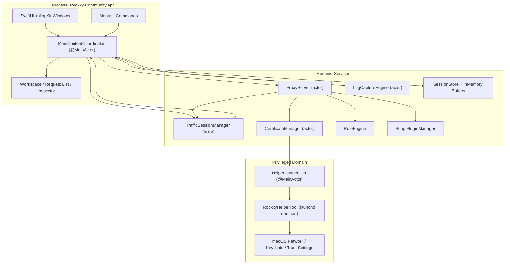
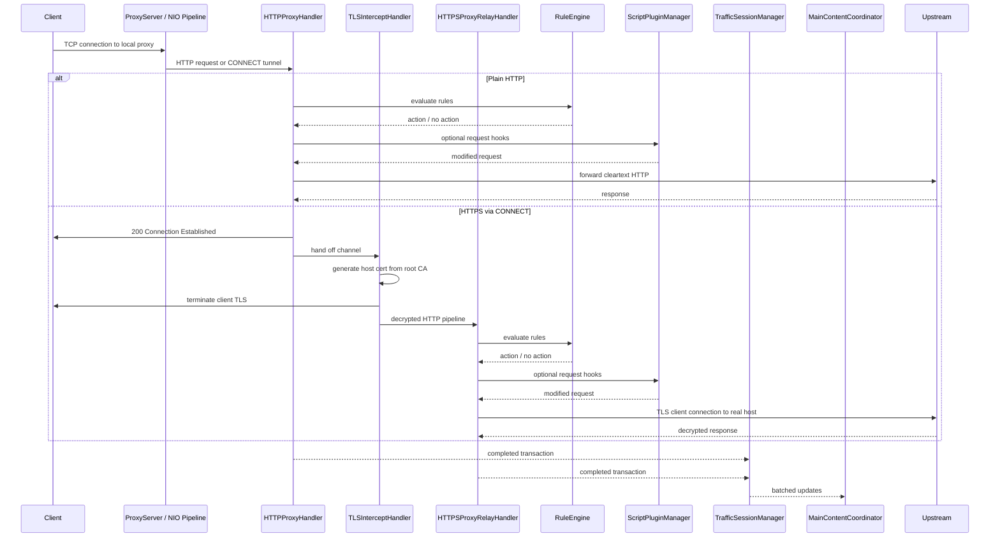
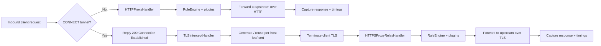
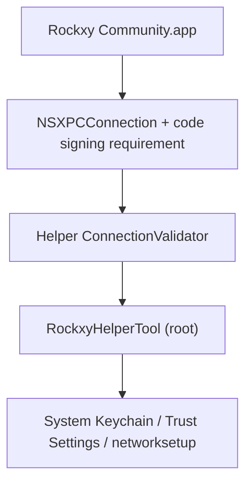

<p align="center">
  
</p>

<h1 align="center">Rockxy</h1>

<p align="center">
  <a href="README.md">English</a> |
  <a href="README.vi.md">Tiếng Việt</a> |
  <a href="README.zh.md">中文</a> |
  <a href="README.ja.md">日本語</a> |
  <a href="README.ko.md">한국어</a> |
  <a href="README.fr.md">Français</a> |
  <a href="README.de.md">Deutsch</a>
</p>

<p align="center">
  <strong>HTTP debugging proxy mã nguồn mở cho macOS.</strong>
</p>

<p align="center">
  Chặn bắt lưu lượng HTTP/HTTPS, kiểm tra các request API, gỡ lỗi kết nối WebSocket, và phân tích truy vấn GraphQL.<br>
  Xây dựng bằng Swift với SwiftNIO, SwiftUI, và AppKit.
</p>

<p align="center">
  <a href="#"></a>
  <a href="#"></a>
  <a href="LICENSE"></a>
  <a href="CONTRIBUTING.md"></a>
  <a href="https://github.com/sponsors/LocNguyenHuu"></a>
</p>

<p align="center">
  
</p>

---

> **Trạng thái**: Đang phát triển tích cực. Proxy engine lõi, chặn bắt HTTPS, hệ thống rule, hệ sinh thái plugin, và giao diện inspector đã hoạt động. Xem [CHANGELOG.md](CHANGELOG.md) để theo dõi tiến độ.

<!-- BEGIN GENERATED: latest-release -->
## Bản Phát Hành Mới Nhất

**v0.4.0** — 2026-04-09

### Đã Thêm

- Redesign rule editor with Proxyman-style dropdowns and enlarged window

### Đã Sửa

- Prevent selectPlugin load failure from being overwritten by success status
- Surface UI feedback when applyTemplate receives unknown name
- Tighten scripting template fallback, scope subpaths toggle, localize provenance
- Address code review findings for block-list PR
- Restore quick-create handoff, remove nonfunctional controls, enforce honest UI

### Đã Thay Đổi

- Merge remote-tracking branch 'origin/main'
- Add multilingual README translations
- Add localized readmes

Xem [CHANGELOG.md](CHANGELOG.md) để biết toàn bộ lịch sử phát hành.
<!-- END GENERATED: latest-release -->

## Tính năng

### Bắt lưu lượng mạng
- **Máy chủ proxy HTTP/HTTPS** — proxy chặn bắt dựa trên SwiftNIO với hỗ trợ đường hầm CONNECT
- **Chặn bắt SSL/TLS** — giải mã man-in-the-middle với chứng chỉ tự động sinh cho từng host (LRU cache ~1000)
- **Gỡ lỗi WebSocket** — bắt và kiểm tra frame hai chiều
- **Phát hiện GraphQL** — tự động trích xuất tên operation và kiểm tra truy vấn
- **Nhận dạng tiến trình** — xem ứng dụng nào (Safari, Chrome, curl, Slack, Postman, v.v.) tạo mỗi request thông qua ánh xạ port `lsof` + phân tích User-Agent

### Trình kiểm tra Request & Response
- **Trình xem JSON** — dạng cây có thể thu gọn với tô sáng cú pháp
- **Trình kiểm tra Hex** — hiển thị body dạng nhị phân cho nội dung không phải văn bản
- **Biểu đồ thời gian** — DNS, kết nối TCP, bắt tay TLS, TTFB, và giai đoạn truyền tải được trực quan hóa cho mỗi request
- **Header, cookie, query param, auth** — inspector dạng tab với tùy chọn xem raw
- **Cột header tùy chỉnh** — chọn thêm header request/response để hiển thị dưới dạng cột

### Workspace & Năng suất
- **Tab workspace** — các workspace bắt lưu lượng riêng biệt với bộ lọc và tiêu điểm độc lập
- **Mục yêu thích** — ghim các host hoặc request thường dùng để truy cập nhanh
- **Chế độ xem timeline** — trình tự request trực quan theo thời gian cho một tập con tập trung

### Thao tác lưu lượng & Mock API
- **Map Local** — phục vụ response từ file cục bộ (mock API response mà không cần sửa mã máy chủ)
- **Map Remote** — chuyển hướng request đến host/port/path khác (kiểm thử API gateway, chuyển đổi staging ↔ production)
- **Breakpoint** — tạm dừng request hoặc response giữa chừng, chỉnh sửa URL/header/body/status, rồi chuyển tiếp hoặc hủy
- **Danh sách chặn** — chặn request theo mẫu URL (wildcard hoặc regex)
- **Throttle** — mô phỏng mạng chậm bằng cách trì hoãn việc chuyển tiếp request
- **Sửa Header** — thêm, xóa, hoặc thay thế header HTTP ngay lập tức
- **Danh sách cho phép** — chỉ bắt lưu lượng từ các domain hoặc ứng dụng được chọn để giảm nhiễu
- **Bỏ qua Proxy** — loại trừ các host cụ thể khỏi proxy trong khi system proxy đang bật
- **Quy tắc SSL Proxying** — kiểm soát chặn bắt TLS theo từng domain

### Gỡ lỗi & Phân tích
- **Tích hợp OSLog** — bắt log hệ thống macOS và liên kết với request mạng theo thời gian
- **So sánh song song** — so sánh hai request/response đã bắt được
- **Timeline request** — biểu đồ thác nước trực quan về trình tự và thời gian request
- **Ẩn thông tin xác thực** — tự động ẩn Bearer token và mật khẩu trong log đã bắt

### Khả năng mở rộng
- **Hệ thống plugin JavaScript** — mở rộng Rockxy bằng script tùy chỉnh (JavaScriptCore runtime, sandbox timeout 5 giây)
- **Hook request/response** — plugin có thể kiểm tra và sửa đổi lưu lượng trong pipeline proxy
- **Giao diện cài đặt plugin** — form cấu hình tự động sinh từ manifest plugin
- **Định dạng xuất** — sao chép dưới dạng cURL, HAR, raw HTTP, hoặc JSON
- **Soạn + phát lại** — chỉnh sửa và gửi lại request, hoặc phát lại lưu lượng đã bắt
- **Xem trước khi import** — xác minh import HAR/session trước khi đưa vào storage

### Trải nghiệm macOS gốc
- **SwiftUI + AppKit gốc** — không Electron, không web view, không thỏa hiệp đa nền tảng
- **Danh sách request NSTableView** — cuộn ảo xử lý 100k+ request đã bắt mà không giật
- **Icon ứng dụng thật** — phân giải qua tra cứu bundle ID của `NSWorkspace`
- **Tích hợp system proxy** — helper daemon đặc quyền để cài đặt proxy không cần mật khẩu (SMAppService)
- **Dark mode** — hỗ trợ đầy đủ với màu ngữ nghĩa hệ thống
- **Phím tắt** — Cmd+Shift+R (bắt đầu), Cmd+. (dừng), Cmd+K (xóa), và nhiều hơn nữa

## Trường hợp sử dụng

- **Gỡ lỗi ứng dụng iOS / macOS** — kiểm tra các lệnh gọi API từ ứng dụng chạy trong Simulator hoặc trên thiết bị
- **Kiểm thử REST API** — xem chính xác các cặp request/response mà không cần chuyển sang công cụ khác
- **Gỡ lỗi GraphQL** — xem tên operation, biến, và response trong nháy mắt
- **Mock API response** — ánh xạ file cục bộ đến endpoint để phát triển offline hoặc kiểm thử trường hợp biên
- **Kiểm tra WebSocket** — gỡ lỗi kết nối thời gian thực (ứng dụng chat, live feed, game protocol)
- **Phân tích hiệu năng** — xác định endpoint chậm, payload lớn, và lệnh gọi API trùng lặp
- **Gỡ lỗi SSL/TLS** — kiểm tra lưu lượng HTTPS đã mã hóa với kiểm soát chặn bắt theo domain
- **Ghi lưu lượng mạng** — bắt và phát lại phiên HTTP để kiểm thử hồi quy
- **Phân tích ngược API** — hiểu hành vi API chưa có tài liệu từ ứng dụng bên thứ ba
- **Tích hợp CI/CD** — proxy headless cho kiểm thử hợp đồng API tự động (đang lên kế hoạch)

## Rockxy vs Proxyman vs Charles Proxy

Bạn đang tìm một giải pháp thay thế Proxyman hoặc Charles Proxy mã nguồn mở? Đây là cách Rockxy so sánh:

| Tính năng | Rockxy | Proxyman | Charles Proxy |
|-----------|--------|----------|---------------|
| **Giấy phép** | Mã nguồn mở (AGPL-3.0) | Độc quyền (freemium) | Độc quyền (trả phí) |
| **Giá** | Miễn phí | Gói miễn phí + $69/năm | $50 mua một lần |
| **Nền tảng** | macOS | macOS, iOS, Windows | macOS, Windows, Linux |
| **Mã nguồn** | Công khai hoàn toàn trên GitHub | Mã nguồn đóng | Mã nguồn đóng |
| **Công nghệ** | Swift + SwiftNIO (native) | Swift + AppKit (native) | Java (đa nền tảng) |
| **Chặn bắt HTTP/HTTPS** | Có | Có | Có |
| **Gỡ lỗi WebSocket** | Có | Có | Có |
| **Phát hiện GraphQL** | Có (tự động) | Có | Không |
| **Map Local** | Có | Có | Có |
| **Map Remote** | Có | Có | Có |
| **Breakpoint** | Có | Có | Có |
| **Danh sách chặn** | Có | Có | Có |
| **Sửa Header** | Có | Có | Có (rewrite) |
| **Throttle / Điều kiện mạng** | Có | Có | Có |
| **So sánh request** | Có (song song) | Có | Không |
| **Plugin JavaScript** | Có (JSCore sandbox) | Có (Scripting) | Không |
| **Phát lại request** | Có (Repeat + Edit) | Có | Có |
| **Import/export HAR** | Có | Có | Không (dùng định dạng riêng) |
| **Tích hợp OSLog** | Có | Không | Không |
| **Nhận dạng tiến trình** | Có (ứng dụng nào cho mỗi request) | Có | Không |
| **Trình xem cây JSON** | Có | Có | Có |
| **Trình kiểm tra Hex** | Có | Có | Có |
| **Biểu đồ thời gian** | Có | Có | Có |
| **Cuộn ảo (100k+ dòng)** | Có (NSTableView) | Có | Chậm ở khối lượng lớn |
| **Helper đặc quyền (không hỏi sudo)** | Có (SMAppService) | Có | Không (hỏi mật khẩu liên tục) |
| **Dark mode** | Có | Có | Một phần |
| **Tự host / kiểm tra được** | Có | Không | Không |
| **Đóng góp cộng đồng** | Mở nhận PR | Không | Không |

**Tại sao chọn Rockxy?**
- Bạn muốn một HTTP debugging proxy **miễn phí, mã nguồn mở** không có hạn chế giấy phép
- Bạn muốn **kiểm tra mã nguồn** của công cụ đang chặn bắt lưu lượng của bạn
- Bạn muốn **đóng góp tính năng** hoặc tùy chỉnh công cụ theo quy trình làm việc của bạn
- Bạn cần **liên kết OSLog** để gỡ lỗi log ứng dụng macOS cùng lưu lượng mạng
- Bạn muốn một **trải nghiệm macOS gốc** mà không có overhead Java runtime

## Yêu cầu

- macOS 14.0+ (Sonoma trở lên)
- Xcode 16+
- Swift 5.9

## Bắt đầu nhanh

```bash
git clone https://github.com/LocNguyenHuu/Rockxy.git
cd Rockxy
xcodebuild -project Rockxy.xcodeproj -scheme Rockxy -configuration Debug build
```

Hoặc mở `Rockxy.xcodeproj` trong Xcode và nhấn Run.

Khi khởi chạy lần đầu, cửa sổ Welcome hướng dẫn bạn:
1. Tạo và tin cậy chứng chỉ root CA
2. Cài đặt helper tool đặc quyền để kiểm soát system proxy
3. Bật system proxy
4. Khởi động máy chủ proxy

## Kiến trúc

### Tổng quan hệ thống

Rockxy được chia thành ba miền tin cậy và thực thi:

1. **Lớp UI + điều phối** — cửa sổ SwiftUI/AppKit, inspector, menu, và `MainContentCoordinator`
2. **Lớp proxy/runtime** — NIO channel handler, phát hành chứng chỉ, biến đổi request, storage, và plugin
3. **Lớp helper đặc quyền** — một launchd daemon riêng biệt chỉ dùng cho các thao tác proxy và chứng chỉ cấp hệ thống cần quyền nâng cao

Mục tiêu thiết kế là giữ xử lý packet ngoài main thread, giữ các thao tác đặc quyền ngoài tiến trình ứng dụng, và giữ trạng thái hiển thị cho người dùng đồng bộ thông qua ranh giới actor hoặc `@MainActor` rõ ràng.

### Sơ đồ thành phần



### Các lớp runtime

| Lớp | Các kiểu chính | Trách nhiệm |
|-----|----------------|-------------|
| **Trình bày** | `MainContentCoordinator`, `ContentView`, các view inspector/request-list/sidebar | Giữ trạng thái hiển thị cho người dùng, định tuyến lệnh, liên kết dữ liệu proxy/log vào SwiftUI/AppKit |
| **Bắt / vận chuyển** | `ProxyServer`, `HTTPProxyHandler`, `TLSInterceptHandler`, `HTTPSProxyRelayHandler` | Nhận lưu lượng proxy, xử lý CONNECT, chặn bắt MITM TLS, và chuyển tiếp upstream |
| **Biến đổi / chính sách** | `RuleEngine`, `BreakpointRequestBuilder`, `AllowListManager`, `NoCacheHeaderMutator`, `MapLocalDirectoryResolver` | Áp dụng rule request/response và chính sách gỡ lỗi hiện tại trước khi chuyển tiếp hoặc lưu trữ |
| **Chứng chỉ / tin cậy** | `CertificateManager`, `RootCAGenerator`, `HostCertGenerator`, `CertificateStore`, `KeychainHelper` | Tạo và lưu trữ root CA, cache chứng chỉ host, xác thực trạng thái tin cậy, cài đặt tin cậy qua luồng helper/app |
| **Storage / phiên** | `TrafficSessionManager`, `LogCaptureEngine`, `SessionStore`, in-memory buffer | Buffer dữ liệu trực tiếp, lưu trạng thái đã chọn vào SQLite, và gộp cập nhật gửi đến UI |
| **Quan sát / phân tích** | phát hiện GraphQL, phát hiện content-type, liên kết log | Làm giàu lưu lượng đã bắt sau hoặc song song với xử lý vận chuyển |
| **Tích hợp hệ thống đặc quyền** | `HelperConnection`, `RockxyHelperTool`, XPC protocol dùng chung | Áp dụng cài đặt system proxy và các thao tác chứng chỉ đặc quyền với kiểm tra tin cậy rõ ràng |

### Vòng đời request proxy



### Luồng HTTP vs HTTPS



### Mô hình đồng thời

- `ProxyServer` là một actor quản lý các chuyển đổi vòng đời như bind và shutdown.
- NIO channel handler chạy trên event-loop thread và chỉ kết nối vào các service actor-isolated khi cần thiết.
- `CertificateManager`, `TrafficSessionManager`, và các service liên quan sử dụng actor isolation thay vì khóa thủ công cho trạng thái chia sẻ lâu dài.
- `MainContentCoordinator` là `@MainActor` vì đây là ranh giới đồng bộ hóa cho SwiftUI/AppKit.
- Việc cập nhật UI được gộp thành batch thay vì từng transaction để tránh tải main thread khi lưu lượng lớn.

### Các hệ thống con lõi

| Hệ thống con | Vị trí | Chức năng |
|---------------|--------|-----------|
| **Proxy Engine** | `Core/ProxyEngine/` | SwiftNIO `ServerBootstrap`, pipeline channel cho mỗi kết nối, xử lý CONNECT, chuyển giao TLS, chuyển tiếp HTTP/HTTPS |
| **Certificate** | `Core/Certificate/` | Vòng đời root CA, phát hành chứng chỉ host, kiểm tra tin cậy, lưu trữ disk + keychain, cache chứng chỉ host |
| **Rule Engine** | `Core/RuleEngine/` | Đánh giá rule theo thứ tự cho block, map local, map remote, throttle, sửa header, và breakpoint |
| **Traffic Capture** | `Core/TrafficCapture/` | Gộp session, chính sách allow-list, hỗ trợ phát lại, chuyển giao trạng thái proxy cho UI |
| **Storage** | `Core/Storage/` | Lưu trữ SQLite, buffer session/log trong bộ nhớ, giảm tải body lớn |
| **Detection / làm giàu** | `Core/Detection/` | Phát hiện GraphQL, phát hiện content type, nhóm API endpoint |
| **Plugin** | `Core/Plugins/` | Thực thi hook request/response dựa trên JavaScriptCore và hỗ trợ metadata/cấu hình plugin |
| **Helper Tool** | `RockxyHelperTool/`, `Shared/` | Dịch vụ XPC đặc quyền cho ghi đè proxy, cấu hình bypass-domain, và hỗ trợ cài đặt/gỡ chứng chỉ |

### Kiến trúc bảo mật

> **Báo cáo lỗ hổng:** Nếu bạn phát hiện vấn đề bảo mật, vui lòng báo cáo riêng tư. Xem [SECURITY.md](SECURITY.md) để biết hướng dẫn tiết lộ.

Rockxy sử dụng mô hình bảo mật nhiều lớp vì nó kết thúc TLS, lưu trữ lưu lượng nhạy cảm, và giao tiếp với một helper chạy quyền root.



#### Ranh giới bảo mật

| Ranh giới | Rủi ro | Biện pháp kiểm soát hiện tại |
|-----------|--------|------------------------------|
| **App ↔ helper** | Ứng dụng không tin cậy cố gọi các thao tác proxy/chứng chỉ đặc quyền | `NSXPCConnection` với yêu cầu code-signing kèm xác thực kết nối phía helper và so sánh chuỗi chứng chỉ |
| **Chặn bắt TLS** | Root CA không hợp lệ hoặc hết hạn gây lỗi tin cậy hoặc trạng thái MITM khó hiểu | Vòng đời root CA rõ ràng, kiểm tra tin cậy, theo dõi fingerprint root, phát hành chứng chỉ host chỉ từ root đang hoạt động |
| **Xử lý body request** | Cạn kiệt bộ nhớ do body request/response quá lớn | Giới hạn body request 100 MB (từ chối 413), giới hạn URI 8 KB (từ chối 414), giới hạn frame WebSocket (10 MB/frame, 100 MB/kết nối) |
| **Phục vụ file cục bộ từ rule** | Path traversal hoặc thoát symlink qua rule Map Local directory | Tải file dựa trên fd (loại bỏ TOCTOU), phân giải symlink, kiểm tra chứa đường dẫn gốc |
| **Mẫu regex trong rule** | ReDoS từ regex bệnh lý làm đóng băng proxy | Xác thực regex lúc biên dịch, cache mẫu đã biên dịch, giới hạn độ dài mẫu 500 ký tự, giới hạn đầu vào 8 KB |
| **Request đã sửa tại breakpoint** | Chuyển tiếp request sai định dạng sau khi sửa URL/header/body | Xây dựng lại request tập trung trong `BreakpointRequestBuilder`, bảo toàn authority, chuẩn hóa scheme, đối chiếu content-length |
| **Thực thi plugin** | Script biến đổi lưu lượng theo cách không an toàn hoặc không xác định | JavaScriptCore bridge, API hook giới hạn, bắt buộc timeout, xác thực ID/key plugin, không truy cập trực tiếp filesystem/mạng |
| **Lưu lượng đã lưu** | Body request/response nhạy cảm được giữ quá lâu hoặc với quyền yếu | Buffer trong bộ nhớ kèm lưu trữ disk/SQLite, giảm tải body lớn với quyền file 0o600, kiểm tra chứa đường dẫn khi tải/xóa, ẩn thông tin xác thực trong log |
| **Chèn header** | Chèn CRLF qua thao tác host header MapRemote | Sanitize giá trị header loại bỏ ký tự điều khiển trước khi chuyển tiếp |
| **Xác thực đầu vào helper** | Domain hoặc tên service sai định dạng truyền cho networksetup | Xác thực bypass domain chỉ ASCII, sanitize tên service, whitelist loại proxy, giới hạn số lượng domain |

#### Mô hình tin cậy helper tool

Helper chạy dưới dạng launchd daemon (`com.amunx.Rockxy.HelperTool`) đăng ký qua `SMAppService.daemon()`. Nó tồn tại để các thao tác ghi đè proxy và một số thao tác chứng chỉ có thể thực hiện mà không cần hỏi mật khẩu `networksetup` liên tục từ tiến trình ứng dụng.

Phòng thủ theo chiều sâu hiện bao gồm:

- Thiết lập kết nối XPC đặc quyền phía app
- Xác thực caller phía helper trong `ConnectionValidator` với bundle identifier được mã cứng
- Bắt buộc yêu cầu code-signing (`anchor apple generic`)
- So sánh chuỗi chứng chỉ để tin cậy không chỉ dựa trên chuỗi bundle ID hoặc team ID
- Giới hạn tốc độ phía helper cho các thao tác thay đổi trạng thái (thay đổi proxy, cài đặt chứng chỉ)
- Xác thực đầu vào trên tất cả tham số helper (bypass domain, tên service, loại proxy)
- Tạo file tạm atomic với quyền hạn chế (0o600)
- Đường dẫn backup/restore proxy rõ ràng cho khôi phục sự cố

#### Mô hình tin cậy chứng chỉ

- Việc tạo và lưu trữ root CA nằm trong `CertificateManager`.
- Ứng dụng sở hữu việc tạo, tải, và xác minh trạng thái tin cậy root CA.
- Helper có thể hỗ trợ các thao tác cài đặt keychain/hệ thống đặc quyền, nhưng tin cậy vẫn có đường xác minh hiển thị phía app.
- Chứng chỉ host được tạo theo yêu cầu từ root hiện tại và được cache để tránh phát hành tốn kém lặp lại.
- Theo dõi fingerprint root được sử dụng để dọn dẹp chứng chỉ cũ và giảm tình trạng "nhiều root Rockxy cũ đã cài đặt".

#### Lưu ý bảo mật thực tế

- Rockxy nên được coi là công cụ dành cho nhà phát triển có quyền truy cập lưu lượng nhạy cảm. Không nên để bật ghi đè system proxy lâu hơn mức cần thiết.
- Cài đặt root CA cho phép chặn bắt HTTPS chỉ với các client tin cậy root đó.
- Session đã lưu, bản xuất, và mã plugin nên được coi là artifact dự án có thể nhạy cảm.

## Cấu trúc dự án

```
Rockxy/
├── Core/
│   ├── ProxyEngine/       # Máy chủ SwiftNIO, HTTP/TLS/WS handler, helper client
│   ├── Certificate/       # Tạo X.509, root CA, tích hợp Keychain
│   ├── RuleEngine/        # Khớp rule và thực thi hành động
│   ├── LogEngine/         # Bắt log OSLog + process và liên kết
│   ├── TrafficCapture/    # Quản lý session, system proxy, phát lại request
│   ├── Storage/           # SQLite store, buffer trong bộ nhớ, cài đặt
│   ├── Detection/         # Content type, GraphQL, nhóm API
│   ├── Plugins/           # Phát hiện plugin, JS runtime, phân tích manifest
│   ├── Services/          # Quản lý cửa sổ, thông báo
│   └── Utilities/         # Giải mã body, xác thực đầu vào, formatter
├── Views/
│   ├── Main/              # Cửa sổ chính, extension coordinator
│   ├── RequestList/       # Danh sách request dựa trên NSTableView (100k+ dòng)
│   ├── Inspector/         # Tab request/response, cây JSON, hiển thị hex
│   ├── Sidebar/           # Cây domain, nhóm app, mục yêu thích
│   ├── Toolbar/           # Chỉ báo trạng thái, nút điều khiển
│   ├── Welcome/           # Trình hướng dẫn cài đặt, checklist chứng chỉ
│   ├── Settings/          # Tab Chung, Proxy, SSL Proxying, Quyền riêng tư
│   ├── Rules/             # Danh sách rule, hộp thoại thêm/sửa
│   ├── Compose/           # Trình soạn thảo Edit and Repeat request
│   ├── Diff/              # So sánh transaction song song
│   ├── Scripting/         # Trình soạn mã, console plugin
│   ├── Timeline/          # Trực quan hóa waterfall request
│   ├── Breakpoint/        # Cửa sổ chỉnh sửa breakpoint
│   └── Components/        # Tái sử dụng: StatusCodeBadge, FilterPill, v.v.
├── Models/
│   ├── Network/           # HTTPTransaction, Request/Response, TimingInfo, WebSocket
│   ├── Log/               # LogEntry, LogLevel, LogSource
│   ├── Certificate/       # RootCA, RootCAStatusSnapshot
│   ├── Rules/             # ProxyRule, RuleAction
│   ├── Settings/          # AppSettings, ProxySettings
│   ├── UI/                # SidebarItem, FilterState
│   └── Plugins/           # PluginInfo, PluginConfig, PluginManifest
├── ViewModels/
├── Extensions/
└── Theme/

RockxyHelperTool/              # Launchd daemon đặc quyền (chạy quyền root)
├── main.swift                 # Điểm vào, XPC listener
├── HelperDelegate.swift       # Xác thực kết nối, xử lý ngắt kết nối
├── HelperService.swift        # Triển khai protocol, giới hạn tốc độ, xác thực port
├── ConnectionValidator.swift  # Trích xuất & so sánh chuỗi chứng chỉ
├── CrashRecovery.swift        # Backup/restore cài đặt proxy
└── ProxyConfigurator.swift    # Wrapper networksetup

Shared/
└── RockxyHelperProtocol.swift # @objc XPC protocol (app ↔ helper)

RockxyTests/                   # Swift Testing framework (@Suite, @Test, #expect)
├── Core/                      # Test rule engine, certificate, plugin, storage, proxy
├── ViewModels/                # Test WelcomeViewModel
└── Helpers/                   # Phương thức factory TestFixtures

docs/                          # Tài liệu (định dạng Mintlify)
.github/workflows/             # CI: lint → build (arm64 + x86_64) → release
```

## Ngăn xếp công nghệ

| Lớp | Công nghệ |
|-----|-----------|
| UI Framework | SwiftUI + AppKit (NSTableView, NSViewRepresentable) |
| Mạng | [SwiftNIO](https://github.com/apple/swift-nio) 2.95 + [SwiftNIO SSL](https://github.com/apple/swift-nio-ssl) 2.36 |
| Chứng chỉ | [swift-certificates](https://github.com/apple/swift-certificates) 1.18 + [swift-crypto](https://github.com/apple/swift-crypto) 4.2 |
| Cơ sở dữ liệu | [SQLite.swift](https://github.com/stephencelis/SQLite.swift) 0.16 |
| Đồng thời | Swift Actors, structured concurrency, @MainActor |
| Plugin | JavaScriptCore (framework macOS tích hợp) |
| Helper IPC | XPC Services + SMAppService (macOS 13+) |
| Kiểm thử | Swift Testing framework (@Suite, @Test, #expect) |
| CI/CD | GitHub Actions (SwiftLint → build arm64/x86_64 song song → release) |

## Xây dựng từ mã nguồn

### Build phát triển

```bash
git clone https://github.com/LocNguyenHuu/Rockxy.git
cd Rockxy
./scripts/setup-developer.sh   # Tạo Configuration/Developer.xcconfig cho signing cục bộ
xcodebuild -project Rockxy.xcodeproj -scheme Rockxy -configuration Debug build
```

### Build phát hành

```bash
# Apple Silicon (M1/M2/M3/M4)
xcodebuild -project Rockxy.xcodeproj -scheme Rockxy -configuration Release -arch arm64 build

# Intel
xcodebuild -project Rockxy.xcodeproj -scheme Rockxy -configuration Release -arch x86_64 build
```

### Chạy test

```bash
# Tất cả test
xcodebuild -project Rockxy.xcodeproj -scheme Rockxy test

# Test class cụ thể
xcodebuild -project Rockxy.xcodeproj -scheme Rockxy test -only-testing:RockxyTests/CertificateTests

# Test method cụ thể
xcodebuild -project Rockxy.xcodeproj -scheme Rockxy test -only-testing:RockxyTests/RuleEngineTests/testWildcardMatching
```

### Lint và format

```bash
brew install swiftlint swiftformat

swiftlint lint --strict    # Phải pass với zero violation
swiftformat .              # Tự động format
```

### Lưu ý về Helper Tool

Nếu bạn thay đổi mã trong `RockxyHelperTool/` hoặc `Shared/RockxyHelperProtocol.swift`, rebuild ứng dụng là chưa đủ. Bạn phải gỡ helper cũ và cài lại helper mới qua helper manager của ứng dụng để áp dụng thay đổi.

## Quyết định thiết kế

### Tại sao SwiftNIO thay vì URLSession

URLSession là HTTP client cấp cao. Rockxy cần một TCP server cấp thấp có thể nhận kết nối, phân tích HTTP, thực hiện chặn bắt MITM TLS qua đường hầm CONNECT, và chuyển tiếp lưu lượng — tất cả đều cần kiểm soát socket trực tiếp. SwiftNIO cung cấp nền tảng I/O non-blocking, hướng sự kiện giúp điều này khả thi trong Swift thuần.

### Tại sao NSTableView cho danh sách request

SwiftUI `List` không thể xử lý 100k+ dòng với cuộn ảo. Danh sách request sử dụng `NSTableView` được bọc trong `NSViewRepresentable` để đạt hiệu năng cuộn O(1) bất kể khối lượng lưu lượng.

### Tại sao dùng Helper Daemon đặc quyền

macOS yêu cầu xác thực admin cho mỗi lệnh gọi `networksetup`. Helper tool (`SMAppService.daemon()`) chạy quyền root và xác thực caller qua so sánh chuỗi chứng chỉ, loại bỏ việc hỏi mật khẩu liên tục trong khi vẫn duy trì bảo mật.

### Mô hình đồng thời dựa trên Actor

Proxy server, session manager, và certificate manager đều là Swift actor. Điều này loại bỏ data race mà không cần khóa thủ công. Coordinator kết nối trạng thái actor-isolated sang `@MainActor` cho SwiftUI sử dụng thông qua cập nhật theo batch (mỗi 250ms).

### Sandbox plugin

Plugin JavaScript chạy trong JavaScriptCore với bridge API được kiểm soát (`$rockxy`). Mỗi lần thực thi script có timeout 5 giây. Plugin có thể kiểm tra và sửa đổi request nhưng không thể truy cập filesystem hoặc mạng trực tiếp.

## Hiệu năng

- **100k+ request** — cuộn ảo NSTableView với tái sử dụng cell, không giật UI
- **Loại bỏ ring buffer** — tại 50k transaction, 10% cũ nhất chuyển sang SQLite hoặc bị loại bỏ
- **Giảm tải body** — body response/request >1MB lưu trên disk, tải theo yêu cầu
- **Cập nhật UI theo batch** — transaction proxy được gộp mỗi 250ms hoặc 50 item trước khi gửi đến UI
- **Hiệu năng chuỗi** — `NSString.length` (O(1)) thay vì `String.count` (O(n)) cho body lớn
- **Buffer log** — 100k entry trong bộ nhớ, tràn sang SQLite
- **Build đồng thời** — `System.coreCount` NIO event loop thread

## Lưu trữ

| Dữ liệu | Cơ chế | Vị trí |
|----------|--------|--------|
| Tùy chọn người dùng | UserDefaults | `AppSettingsStorage` |
| Session đang hoạt động | Ring buffer trong bộ nhớ | `InMemorySessionBuffer` |
| Session đã lưu | SQLite | `SessionStore` |
| Khóa riêng root CA | macOS Keychain | `KeychainHelper` |
| Rule | File JSON | `RuleStore` |
| Body lớn | File trên disk | `~/Library/Application Support/Rockxy/bodies/` |
| Log entry | SQLite | `SessionStore` (bảng log_entries) |
| Backup proxy | Plist (0o600) | `/Library/Application Support/com.amunx.Rockxy/proxy-backup.plist` |
| Plugin | File JS + manifest | `~/Library/Application Support/Rockxy/Plugins/` |

## Phong cách mã nguồn

Toàn bộ quy tắc nằm trong `.swiftlint.yml` và `.swiftformat`. Các điểm chính:

- Thụt lề 4 dấu cách, độ rộng dòng mục tiêu 120 ký tự
- Kiểm soát truy cập rõ ràng trên mọi khai báo
- Không force unwrap (`!`) hoặc force cast (`as!`) — sử dụng `guard let`, `if let`, `as?`
- OSLog cho mọi log, không bao giờ dùng `print()`
- `String(localized:)` cho chuỗi hiển thị người dùng
- [Conventional Commits](https://www.conventionalcommits.org/) cho commit message

### Giới hạn kích thước file

| Chỉ số | Cảnh báo | Lỗi |
|--------|----------|-----|
| Độ dài file | 1200 dòng | 1800 dòng |
| Body kiểu | 1100 dòng | 1500 dòng |
| Body hàm | 160 dòng | 250 dòng |
| Độ phức tạp vòng | 40 | 60 |

Khi tiến gần giới hạn, tách thành file extension `TypeName+Category.swift` nhóm theo logic domain.

## CI/CD

Workflow GitHub Actions (dispatch thủ công với tham số channel tùy chọn):

1. **Lint** — `swiftlint lint --strict` trên macOS 14
2. **Build** — build release arm64 và x86_64 song song với Xcode 16
3. **Artifact** — tải lên artifact build đã ký để phân phối

## Lộ trình

### Đã phát hành

- [x] Import và export file HAR
- [x] Phát lại request (Repeat và Edit and Repeat)
- [x] File session `.rockxysession` gốc (lưu, mở, metadata)
- [x] Phát hiện và kiểm tra GraphQL-over-HTTP
- [x] Scripting JavaScript (tạo, sửa, test, bật/tắt script)
- [x] So sánh request song song
- [x] Tăng cường bảo mật (giới hạn kích thước body, xác thực regex, bảo vệ path traversal, xác thực đầu vào)
- [x] Ẩn thông tin xác thực trong log đã bắt

### Đang lên kế hoạch

- [ ] Nhóm lỗi và bảng phân tích (phân cụm HTTP 4xx/5xx, chỉ số độ trễ)
- [ ] Hỗ trợ HTTP/2 và HTTP/3
- [ ] Ghi chuỗi (phát lại chuỗi request phụ thuộc nhau)
- [ ] Proxy thiết bị từ xa (gỡ lỗi thiết bị iOS qua USB/Wi-Fi)
- [ ] Chế độ headless cho tích hợp pipeline CI/CD
- [ ] Kiểm tra gRPC / Protocol Buffers
- [ ] Mô phỏng điều kiện mạng (độ trễ, mất gói, giới hạn băng thông)

## Đóng góp

Chào đón mọi đóng góp. Dù là sửa lỗi, tính năng mới, tài liệu, hay phản hồi UX — tất cả đóng góp đều giúp Rockxy tốt hơn. Vui lòng đọc [Quy tắc ứng xử](CODE_OF_CONDUCT.md) trước khi tham gia.

**Bắt đầu:**

1. Fork repository và clone fork của bạn
2. Tạo nhánh tính năng từ `develop` (`feat/your-change` hoặc `fix/your-fix`)
3. Thực hiện thay đổi, đảm bảo `swiftlint lint --strict` pass
4. Mở pull request với mô tả rõ ràng về những gì đã thay đổi và tại sao

Xem [CONTRIBUTING.md](CONTRIBUTING.md) để biết hướng dẫn cài đặt chi tiết, phong cách mã, quy ước commit, và checklist PR đầy đủ.

**Các cách đóng góp:**

- **Mã nguồn** — sửa lỗi, tính năng mới, cải thiện hiệu năng
- **Test** — mở rộng phạm vi test, thêm trường hợp biên, cải thiện fixture
- **Tài liệu** — cải thiện tài liệu trong `docs/`, sửa lỗi chính tả, thêm ví dụ
- **Báo cáo lỗi** — tạo issue rõ ràng, có thể tái tạo, kèm phiên bản macOS và các bước thực hiện
- **Phản hồi UX** — đề xuất cải thiện quy trình làm việc inspector, sidebar, hoặc toolbar

Các issue phù hợp cho người mới được gắn nhãn [`good first issue`](https://github.com/LocNguyenHuu/Rockxy/labels/good%20first%20issue) trên GitHub.

Bằng việc mở pull request, bạn đồng ý với [Thỏa thuận giấy phép đóng góp](CLA.md).

## Hỗ trợ

- [GitHub Sponsors](https://github.com/sponsors/LocNguyenHuu) — hỗ trợ phát triển Rockxy
- [GitHub Issues](https://github.com/LocNguyenHuu/Rockxy/issues) — báo cáo lỗi và yêu cầu tính năng
- [GitHub Discussions](https://github.com/LocNguyenHuu/Rockxy/discussions) — câu hỏi và thảo luận cộng đồng
- **Email** — [rockxyapp@gmail.com](mailto:rockxyapp@gmail.com)
- **Vấn đề bảo mật** — xem [SECURITY.md](SECURITY.md) để biết cách tiết lộ có trách nhiệm

## Giấy phép

[GNU Affero General Public License v3.0](LICENSE) — Bản quyền 2024–2026 Rockxy Contributors.

---

**Xây dựng bằng Swift, SwiftNIO, SwiftUI, và AppKit.**
