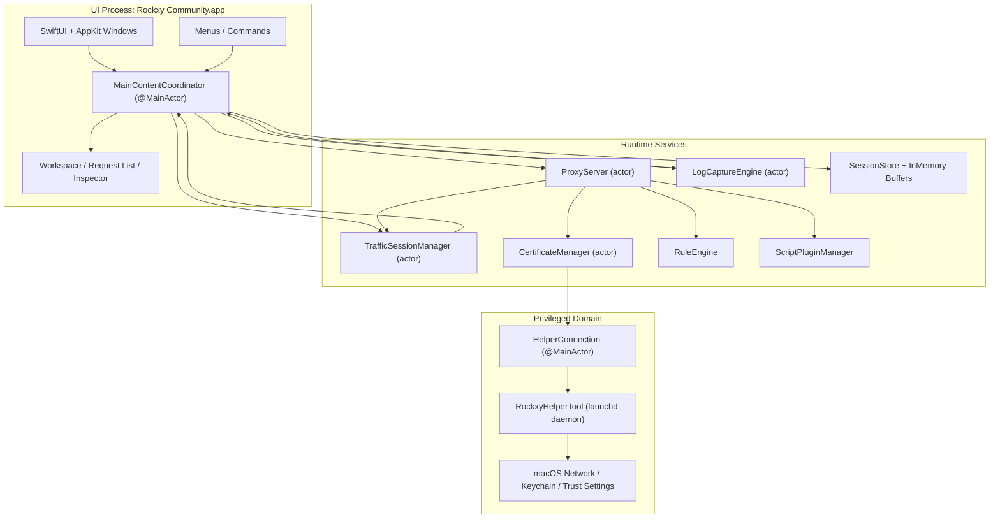
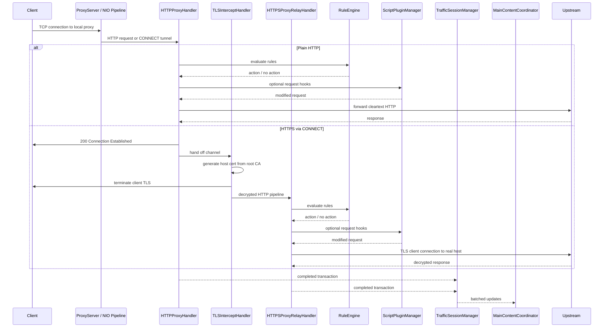
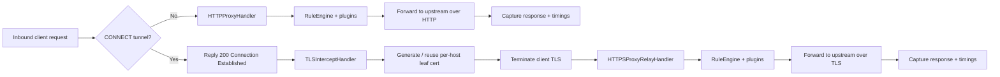
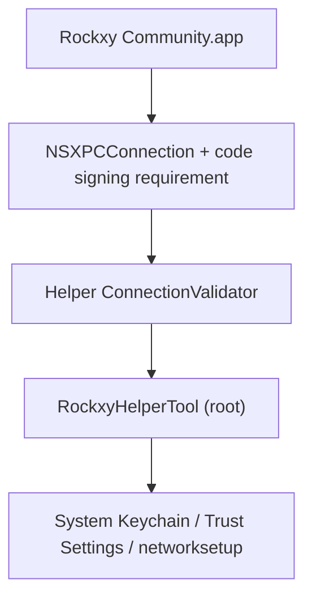

<p align="center">
  
</p>

<h1 align="center">Rockxy</h1>

<p align="center">
  <a href="README.md">English</a> |
  <a href="README.vi.md">Tiếng Việt</a> |
  <a href="README.zh.md">中文</a> |
  <a href="README.ja.md">日本語</a> |
  <a href="README.ko.md">한국어</a> |
  <a href="README.fr.md">Français</a> |
  <a href="README.de.md">Deutsch</a>
</p>

<p align="center">
  <strong>macOS 上的开源 HTTP 调试代理。</strong>
</p>

<p align="center">
  拦截 HTTP/HTTPS 流量，检查 API 请求，调试 WebSocket 连接，分析 GraphQL 查询。<br>
  基于 Swift，使用 SwiftNIO、SwiftUI 和 AppKit 构建。
</p>

<p align="center">
  <a href="#"></a>
  <a href="#"></a>
  <a href="LICENSE"></a>
  <a href="CONTRIBUTING.md"></a>
  <a href="https://github.com/sponsors/LocNguyenHuu"></a>
</p>

<p align="center">
  
</p>

---

> **状态**：积极开发中。核心代理引擎、HTTPS 拦截、规则系统、插件生态和 Inspector UI 已可用。进度请见 [CHANGELOG.md](CHANGELOG.md)。

<!-- BEGIN GENERATED: latest-release -->
## 最新发布

**v0.5.0** — 2026-04-10

### 新增

- Security hardening, docs honesty, trust recovery, helper lifecycle, architecture cleanup

### 修复

- Wire JSONInspectorView into response body tab, deterministic tab selection
- Code review follow-up — thread safety, fail-closed backup, honest docs, UI polish

### 变更

- Sync changelog release surfaces

完整发布历史见 [CHANGELOG.md](CHANGELOG.md)。
<!-- END GENERATED: latest-release -->

## 功能

### 网络流量捕获
- **HTTP/HTTPS 代理服务器** — 基于 SwiftNIO 的拦截代理，支持 CONNECT 隧道
- **SSL/TLS 拦截** — 通过 MITM 解密，自动生成按主机证书（LRU 缓存约 1000）
- **WebSocket 调试** — 双向帧捕获与检查
- **GraphQL 识别** — 自动提取 operation 名称并检查查询
- **进程识别** — 通过 `lsof` 端口映射 + User-Agent 解析，显示每条请求的来源应用（Safari、Chrome、curl、Slack、Postman 等）

### 请求与响应 Inspector
- **JSON 视图** — 可折叠树形结构与语法高亮
- **Hex Inspector** — 非文本内容的二进制 body 展示
- **Timing waterfall** — 可视化每条请求的 DNS、TCP 连接、TLS 握手、TTFB 与传输阶段
- **Headers、Cookies、Query、Auth** — 标签化 Inspector，支持原始视图
- **自定义 Header 列** — 选择额外的请求/响应头作为列显示

### 工作区与效率
- **工作区标签页** — 独立的捕获空间，各有独立的过滤器与焦点
- **收藏夹** — 固定常用主机或请求，快速定位
- **时间线视图** — 聚焦子集的请求序列时间线

### 流量操控与 Mock API
- **Map Local** — 使用本地文件响应请求（无需改动服务端即可 Mock API）
- **Map Remote** — 重定向请求到不同的 host/port/path（API 网关测试、staging ↔ production 切换）
- **Breakpoints** — 中途暂停请求或响应，编辑 URL/headers/body/status 后转发或中止
- **Block List** — 按 URL pattern（通配符或正则）阻断请求
- **Throttle** — 延迟请求转发以模拟慢速网络
- **Modify Headers** — 实时添加、移除或替换 HTTP headers
- **Allow List** — 仅捕获指定域名或应用以降低噪音
- **Bypass Proxy** — 系统代理启用时排除特定主机
- **SSL Proxying 规则** — 按域名控制 TLS 拦截

### 调试与分析
- **OSLog 集成** — 捕获 macOS 系统日志，按时间戳与网络请求关联
- **并排对比** — 对比两条已捕获的请求/响应
- **请求时间线** — 请求序列与耗时瀑布图
- **凭据脱敏** — 自动隐藏捕获日志中的 Bearer token 和密码

### 可扩展性
- **JavaScript 插件系统** — 基于 JavaScriptCore 的自定义脚本扩展（5 秒超时沙箱）
- **请求/响应 Hook** — 插件可在代理流水线中检查并修改流量
- **插件设置 UI** — 根据插件 manifest 自动生成配置表单
- **导出格式** — cURL、HAR、原始 HTTP 或 JSON
- **Compose + 重放** — 编辑并重发请求，或重放已捕获流量
- **导入审核** — HAR/session 导入前预览检查

### 原生 macOS 体验
- **原生 SwiftUI + AppKit** — 非 Electron、非 WebView、无跨平台妥协
- **NSTableView 请求列表** — 虚拟滚动支持 100k+ 请求无卡顿
- **真实应用图标** — 通过 `NSWorkspace` bundle ID 查询获取
- **系统代理集成** — 特权 helper 守护进程实现免密码代理设置（SMAppService）
- **深色模式** — 完整支持系统语义颜色
- **快捷键** — Cmd+Shift+R（开始）、Cmd+.（停止）、Cmd+K（清空）等

## 使用场景

- **iOS / macOS 应用调试** — 检查来自模拟器或真机的 API 调用
- **REST API 测试** — 查看完整请求/响应对，无需切换工具
- **GraphQL 调试** — 快速查看 operation 名称、变量和响应
- **Mock API 响应** — 将本地文件映射到端点，用于离线开发或边界用例测试
- **WebSocket 检查** — 调试实时连接（聊天应用、直播、游戏协议）
- **性能分析** — 定位慢接口、大 payload 和冗余 API 调用
- **SSL/TLS 调试** — 通过按域名控制的 HTTPS 拦截检查加密流量
- **网络流量录制** — 捕获并重放 HTTP 会话用于回归测试
- **API 逆向工程** — 分析第三方应用的未文档化 API 行为
- **CI/CD 集成** — 用于自动化 API 合约测试的无界面代理（计划中）

## Rockxy vs Proxyman vs Charles Proxy

寻找 Proxyman 或 Charles Proxy 的开源替代？对比如下：

| 功能 | Rockxy | Proxyman | Charles Proxy |
|---------|--------|----------|---------------|
| **许可证** | 开源（AGPL-3.0） | 私有（freemium） | 私有（付费） |
| **价格** | 免费 | 免费版 + $69/年 | $50 一次性 |
| **平台** | macOS | macOS、iOS、Windows | macOS、Windows、Linux |
| **源码** | GitHub 完整可用 | 闭源 | 闭源 |
| **技术** | Swift + SwiftNIO（原生） | Swift + AppKit（原生） | Java（跨平台） |
| **HTTP/HTTPS 拦截** | 是 | 是 | 是 |
| **WebSocket 调试** | 是 | 是 | 是 |
| **GraphQL 识别** | 是（自动识别） | 是 | 否 |
| **Map Local** | 是 | 是 | 是 |
| **Map Remote** | 是 | 是 | 是 |
| **Breakpoints** | 是 | 是 | 是 |
| **Block List** | 是 | 是 | 是 |
| **Modify Headers** | 是 | 是 | 是（rewrite） |
| **Throttle / Network Conditions** | 是 | 是 | 是 |
| **请求对比** | 是（并排） | 是 | 否 |
| **JavaScript 插件** | 是（JSCore 沙箱） | 是（脚本） | 否 |
| **请求重放** | 是（Repeat + Edit） | 是 | 是 |
| **HAR 导入/导出** | 是 | 是 | 否（自有格式） |
| **OSLog 集成** | 是 | 否 | 否 |
| **进程识别** | 是（显示来源应用） | 是 | 否 |
| **JSON 树视图** | 是 | 是 | 是 |
| **Hex Inspector** | 是 | 是 | 是 |
| **Timing waterfall** | 是 | 是 | 是 |
| **虚拟滚动（100k+ 行）** | 是（NSTableView） | 是 | 大量数据时变慢 |
| **特权 helper（免 sudo 提示）** | 是（SMAppService） | 是 | 否（频繁提示） |
| **深色模式** | 是 | 是 | 部分支持 |
| **可自托管 / 可审计** | 是 | 否 | 否 |
| **社区贡献** | 接受 PR | 否 | 否 |

**为什么选择 Rockxy？**
- 你需要一个**免费的开源** HTTP 调试代理，没有许可证限制
- 你希望**审计源码**，确保拦截流量的工具可信
- 你想**贡献功能**或按自己的工作流定制工具
- 你需要 **OSLog 关联**来同时调试 macOS 应用日志与网络流量
- 你想要**原生 macOS 体验**，无需 Java 运行时开销

## 环境要求

- macOS 14.0+（Sonoma 或更高）
- Xcode 16+
- Swift 5.9

## 快速开始

```bash
git clone https://github.com/LocNguyenHuu/Rockxy.git
cd Rockxy
xcodebuild -project Rockxy.xcodeproj -scheme Rockxy -configuration Debug build
```

或在 Xcode 中打开 `Rockxy.xcodeproj` 并直接运行。

首次启动时，Welcome 窗口会引导完成以下步骤：
1. 生成并信任 root CA 证书
2. 安装特权 helper 工具以控制系统代理
3. 启用系统代理
4. 启动代理服务器

## 架构

### 系统概览

Rockxy 划分为三个信任与执行域：

1. **UI + 调度层** — SwiftUI/AppKit 窗口、Inspector、菜单与 `MainContentCoordinator`
2. **代理/运行时层** — SwiftNIO channel handlers、证书签发、请求变更、存储与插件
3. **特权 helper 层** — 独立的 launchd 守护进程，仅用于需要高权限的系统级代理和证书操作

设计目标是将包处理移出主线程，将特权操作移出应用进程，并通过明确的 actor 或 `@MainActor` 边界同步用户界面状态。

### 组件图



### 运行时层

| 层 | 主要类型 | 职责 |
|-------|------------|----------------|
| **表现层** | `MainContentCoordinator`、`ContentView`、Inspector/请求列表/侧边栏视图 | 持有用户界面状态，路由命令，将代理和日志数据绑定到 SwiftUI/AppKit |
| **捕获 / 传输** | `ProxyServer`、`HTTPProxyHandler`、`TLSInterceptHandler`、`HTTPSProxyRelayHandler` | 接收代理流量，处理 CONNECT，执行 MITM TLS 拦截，转发上游 |
| **变更 / 策略** | `RuleEngine`、`BreakpointRequestBuilder`、`AllowListManager`、`NoCacheHeaderMutator`、`MapLocalDirectoryResolver` | 在转发或存储前应用请求/响应规则与当前调试策略 |
| **证书 / 信任** | `CertificateManager`、`RootCAGenerator`、`HostCertGenerator`、`CertificateStore`、`KeychainHelper` | 生成并持久化 root CA，缓存主机证书，验证信任状态，通过 helper/app 流程安装信任 |
| **存储 / 会话** | `TrafficSessionManager`、`LogCaptureEngine`、`SessionStore`、内存缓冲区 | 缓冲实时数据，选择性持久化到 SQLite，批量更新 UI |
| **可观测 / 分析** | GraphQL 检测、content-type 检测、日志关联 | 在传输处理期间或之后为已捕获流量添加元数据 |
| **特权系统集成** | `HelperConnection`、`RockxyHelperTool`、共享 XPC 协议 | 通过显式信任检查执行系统代理设置和特权证书操作 |

### 代理请求生命周期



### HTTP vs HTTPS 流程



### 并发模型

- `ProxyServer` 是一个 actor，负责 bind 和 shutdown 等生命周期管理。
- NIO channel handlers 运行在 event-loop 线程上，仅在需要时桥接到 actor 隔离的服务。
- `CertificateManager`、`TrafficSessionManager` 及相关服务使用 actor 隔离而非手动锁来管理长期共享状态。
- `MainContentCoordinator` 标记为 `@MainActor`，因为它是 SwiftUI/AppKit 的同步边界。
- UI 更新采用批量模式而非逐条推送，以避免高负载时主线程抖动。

### 核心子系统

| 子系统 | 位置 | 作用 |
|-----------|----------|--------------|
| **代理引擎** | `Core/ProxyEngine/` | SwiftNIO `ServerBootstrap`、每连接 channel pipeline、CONNECT 处理、TLS 接管、HTTP/HTTPS 转发 |
| **证书** | `Core/Certificate/` | Root CA 生命周期、主机证书签发、信任检查、磁盘 + Keychain 持久化、主机证书缓存 |
| **规则引擎** | `Core/RuleEngine/` | 有序规则评估：block、map local、map remote、throttle、modify headers、breakpoint |
| **流量捕获** | `Core/TrafficCapture/` | 会话批处理、allow-list 策略、replay 支持、代理状态同步到 UI |
| **存储** | `Core/Storage/` | SQLite 持久化、内存会话/日志缓冲区、大 body 分流存储 |
| **检测 / 增强** | `Core/Detection/` | GraphQL 检测、content type 检测、API 端点分组 |
| **插件** | `Core/Plugins/` | 基于 JavaScriptCore 的请求/响应 hook 执行与插件元数据/配置支持 |
| **Helper 工具** | `RockxyHelperTool/`、`Shared/` | 特权 XPC 服务，用于代理覆盖、bypass 域名配置和证书安装/移除 |

### 安全架构

> **漏洞报告：** 如果发现安全问题，请私下报告。详见 [SECURITY.md](SECURITY.md) 了解披露流程。

Rockxy 采用分层安全模型，因为它终止 TLS、存储敏感流量，并与拥有 root 权限的 helper 通信。



#### 安全边界

| 边界 | 风险 | 现有控制 |
|----------|------|-----------------|
| **App ↔ helper** | 不可信应用尝试调用特权代理/证书操作 | `NSXPCConnection` + code-signing 约束，helper 侧连接验证与证书链比对 |
| **TLS 拦截** | Root CA 失效或过期导致信任异常或 MITM 状态混乱 | 明确的 root CA 生命周期、信任检查、root 指纹跟踪、仅从当前活跃 root 签发主机证书 |
| **请求体处理** | 超大请求/响应 body 导致内存耗尽 | 100 MB 请求体上限（413 拒绝）、8 KB URI 长度上限（414 拒绝）、WebSocket 帧限制（10 MB/帧、100 MB/连接） |
| **本地文件映射** | Map Local 目录规则中的路径穿越或符号链接逃逸 | 基于 fd 的文件加载（消除 TOCTOU）、符号链接解析、根路径 containment 校验 |
| **规则正则表达式** | 异常正则导致 ReDoS 冻结代理 | 编译期正则验证、预编译 pattern 缓存、500 字符 pattern 长度限制、8 KB 输入上限 |
| **断点编辑请求** | URL/header/body 编辑后转发格式错误的请求 | `BreakpointRequestBuilder` 集中重建请求、保持 authority、scheme 规范化、content-length 修正 |
| **插件执行** | 脚本以不安全或不确定方式修改流量 | JavaScriptCore bridge、受限 hook API、超时强制、插件 ID/key 校验、禁止直接访问文件系统/网络 |
| **流量存储** | 敏感请求/响应 body 存放过久或权限不足 | 内存缓冲 + 磁盘/SQLite 持久化、大 body 分流存储并设置 0o600 权限、加载/删除时路径 containment 校验、日志凭据脱敏 |
| **Header 注入** | MapRemote host header 操控导致 CRLF 注入 | 转发前对 header 值进行控制字符过滤 |
| **Helper 输入验证** | 向 networksetup 传入格式错误的域名或服务名 | ASCII-only bypass 域名校验、服务名清理、代理类型白名单、域名数量限制 |

#### Helper 信任模型

Helper 作为 launchd daemon（`com.amunx.Rockxy.HelperTool`）通过 `SMAppService.daemon()` 注册。其存在目的是让代理覆盖和部分证书操作无需应用进程反复弹出 `networksetup` 密码提示。

现有纵深防御措施包括：

- app 侧特权 XPC 连接配置
- helper 侧 `ConnectionValidator` 中的调用方验证（硬编码 bundle identifier）
- code-signing 约束强制执行（`anchor apple generic`）
- 证书链比对，不仅依赖 bundle ID 或 team ID 字符串
- helper 侧对状态变更操作的速率限制（代理修改、证书安装）
- 所有 helper 参数的输入验证（bypass 域名、服务名、代理类型）
- 以受限权限（0o600）创建原子临时文件
- 显式代理备份/恢复路径用于崩溃恢复

#### 证书信任模型

- Root CA 的生成和持久化位于 `CertificateManager` 中。
- 应用负责 root CA 的创建、加载和信任状态验证。
- Helper 可协助进行特权 Keychain/系统安装操作，但信任仍有应用侧可见的验证路径。
- 主机证书从当前 root 按需生成并缓存，以避免重复签发的开销。
- Root 指纹跟踪用于清理过期证书，减少"多个旧 Rockxy root 残留"的问题。

#### 实际安全说明

- Rockxy 是一个可访问敏感流量的开发工具。不需要时请勿长期启用系统代理覆盖。
- 安装 root CA 仅对信任该 root 的客户端启用 HTTPS 拦截。
- 保存的会话、导出文件和插件代码应视为潜在的敏感项目资产。

## 项目结构

```
Rockxy/
├── Core/
│   ├── ProxyEngine/       # SwiftNIO server, HTTP/TLS/WS handlers, helper client
│   ├── Certificate/       # X.509 generation, root CA, Keychain integration
│   ├── RuleEngine/        # Rule matching and action execution
│   ├── LogEngine/         # OSLog + process log capture and correlation
│   ├── TrafficCapture/    # Session manager, system proxy, request replay
│   ├── Storage/           # SQLite store, in-memory buffer, settings
│   ├── Detection/         # Content type, GraphQL, API grouping
│   ├── Plugins/           # Plugin discovery, JS runtime, manifest parsing
│   ├── Services/          # Window management, notifications
│   └── Utilities/         # Body decoder, input validation, formatters
├── Views/
│   ├── Main/              # Main window, coordinator extensions
│   ├── RequestList/       # NSTableView-backed request list (100k+ rows)
│   ├── Inspector/         # Request/response tabs, JSON tree, hex display
│   ├── Sidebar/           # Domain tree, app grouping, favorites
│   ├── Toolbar/           # Status indicators, control buttons
│   ├── Welcome/           # Setup wizard, certificate checklist
│   ├── Settings/          # General, Proxy, SSL Proxying, Privacy tabs
│   ├── Rules/             # Rule list, add/edit dialogs
│   ├── Compose/           # Edit and Repeat request editor
│   ├── Diff/              # Side-by-side transaction comparison
│   ├── Scripting/         # Code editor, plugin console
│   ├── Timeline/          # Request waterfall visualization
│   ├── Breakpoint/        # Breakpoint edit window
│   └── Components/        # Reusable: StatusCodeBadge, FilterPill, etc.
├── Models/
│   ├── Network/           # HTTPTransaction, Request/Response, TimingInfo, WebSocket
│   ├── Log/               # LogEntry, LogLevel, LogSource
│   ├── Certificate/       # RootCA, RootCAStatusSnapshot
│   ├── Rules/             # ProxyRule, RuleAction
│   ├── Settings/          # AppSettings, ProxySettings
│   ├── UI/                # SidebarItem, FilterState
│   └── Plugins/           # PluginInfo, PluginConfig, PluginManifest
├── ViewModels/
├── Extensions/
└── Theme/

RockxyHelperTool/              # Privileged launchd daemon (runs as root)
├── main.swift                 # Entry point, XPC listener
├── HelperDelegate.swift       # Connection validation, disconnect handling
├── HelperService.swift        # Protocol impl, rate limiting, port validation
├── ConnectionValidator.swift  # Certificate chain extraction & comparison
├── CrashRecovery.swift        # Backup/restore proxy settings
└── ProxyConfigurator.swift    # networksetup wrapper

Shared/
└── RockxyHelperProtocol.swift # @objc XPC protocol (app ↔ helper)

RockxyTests/                   # Swift Testing framework (@Suite, @Test, #expect)
├── Core/                      # Rule engine, certificate, plugin, storage, proxy tests
├── ViewModels/                # WelcomeViewModel tests
└── Helpers/                   # TestFixtures factory methods

docs/                          # Documentation (Mintlify format)
.github/workflows/             # CI: lint → build (arm64 + x86_64) → release
```

## 技术栈

| 层 | 技术 |
|-------|-----------|
| UI 框架 | SwiftUI + AppKit（NSTableView、NSViewRepresentable） |
| 网络 | [SwiftNIO](https://github.com/apple/swift-nio) 2.95 + [SwiftNIO SSL](https://github.com/apple/swift-nio-ssl) 2.36 |
| 证书 | [swift-certificates](https://github.com/apple/swift-certificates) 1.18 + [swift-crypto](https://github.com/apple/swift-crypto) 4.2 |
| 数据库 | [SQLite.swift](https://github.com/stephencelis/SQLite.swift) 0.16 |
| 并发 | Swift Actors、结构化并发、@MainActor |
| 插件 | JavaScriptCore（macOS 内建框架） |
| Helper IPC | XPC Services + SMAppService（macOS 13+） |
| 测试 | Swift Testing framework（@Suite、@Test、#expect） |
| CI/CD | GitHub Actions（SwiftLint → 并行 arm64/x86_64 构建 → release） |

## 从源码构建

### 开发构建

```bash
git clone https://github.com/LocNguyenHuu/Rockxy.git
cd Rockxy
./scripts/setup-developer.sh   # Generates Configuration/Developer.xcconfig for local signing
xcodebuild -project Rockxy.xcodeproj -scheme Rockxy -configuration Debug build
```

### Release 构建

```bash
# Apple Silicon (M1/M2/M3/M4)
xcodebuild -project Rockxy.xcodeproj -scheme Rockxy -configuration Release -arch arm64 build

# Intel
xcodebuild -project Rockxy.xcodeproj -scheme Rockxy -configuration Release -arch x86_64 build
```

### 运行测试

```bash
# 全部测试
xcodebuild -project Rockxy.xcodeproj -scheme Rockxy test

# 指定测试类
xcodebuild -project Rockxy.xcodeproj -scheme Rockxy test -only-testing:RockxyTests/CertificateTests

# 指定测试方法
xcodebuild -project Rockxy.xcodeproj -scheme Rockxy test -only-testing:RockxyTests/RuleEngineTests/testWildcardMatching
```

### Lint 与格式化

```bash
brew install swiftlint swiftformat

swiftlint lint --strict    # 必须零违规通过
swiftformat .              # 自动格式化
```

### Helper 工具说明

如果修改了 `RockxyHelperTool/` 或 `Shared/RockxyHelperProtocol.swift` 下的代码，仅重新构建应用是不够的。必须先卸载旧的 helper，再通过应用的 Helper Manager 重新安装新版本。

## 设计决策

### 为什么选择 SwiftNIO 而非 URLSession

URLSession 是高层 HTTP 客户端。Rockxy 需要底层 TCP 服务器来接收连接、解析 HTTP、通过 CONNECT 隧道执行 MITM TLS 拦截并转发流量 — 这些都需要直接的 socket 控制。SwiftNIO 提供了事件驱动的非阻塞 I/O 基础，使得纯 Swift 实现这一切成为可能。

### 为什么请求列表使用 NSTableView

SwiftUI 的 `List` 无法在 100k+ 行的场景下实现虚拟滚动。请求列表使用 `NSTableView` 通过 `NSViewRepresentable` 封装，无论流量多大都能保持 O(1) 滚动性能。

### 为什么需要特权 Helper 守护进程

macOS 的每次 `networksetup` 调用都需要管理员认证。Helper 工具（`SMAppService.daemon()`）以 root 运行，通过证书链比对验证调用方，在保持安全性的同时消除反复输入密码的提示。

### 基于 Actor 的并发模型

代理服务器、会话管理器和证书管理器均使用 Swift actor，无需手动加锁即可消除数据竞争。Coordinator 通过批量更新（每 250ms）将 actor 隔离的状态桥接到 `@MainActor` 供 SwiftUI 消费。

### 插件沙箱

JavaScript 插件运行在 JavaScriptCore 中，通过受控的桥接 API（`$rockxy`）交互。每次脚本执行有 5 秒超时。插件可以检查和修改请求，但无法直接访问文件系统或网络。

## 性能

- **100k+ 请求** — NSTableView 虚拟滚动与 cell 复用，UI 无卡顿
- **Ring buffer 淘汰** — 超过 50k 条事务时，最旧的 10% 移至 SQLite 或丢弃
- **Body 分流** — 请求/响应 body 超过 1MB 时存储到磁盘，按需加载
- **批量 UI 更新** — 代理事务每 250ms 或每 50 项批量推送到 UI
- **字符串性能** — 大 body 使用 `NSString.length`（O(1)）替代 `String.count`（O(n)）
- **日志缓冲** — 100k 条内存缓存，溢出写入 SQLite
- **并发构建** — NIO event loop 线程数取 `System.coreCount`

## 存储

| 数据 | 机制 | 位置 |
|------|-----------|----------|
| 用户偏好 | UserDefaults | `AppSettingsStorage` |
| 活动会话 | 内存 ring buffer | `InMemorySessionBuffer` |
| 已保存会话 | SQLite | `SessionStore` |
| Root CA 私钥 | macOS Keychain | `KeychainHelper` |
| 规则 | JSON 文件 | `RuleStore` |
| 大 body | 磁盘文件 | `~/Library/Application Support/Rockxy/bodies/` |
| 日志条目 | SQLite | `SessionStore`（log_entries 表） |
| 代理备份 | Plist（0o600） | `/Library/Application Support/com.amunx.Rockxy/proxy-backup.plist` |
| 插件 | JS 文件 + manifest | `~/Library/Application Support/Rockxy/Plugins/` |

## 代码规范

完整规则见 `.swiftlint.yml` 和 `.swiftformat`。要点如下：

- 4 空格缩进，目标行宽 120 字符
- 所有声明显式标注访问控制
- 禁止 force unwrap（`!`）和 force cast（`as!`） — 使用 `guard let`、`if let`、`as?`
- 全部日志使用 OSLog，禁止 `print()`
- 用户可见文本使用 `String(localized:)`
- 提交信息遵循 [Conventional Commits](https://www.conventionalcommits.org/)

### 文件大小限制

| 指标 | 警告 | 错误 |
|--------|---------|-------|
| 文件长度 | 1200 行 | 1800 行 |
| 类型体长度 | 1100 行 | 1500 行 |
| 函数体长度 | 160 行 | 250 行 |
| 圈复杂度 | 40 | 60 |

接近限制时，按领域逻辑拆分到 `TypeName+Category.swift` 扩展文件中。

## CI/CD

GitHub Actions 工作流（手动触发，支持可选 channel 参数）：

1. **Lint** — 在 macOS 14 上执行 `swiftlint lint --strict`
2. **Build** — 使用 Xcode 16 并行构建 arm64 和 x86_64 release
3. **Artifacts** — 上传已签名的构建产物用于分发

## 路线图

### 已发布

- [x] HAR 文件导入与导出
- [x] 请求重放（Repeat 与 Edit and Repeat）
- [x] 原生 `.rockxysession` 会话文件（保存、打开、元数据）
- [x] GraphQL-over-HTTP 检测与检查
- [x] JavaScript 脚本（创建、编辑、测试、启用/禁用脚本）
- [x] 并排请求对比
- [x] 安全加固（body 大小限制、正则验证、路径穿越保护、输入验证）
- [x] 捕获日志中的凭据脱敏

### 计划中

- [ ] 错误分组与分析仪表盘（HTTP 4xx/5xx 聚类、延迟指标）
- [ ] HTTP/2 与 HTTP/3 支持
- [ ] 序列录制（重放依赖链请求）
- [ ] 远程设备代理（通过 USB/Wi-Fi 调试 iOS 设备）
- [ ] CI/CD 流水线集成的无界面模式
- [ ] gRPC / Protocol Buffers 检查
- [ ] 网络条件模拟（延迟、丢包、带宽限制）

## 贡献

欢迎贡献。无论是修复 bug、添加新功能、改进文档还是提供 UX 反馈 — 每一份贡献都让 Rockxy 变得更好。参与前请阅读我们的 [Code of Conduct](CODE_OF_CONDUCT.md)。

**入门步骤：**

1. Fork 仓库并克隆你的 fork
2. 从 `develop` 创建功能分支（`feat/your-change` 或 `fix/your-fix`）
3. 完成修改，确保 `swiftlint lint --strict` 通过
4. 提交 PR，清楚描述改了什么以及为什么

详见 [CONTRIBUTING.md](CONTRIBUTING.md) 获取完整的设置说明、代码风格、提交规范与 PR 清单。

**贡献方式：**

- **代码** — 修复 bug、新增功能、性能优化
- **测试** — 扩展测试覆盖率、补充边界用例、改进 fixtures
- **文档** — 改进 `docs/` 中的文档、修正错别字、添加示例
- **Bug 报告** — 提交清晰可复现的 issue，附带 macOS 版本与复现步骤
- **UX 反馈** — 对 Inspector、侧边栏或工具栏的工作流提出改进建议

适合新手的 issue 标记为 [`good first issue`](https://github.com/LocNguyenHuu/Rockxy/labels/good%20first%20issue)。

提交 PR 即表示同意 [Contributor License Agreement](CLA.md)。

## 支持

- [GitHub Sponsors](https://github.com/sponsors/LocNguyenHuu) — 支持 Rockxy 的开发
- [GitHub Issues](https://github.com/LocNguyenHuu/Rockxy/issues) — Bug 报告与功能请求
- [GitHub Discussions](https://github.com/LocNguyenHuu/Rockxy/discussions) — 社区问答与交流
- **Email** — [rockxyapp@gmail.com](mailto:rockxyapp@gmail.com)
- **安全问题** — 参见 [SECURITY.md](SECURITY.md) 了解负责任的披露流程

## 许可证

[GNU Affero General Public License v3.0](LICENSE) — Copyright 2024–2026 Rockxy Contributors.

---

**由 Swift、SwiftNIO、SwiftUI 与 AppKit 构建。**
