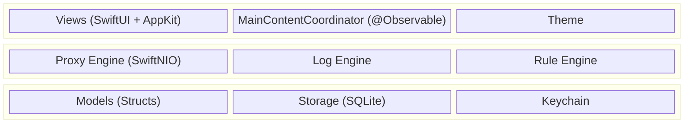
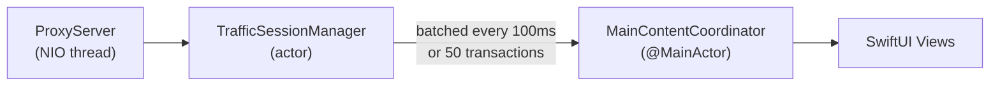
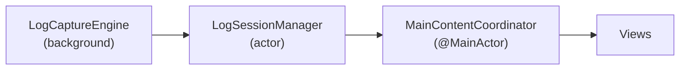
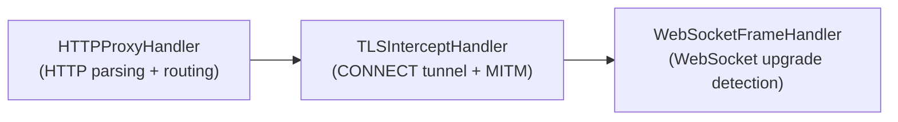

## Tech Stack

Rockxy is a native macOS application built with:

- **SwiftUI + AppKit** hybrid UI (NSTableView for high-volume request lists, SwiftUI for everything else)
- **Swift Concurrency** — actors for thread-safe proxy, storage, and log engines
- **SwiftNIO** — non-blocking event-driven proxy server
- **swift-certificates** — X.509 certificate generation for HTTPS interception
- **SQLite.swift** — session and log persistence
- **macOS 14.0+**, Swift 5.9

<Note>
  Rockxy is 100% native — no Electron, no web views, no embedded browser engines. Every pixel is rendered by AppKit or SwiftUI.
</Note>

## Architecture Overview



## SPM Dependencies

All dependencies are managed via Xcode's SPM integration — there is no top-level `Package.swift`.

| Package | Version | Purpose |
|---------|---------|---------|
| [apple/swift-nio](https://github.com/apple/swift-nio) | 2.76+ | Non-blocking event loop for the proxy server |
| [apple/swift-nio-ssl](https://github.com/apple/swift-nio-ssl) | 2.29+ | TLS handling for HTTPS interception |
| [apple/swift-certificates](https://github.com/apple/swift-certificates) | 1.7+ | X.509 certificate generation (root CA + per-host) |
| [apple/swift-crypto](https://github.com/apple/swift-crypto) | 3.10+ | Cryptographic primitives |
| [stephencelis/SQLite.swift](https://github.com/stephencelis/SQLite.swift) | 0.15+ | SQLite wrapper for session and log persistence |

## Project Structure

<Tree>
  - Rockxy/
    - Core/
      - ProxyEngine/ — SwiftNIO HTTP/HTTPS proxy server, channel handlers
      - Certificate/ — Root CA generation, per-host certs, keychain integration
      - RuleEngine/ — Rule matching and actions (block, map, throttle, breakpoint)
      - LogEngine/ — OSLog capture, stdout/stderr, custom log sources
      - TrafficCapture/ — System proxy manager, session manager, request replay
      - Storage/ — SQLite persistence, in-memory buffers, settings
      - Detection/ — GraphQL detector, content type detection, API grouping
      - Plugins/ — Plugin manager, built-in inspectors and exporters
      - Services/Infrastructure/ — Window management, notifications
      - Utilities/ — Body decoder, size and duration formatters
    - Models/
      - Network/ — HTTPTransaction, Request, Response, WebSocket frames
      - Log/ — LogEntry, LogLevel, LogSource
      - Rules/ — ProxyRule, RuleAction
      - Settings/ — AppSettings
      - UI/ — SidebarItem, InspectorTab, FilterCriteria
    - Views/
      - Main/ — ContentView, Coordinator + Extensions/
      - Sidebar/
      - RequestList/
      - Inspector/ — 8 inspector tab views
      - Logs/
      - Timeline/
      - Rules/
      - Settings/
      - Toolbar/
      - Components/
    - Extensions/
    - Theme/
</Tree>

## Design Patterns

### Coordinator Pattern

`MainContentCoordinator` is the central state coordinator — marked `@MainActor @Observable` and split across extension files to stay within SwiftLint's file length limits:

```swift
// MainContentCoordinator.swift — core state
@MainActor @Observable
final class MainContentCoordinator {
    var selectedTransaction: HTTPTransaction?
    var transactions: [HTTPTransaction] = []
    var logEntries: [LogEntry] = []
    var isProxyRunning = false
    var isRecording = false
}

// MainContentCoordinator+ProxyControl.swift
extension MainContentCoordinator {
    func startProxy() async throws { ... }
    func stopProxy() async { ... }
}

// MainContentCoordinator+Filtering.swift
extension MainContentCoordinator {
    func applyFilter(_ criteria: FilterCriteria) { ... }
}
```

When adding new coordinator functionality, create a new extension file (e.g., `MainContentCoordinator+NewFeature.swift`) rather than growing an existing file.

### Actor Isolation

All engines that handle concurrent data use Swift actors:

- `ProxyServer` — owns the NIO event loop and server bootstrap
- `CertificateManager` — manages root CA and per-host certificate cache (~1,000 entries LRU)
- `LogCaptureEngine` — captures logs from multiple sources concurrently
- `InMemorySessionBuffer` — thread-safe ring buffer for active transactions

Cross-isolation calls use `async/await`:

```swift
let certificate = await certificateManager.certificate(forHost: hostname)
await sessionBuffer.append(transaction)
```

### Protocol-Oriented Plugins

Rockxy defines protocols for extensibility:

- **`InspectorPlugin`** — adds custom tabs to the request inspector
- **`ExporterPlugin`** — exports sessions in custom formats (HAR, cURL, etc.)
- **`ProtocolHandler`** — handles application-layer protocols beyond HTTP

Plugins register with `PluginManager` and are discovered at launch.

## Data Flow

### Network Traffic



### Log Capture



## Proxy Pipeline

The SwiftNIO channel pipeline processes each connection through a series of handlers:



- **HTTPProxyHandler** — parses incoming HTTP requests, applies rule engine, routes to upstream
- **TLSInterceptHandler** — intercepts CONNECT requests, generates per-host certificates on the fly, establishes TLS tunnel
- **WebSocketFrameHandler** — detects WebSocket upgrades and captures individual frames

## Storage Architecture

| Data | Storage | Implementation |
|------|---------|---------------|
| Active sessions | In-memory ring buffer (50k capacity) | `InMemorySessionBuffer` (actor) |
| Saved sessions | SQLite | `SessionStore` |
| Root CA key | macOS Keychain | `KeychainHelper` |
| Rules | JSON file | `RuleStore` |
| Large bodies (>1MB) | Disk files | `~/Library/Application Support/Rockxy/bodies/` |
| Log entries | SQLite | `SessionStore` (log_entries table) |

## Privileged Helper & Security

Rockxy uses a privileged helper daemon (`RockxyHelperTool`) registered via `SMAppService.daemon()` for password-free system proxy configuration. The helper runs as root and communicates with the app over XPC.

**Security model:**
- `NSXPCConnection` with code-signing requirements
- Certificate-chain comparison via `ConnectionValidator` (defense-in-depth beyond bundle ID)
- Rate limiting on state-changing operations
- Port range validation (1024-65535)

**Resilience features:**
- **Proxy backup/restore** — original proxy settings saved to plist before override, auto-restored on helper restart within 24 hours
- **Emergency cleanup** — proxy settings restored on SIGTERM, SIGINT, XPC invalidation, and `applicationWillTerminate`
- **Owner PID watchdog** — detects when the app process exits unexpectedly
- **SOCKS proxy backup** — backs up and restores SOCKS proxy settings alongside HTTP/HTTPS
- **Stale helper recovery** — detects and recovers from stale helper state after crashes

For vulnerability reporting, see [SECURITY.md](https://github.com/LocNguyenHuu/Rockxy/blob/main/SECURITY.md).

## Next Steps

<CardGroup cols={2}>
  <Card title="Code Style" icon="paintbrush" href="/development/code-style">
    SwiftLint rules, formatting standards, and naming conventions
  </Card>
  <Card title="Building" icon="hammer" href="/development/building">
    Build from source, run tests, and set up your development environment
  </Card>
</CardGroup>
