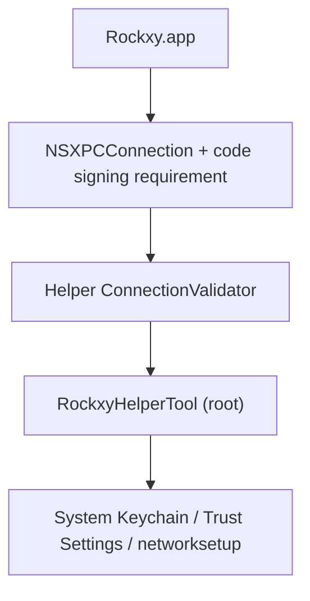

## Overview

Rockxy terminates TLS, stores sensitive traffic, and communicates with a root-privileged helper. Security is layered across every boundary.

## Security Boundaries

| Boundary | Risk | Control |
|----------|------|---------|
| **App to helper** | Untrusted app attempts privileged proxy/cert operations | `NSXPCConnection` with code-signing requirements + helper-side connection validation + certificate-chain comparison |
| **TLS interception** | Invalid or stale root CA causes broken trust or confusing MITM state | Explicit root CA lifecycle, trust checks, root fingerprint tracking, per-host cert issuance from active root only |
| **Request body handling** | Memory exhaustion via oversized bodies | 100 MB request body cap (413 rejection), 8 KB URI length cap (414 rejection), WebSocket frame limits (10 MB/frame, 100 MB/connection) |
| **Map Local file serving** | Path traversal or symlink escape | fd-based file loading (eliminates TOCTOU), symlink resolution, rooted path containment checks |
| **Rule regex patterns** | ReDoS from pathological regex | Compile-time validation, pre-compiled cache, 500-char pattern limit, 8 KB input cap |
| **Breakpoint edits** | Malformed request forwarding after URL/header/body edits | Centralized rebuilding in `BreakpointRequestBuilder`, authority preservation, scheme normalization, content-length reconciliation |
| **Plugin execution** | Scripts mutating traffic unsafely | JavaScriptCore bridge, bounded hook API, 5-second timeout, plugin ID/key validation, no filesystem/network access |
| **Stored traffic** | Sensitive bodies kept too long or with weak permissions | In-memory buffering + disk/SQLite persistence, large-body offload with 0o600 file permissions, path containment on load/delete, log credential redaction |
| **Header injection** | CRLF injection via MapRemote host header | Header value sanitization stripping control characters before forwarding |
| **Helper input validation** | Malformed domains or service names passed to networksetup | ASCII-only bypass domain validation, service name sanitization, proxy type whitelisting, domain count limits |

## Helper Trust Model

The helper runs as a launchd daemon (`com.amunx.rockxy.helper`) registered via `SMAppService.daemon()`. It exists so proxy override and certificate operations can be performed without repeated `networksetup` password prompts.

Defense-in-depth includes:

- App-side privileged XPC connection setup
- Caller validation in `Shared/ConnectionValidator.swift` checks the caller against the configured set of allowed bundle identifiers (loaded from `RockxyIdentity.current.allowedCallerIdentifiers`)
- Code-signing requirement enforcement (`anchor apple generic`) for signed release and development builds
- Certificate-chain comparison — trust is not based only on bundle ID or team ID strings
- Local Xcode ad-hoc fallback is restricted to DerivedData build products with the configured bundle identifier, so unsigned local builds can repair their own copied helper without relaxing release validation
- Helper-side rate limiting for state-changing operations (proxy changes, certificate installs)
- Input validation on all helper parameters (bypass domains, service names, proxy types)
- Atomic temp file creation with restricted permissions (0o600)
- Explicit proxy backup/restore paths for crash recovery

## Certificate Trust Model

- Root CA generation and persistence live in `CertificateManager`
- The app owns root CA creation, loading, and trust-state verification
- The helper assists with privileged keychain/system install operations, but trust has an app-visible verification path
- Host certificates are generated on demand from the current root and cached (LRU ~1,000 entries)
- Root fingerprint tracking cleans up stale certificates and reduces "multiple old Rockxy roots installed" drift

## Practical Security Notes

<Warning>
  Rockxy is a developer tool with access to sensitive traffic. Do not leave system proxy override enabled longer than needed.
</Warning>

- Installing the root CA enables HTTPS interception only for clients that trust that root
- Saved sessions, exports, and plugin code should be treated as potentially sensitive project artifacts
- The privileged helper validates every connection via certificate-chain comparison, not just bundle ID

## Public Release Metadata

Rockxy publishes signed update metadata in `appcast.xml`, latest-release metadata in `releases/latest.json`, and an all-release catalog in `releases/catalog.json`. The canonical public release date for update eligibility is the UTC `release_date` field on each `releases/catalog.json` entry. The latest appcast item mirrors that same value in `rockxy:releaseDate`, and its Sparkle `pubDate` must match it.

Each signed installable release entry carries version, build, UTC `release_date`, GitHub DMG download URL, SHA-256 checksum, DMG length, Sparkle EdDSA signature, release notes URL, and minimum macOS version. Downstream update-eligibility services can mirror the public catalog and choose the newest release whose `release_date` is within their eligibility window.

This public repository stores release metadata only. It does not contain private entitlement payloads, license-signature rules, purchase-provider configuration, or license-validation code.

## Vulnerability Reporting

If you discover a security issue, please report it privately via [SECURITY.md](https://github.com/RockxyApp/Rockxy/blob/main/SECURITY.md).

## Next Steps

<CardGroup cols={2}>
  <Card title="Architecture" icon="sitemap" href="/development/architecture">
    Proxy engine, actor model, and data flow
  </Card>
  <Card title="Design Decisions" icon="lightbulb" href="/development/design-decisions">
    Why SwiftNIO, NSTableView, actors, and the helper daemon
  </Card>
</CardGroup>
